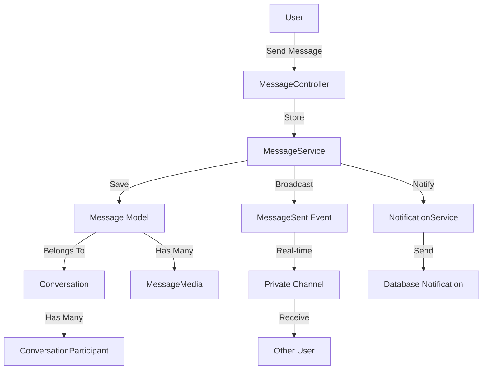

# Direct Messaging / Chat System Implementation Plan

## Overview

Implementasi sistem Direct Messaging yang lengkap untuk platform Noteds.com dengan fitur one-on-one messaging, group chats, file attachments, read receipts, typing indicators, message search, dan real-time updates menggunakan Laravel Broadcasting.

## Architecture Overview

## Database Schema

### 1. Conversations Table

- `id` (UUID, primary)
- `type` (enum: 'direct', 'group')
- `name` (string, nullable - untuk group chats)
- `description` (text, nullable - untuk group chats)
- `avatar` (string, nullable - untuk group chats)
- `created_by` (UUID, foreign key to users)
- `last_message_at` (timestamp, nullable)
- `timestamps`

### 2. Conversation Participants Table

- `id` (UUID, primary)
- `conversation_id` (UUID, foreign key)
- `user_id` (UUID, foreign key to users)
- `role` (enum: 'admin', 'member') - untuk group chats
- `joined_at` (timestamp)
- `left_at` (timestamp, nullable)
- `last_read_at` (timestamp, nullable)
- `muted_until` (timestamp, nullable)
- `timestamps`
- Unique constraint: `conversation_id` + `user_id`

### 3. Messages Table

- `id` (UUID, primary)
- `conversation_id` (UUID, foreign key)
- `user_id` (UUID, foreign key to users)
- `content` (text, nullable - untuk media-only messages)
- `type` (enum: 'text', 'image', 'file', 'voice')
- `reply_to_id` (UUID, nullable, foreign key to messages)
- `is_edited` (boolean, default false)
- `edited_at` (timestamp, nullable)
- `is_deleted` (boolean, default false)
- `deleted_at` (timestamp, nullable)
- `timestamps`
- Indexes: `conversation_id`, `user_id`, `created_at`

### 4. Message Media Table

- `id` (UUID, primary)
- `message_id` (UUID, foreign key)
- `file_path` (string)
- `file_name` (string)
- `mime_type` (string)
- `file_size` (integer)
- `thumbnail_path` (string, nullable - untuk images)
- `duration` (integer, nullable - untuk voice messages, in seconds)
- `order` (integer, default 0)
- `timestamps`

### 5. Read Receipts Table

- `id` (UUID, primary)
- `message_id` (UUID, foreign key)
- `user_id` (UUID, foreign key to users)
- `read_at` (timestamp)
- `timestamps`
- Unique constraint: `message_id` + `user_id`

### 6. Typing Indicators Table (Cache-based, optional)

- Store in Redis/cache dengan TTL 5 seconds
- Key format: `typing:conversation:{conversation_id}:user:{user_id}`
- Value: timestamp

### 7. Blocked Users Table (untuk blocking di chat)

- `id` (UUID, primary)
- `user_id` (UUID, foreign key - user yang block)
- `blocked_user_id` (UUID, foreign key - user yang di-block)
- `timestamps`
- Unique constraint: `user_id` + `blocked_user_id`

## Implementation Phases

### Phase 1: Core Messaging Infrastructure

#### 1.1 Database Migrations

**Files to create:**

- `database/migrations/xxxx_create_conversations_table.php`
- `database/migrations/xxxx_create_conversation_participants_table.php`
- `database/migrations/xxxx_create_messages_table.php`
- `database/migrations/xxxx_create_message_media_table.php`
- `database/migrations/xxxx_create_read_receipts_table.php`
- `database/migrations/xxxx_create_blocked_users_table.php`

**Key points:**

- Use UUID for all primary keys (consistent dengan existing pattern)
- Add proper indexes untuk performance
- Add foreign key constraints dengan cascade delete
- Use enum types untuk `type` fields

#### 1.2 Models

**Files to create:**

- `app/Models/Conversation.php`
- `app/Models/ConversationParticipant.php`
- `app/Models/Message.php`
- `app/Models/MessageMedia.php`
- `app/Models/ReadReceipt.php`
- `app/Models/BlockedUser.php`

**Key relationships:**

- Conversation hasMany Messages
- Conversation hasMany ConversationParticipants
- ConversationParticipant belongsTo User
- Message belongsTo Conversation, User
- Message hasMany MessageMedia
- Message hasMany ReadReceipts
- Message belongsTo Message (reply_to)
- User hasMany Conversations (through participants)
- User hasMany BlockedUsers

**Pattern to follow:**

- Use `HasUuid` trait (consistent dengan existing models)
- Use `HasFactory` trait
- Add proper casts untuk timestamps, booleans
- Add accessors untuk computed properties (e.g., `unread_count`)

#### 1.3 Services

**Files to create:**

- `app/Services/ConversationService.php` - Handle conversation creation, participant management
- `app/Services/MessageService.php` - Handle message sending, editing, deletion
- `app/Services/MessageMediaService.php` - Handle file uploads, media processing
- `app/Services/ReadReceiptService.php` - Handle read receipts tracking
- `app/Services/TypingIndicatorService.php` - Handle typing indicators (cache-based)

**Key methods:**

- `ConversationService::createDirectConversation($user1, $user2)` - Create or get existing direct conversation
- `ConversationService::createGroupConversation($creator, $name, $participants)` - Create group chat
- `MessageService::sendMessage($conversation, $user, $content, $attachments)` - Send message
- `MessageService::markAsRead($message, $user)` - Mark message as read
- `ReadReceiptService::markConversationAsRead($conversation, $user)` - Mark all messages in conversation as read

#### 1.4 Events & Broadcasting

**Files to create:**

- `app/Events/MessageSent.php` - Event ketika message dikirim
- `app/Events/MessageEdited.php` - Event ketika message di-edit
- `app/Events/MessageDeleted.php` - Event ketika message di-delete
- `app/Events/TypingStarted.php` - Event ketika user mulai typing
- `app/Events/TypingStopped.php` - Event ketika user stop typing
- `app/Events/ConversationUpdated.php` - Event ketika conversation di-update (new participant, etc.)

**Broadcasting channels:**

- Private channel: `conversation.{conversationId}` - untuk messages
- Private channel: `user.{userId}.conversations` - untuk conversation list updates
- Private channel: `user.{userId}.typing` - untuk typing indicators

**Update:**

- `routes/channels.php` - Add channel authorization callbacks

### Phase 2: API Endpoints & Controllers

#### 2.1 Controllers

**Files to create:**

- `app/Http/Controllers/Messaging/ConversationController.php`
- `app/Http/Controllers/Messaging/MessageController.php`
- `app/Http/Controllers/Messaging/MessageMediaController.php`
- `app/Http/Controllers/Messaging/TypingIndicatorController.php`

**Key endpoints:**

- `GET /api/conversations` - List conversations dengan pagination
- `GET /api/conversations/{conversation}` - Get conversation details
- `POST /api/conversations` - Create new conversation (direct or group)
- `POST /api/conversations/{conversation}/participants` - Add participants (group only)
- `DELETE /api/conversations/{conversation}/participants/{user}` - Remove participant
- `GET /api/conversations/{conversation}/messages` - Get messages dengan pagination
- `POST /api/conversations/{conversation}/messages` - Send message
- `PUT /api/messages/{message}` - Edit message
- `DELETE /api/messages/{message}` - Delete message
- `POST /api/messages/{message}/read` - Mark message as read
- `POST /api/conversations/{conversation}/read` - Mark all messages as read
- `POST /api/conversations/{conversation}/typing` - Send typing indicator
- `POST /api/conversations/{conversation}/typing/stop` - Stop typing indicator
- `GET /api/conversations/{conversation}/search` - Search messages in conversation
- `POST /api/users/{user}/block` - Block user
- `DELETE /api/users/{user}/block` - Unblock user

#### 2.2 Form Requests

**Files to create:**

- `app/Http/Requests/Messaging/StoreConversationRequest.php`
- `app/Http/Requests/Messaging/StoreMessageRequest.php`
- `app/Http/Requests/Messaging/UpdateMessageRequest.php`
- `app/Http/Requests/Messaging/AddParticipantRequest.php`

**Validation rules:**

- Message content: required jika tidak ada attachments, max 5000 characters
- File attachments: max 10MB per file, max 5 files per message
- Allowed file types: images (jpeg, jpg, png, gif, webp), documents (pdf, doc, docx), voice (mp3, wav, ogg)

#### 2.3 Routes

**Update:**

- `routes/web.php` - Add messaging routes dengan middleware `auth` dan rate limiting

**Rate limiting:**

- Send message: 30 per minute
- Typing indicator: 60 per minute
- Search: 30 per minute

### Phase 3: Real-Time Features

#### 3.1 Broadcasting Setup

**Files to update:**

- `config/broadcasting.php` - Configure broadcasting driver (Pusher/Ably/Laravel WebSockets)
- `routes/channels.php` - Add channel authorization untuk conversations

**Channel authorization:**

- Check if user is participant of conversation
- Check if user is blocked by other participant
- Check if user has permission to access conversation

#### 3.2 Frontend Integration

**Files to create:**

- `resources/js/Utils/echo.js` - Echo configuration
- `resources/js/Composables/useMessaging.js` - Composable untuk messaging logic
- `resources/js/Composables/useTypingIndicator.js` - Composable untuk typing indicators

**Echo setup:**

- Listen to `MessageSent` event
- Listen to `MessageEdited` event
- Listen to `MessageDeleted` event
- Listen to `TypingStarted` event
- Listen to `TypingStopped` event
- Listen to `ConversationUpdated` event

### Phase 4: Frontend Components

#### 4.1 Pages

**Files to create:**

- `resources/js/Pages/Messaging/Index.vue` - Main messaging page dengan conversation list
- `resources/js/Pages/Messaging/Conversation.vue` - Conversation detail dengan message list
- `resources/js/Pages/Messaging/NewConversation.vue` - Create new conversation

#### 4.2 Components

**Files to create:**

- `resources/js/Components/Messaging/ConversationList.vue` - List of conversations
- `resources/js/Components/Messaging/ConversationItem.vue` - Single conversation item
- `resources/js/Components/Messaging/MessageList.vue` - List of messages
- `resources/js/Components/Messaging/MessageItem.vue` - Single message item
- `resources/js/Components/Messaging/MessageInput.vue` - Message input dengan file upload
- `resources/js/Components/Messaging/MessageMedia.vue` - Display message media
- `resources/js/Components/Messaging/TypingIndicator.vue` - Show typing indicator
- `resources/js/Components/Messaging/ReadReceipt.vue` - Show read receipts
- `resources/js/Components/Messaging/FileUpload.vue` - File upload component
- `resources/js/Components/Messaging/VoiceRecorder.vue` - Voice message recorder (Phase 2)

#### 4.3 Layout

**Files to create:**

- `resources/js/Layouts/MessagingLayout.vue` - Layout untuk messaging pages

### Phase 5: Notifications

#### 5.1 Notification Classes

**Files to create:**

- `app/Notifications/NewMessageNotification.php` - Notify user about new message
- `app/Notifications/NewGroupMessageNotification.php` - Notify user about new group message

**Notification channels:**

- Database (default)
- Mail (optional, untuk important messages)
- Push (future, untuk mobile app)

#### 5.2 Notification Service Integration

**Update:**

- `app/Services/NotificationService.php` - Add methods untuk message notifications

### Phase 6: Additional Features

#### 6.1 Message Search

**Files to create:**

- `app/Services/MessageSearchService.php` - Handle message search
- Use Laravel Scout (optional) atau full-text search dengan MySQL

**Search features:**

- Search by content
- Search by sender
- Search by date range
- Search by media type

#### 6.2 Message Archiving

**Files to update:**

- `app/Services/ConversationService.php` - Add archive/unarchive methods
- Add `archived_at` column to `conversation_participants` table

#### 6.3 User Blocking

**Files to create:**

- `app/Services/BlockService.php` - Handle user blocking
- `app/Http/Controllers/Messaging/BlockController.php` - Block/unblock endpoints

**Blocking behavior:**

- Blocked users cannot send messages
- Blocked users cannot see messages
- Show "User blocked" message instead of actual messages
- Allow unblock anytime

### Phase 7: Voice Messages (Optional - Future Enhancement)

#### 7.1 Voice Recording

**Files to create:**

- `resources/js/Components/Messaging/VoiceRecorder.vue` - Voice recorder component
- `app/Services/VoiceMessageService.php` - Handle voice message processing

**Features:**

- Record voice message (max 2 minutes)
- Play voice message
- Show duration
- Waveform visualization (optional)

## Implementation Details

### File Upload Handling

**Pattern to follow:** Similar to `CommentController::storeCommentImages()`**Storage:**

- Store files in `storage/app/public/messages/{conversation_id}/`
- Generate unique filenames dengan timestamp
- Create thumbnails untuk images (using Intervention Image)
- Validate file types dan sizes

### Read Receipts Logic

- Mark as read ketika user opens conversation
- Mark as read ketika user scrolls to message
- Update `last_read_at` in `conversation_participants`
- Show read receipts dengan timestamp (optional: show "Seen" text)

### Typing Indicators

- Store in Redis/cache dengan TTL 5 seconds
- Broadcast typing event setiap 3 seconds while typing
- Auto-stop setelah 5 seconds of inactivity
- Show typing indicator di conversation list dan message list

### Message Deletion

- Soft delete: Set `is_deleted = true`, `deleted_at = timestamp`
- Show "Message deleted" placeholder
- Keep media files (optional: delete after 30 days)
- Allow restore untuk sender (within 24 hours)

### Group Chat Features

- Only creator can add/remove participants
- Only creator can change group name/avatar
- Participants can leave group
- Show participant list
- Show group info (name, description, avatar, participants)

## Security Considerations

1. **Authorization:**

- Check if user is participant sebelum access conversation
- Check if user is blocked sebelum send message
- Validate file uploads (type, size, content)

2. **Rate Limiting:**

- Message sending: 30 per minute
- File uploads: 10 per minute
- Typing indicators: 60 per minute

3. **Privacy:**

- Direct conversations hanya visible to participants
- Group conversations hanya visible to participants
- Blocked users cannot see messages

4. **Content Moderation:**

- Optional: Integrate dengan existing moderation system
- Filter prohibited words
- Report inappropriate messages

## Testing Strategy

1. **Unit Tests:**

- Test ConversationService methods
- Test MessageService methods
- Test ReadReceiptService methods

2. **Feature Tests:**

- Test message sending flow
- Test read receipts
- Test typing indicators
- Test file uploads
- Test blocking functionality

3. **Integration Tests:**

- Test real-time broadcasting
- Test notification delivery
- Test conversation creation

## Performance Optimization

1. **Database Indexes:**

- Index on `conversation_id`, `user_id`, `created_at` in messages table
- Index on `conversation_id`, `user_id` in conversation_participants table
- Index on `last_read_at` untuk unread count queries

2. **Caching:**

- Cache conversation list dengan TTL 1 minute
- Cache unread counts
- Cache typing indicators in Redis

3. **Pagination:**

- Load messages dengan pagination (20 per page)
- Use cursor-based pagination untuk better performance
- Load older messages on scroll

4. **Lazy Loading:**

- Load media files on demand
- Load participant details on demand
- Use eager loading untuk relationships

## Migration Strategy

1. **Backward Compatibility:**

- Existing users tidak terpengaruh
- New feature, tidak breaking changes

2. **Rollout:**

- Deploy database migrations first
- Deploy backend API
- Deploy frontend components
- Enable feature flag (optional)

3. **Data Migration:**

- No existing data to migrate
- Start fresh dengan new conversations

## Estimated Timeline

- **Phase 1 (Core Infrastructure):** 1-2 weeks
- **Phase 2 (API Endpoints):** 1 week
- **Phase 3 (Real-Time Features):** 1 week
- **Phase 4 (Frontend Components):** 2 weeks
- **Phase 5 (Notifications):** 3 days
- **Phase 6 (Additional Features):** 1 week
- **Phase 7 (Voice Messages):** 1 week (optional)

**Total: 6-8 weeks** (without voice messages)

## Dependencies

- Laravel Broadcasting (Pusher/Ably/Laravel WebSockets)
- Intervention Image (untuk image thumbnails)
- Laravel Echo (frontend)
- Redis (untuk typing indicators cache, optional)

## Notes

- Voice messages bisa diimplementasikan di Phase 2 jika diperlukan
- Group chat features bisa di-simplify untuk MVP (basic group chat tanpa advanced features)