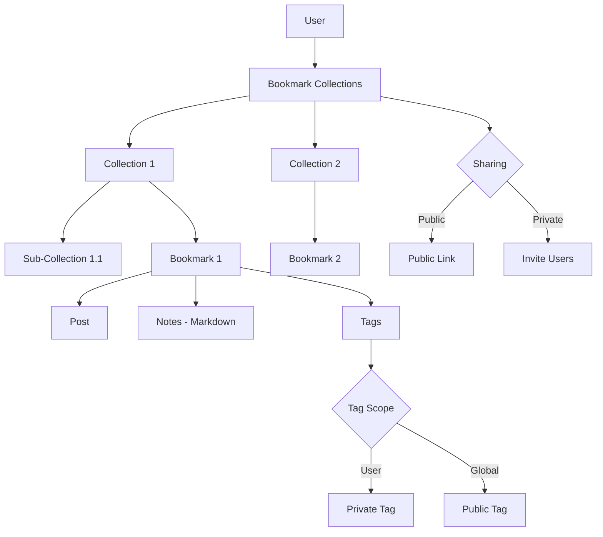

# En

hanced Bookmarks System Implementation

## Overview

Meningkatkan sistem bookmark dengan 4 fitur utama:

1. **Bookmark Collections**: Nested/hierarchical collections untuk organize bookmarks
2. **Bookmark Notes**: Private notes dengan markdown support untuk setiap bookmark
3. **Bookmark Sharing**: Share collections via public link atau invite-only
4. **Bookmark Tags**: Hybrid tag system (user-specific dengan opsi global)

## Architecture Overview




## Implementation Details

### 1. Bookmark Collections (Nested)

#### 1.1 Database Migrations

**File:** `database/migrations/YYYY_MM_DD_HHMMSS_create_bookmark_collections_table.php`

- Create `bookmark_collections` table:
- `id` (uuid primary key)
- `user_id` (uuid, foreign key)
- `parent_id` (nullable uuid, self-referencing for nesting)
- `name` (string)
- `description` (text, nullable)
- `icon` (string, nullable) - emoji atau icon identifier
- `color` (string, nullable) - hex color untuk visual distinction
- `sort_order` (integer, default 0)
- `is_default` (boolean, default false) - default "All Bookmarks" collection
- `timestamps`
- Unique constraint on `[user_id, name, parent_id]` (same name allowed in different parents)
- Index on `user_id`, `parent_id`, `sort_order`

**File:** `database/migrations/YYYY_MM_DD_HHMMSS_add_collection_to_bookmarks_table.php`

- Add `collection_id` (nullable uuid, foreign key) ke `bookmarks` table
- Index pada `collection_id`
- Update unique constraint to `[user_id, post_id, collection_id]` (allow same post in different collections)

#### 1.2 Models

**File:** `app/Models/BookmarkCollection.php` (NEW)

- Relationships: `user()`, `parent()`, `children()`, `bookmarks()`, `sharedWith()`
- Methods: `isRoot()`, `getPath()`, `getDepth()`, `canBeDeleted()`
- Scopes: `root()`, `forUser()`, `ordered()`

**Update:** `app/Models/Bookmark.php`

- Add `collection_id` to fillable
- Add relationships: `collection()`
- Add methods: `moveToCollection()`, `removeFromCollection()`

**Update:** `app/Models/User.php`

- Add relationship: `bookmarkCollections()`

#### 1.3 Collection Management Controller

**File:** `app/Http/Controllers/BookmarkCollectionController.php` (NEW)Methods:

- `index()` - List user collections (tree structure)
- `store()` - Create new collection
- `update()` - Update collection
- `destroy()` - Delete collection (with validation)
- `reorder()` - Update sort_order
- `move()` - Move collection to different parent

### 2. Bookmark Notes (Markdown)

#### 2.1 Database Migration

**File:** `database/migrations/YYYY_MM_DD_HHMMSS_add_notes_to_bookmarks_table.php`

- Add `notes` (text, nullable) ke `bookmarks` table
- Add `notes_updated_at` (timestamp, nullable)

#### 2.2 Update Bookmark Model

**Update:** `app/Models/Bookmark.php`

- Add `notes` to fillable
- Add `notes_updated_at` to casts (datetime)
- Add accessor: `hasNotes()`, `notesPreview()`

#### 2.3 Notes Controller Methods

**Update:** `app/Http/Controllers/BookmarkController.php`

- Add `updateNotes()` - Update bookmark notes
- Add `getNotes()` - Get notes for a bookmark

### 3. Bookmark Sharing

#### 3.1 Database Migrations

**File:** `database/migrations/YYYY_MM_DD_HHMMSS_add_sharing_to_bookmark_collections_table.php`

- Add `is_public` (boolean, default false)
- Add `public_slug` (string, nullable, unique) - untuk public link
- Add `share_settings` (json, nullable) - additional sharing settings
- Index pada `public_slug`

**File:** `database/migrations/YYYY_MM_DD_HHMMSS_create_bookmark_collection_shares_table.php`

- Create `bookmark_collection_shares` table:
- `id` (uuid primary key)
- `collection_id` (uuid, foreign key)
- `shared_with_user_id` (uuid, foreign key) - user yang di-invite
- `shared_by_user_id` (uuid, foreign key) - owner collection
- `permission` (enum: 'view', 'edit') - default 'view'
- `accepted_at` (timestamp, nullable)
- `timestamps`
- Unique constraint on `[collection_id, shared_with_user_id]`
- Index on `collection_id`, `shared_with_user_id`

#### 3.2 Models

**File:** `app/Models/BookmarkCollectionShare.php` (NEW)

- Relationships: `collection()`, `sharedWith()`, `sharedBy()`
- Scopes: `pending()`, `accepted()`, `forUser()`

**Update:** `app/Models/BookmarkCollection.php`

- Add relationships: `shares()`, `sharedWith()`
- Add methods: `generatePublicSlug()`, `isSharedWith()`, `canUserView()`, `canUserEdit()`
- Add accessor: `publicUrl()`

#### 3.3 Sharing Controller

**File:** `app/Http/Controllers/BookmarkCollectionShareController.php` (NEW)Methods:

- `togglePublic()` - Toggle public/private collection
- `generatePublicLink()` - Generate/regenerate public slug
- `invite()` - Invite user to collection
- `accept()` - Accept collection invitation
- `reject()` - Reject collection invitation
- `revoke()` - Revoke access (owner only)
- `updatePermission()` - Update user permission (view/edit)

**File:** `app/Http/Controllers/BookmarkCollectionPublicController.php` (NEW)Methods:

- `show()` - View public collection (no auth required if public)
- `index()` - List public collections (discovery)

### 4. Bookmark Tags

#### 4.1 Database Migrations

**File:** `database/migrations/YYYY_MM_DD_HHMMSS_create_bookmark_tags_table.php`

- Create `bookmark_tags` table:
- `id` (uuid primary key)
- `name` (string)
- `slug` (string, unique)
- `user_id` (nullable uuid, foreign key) - null untuk global tags
- `is_global` (boolean, default false)
- `usage_count` (integer, default 0) - untuk trending tags
- `timestamps`
- Unique constraint on `[name, user_id]` (same name allowed for different users)
- Index on `user_id`, `is_global`, `slug`, `usage_count`

**File:** `database/migrations/YYYY_MM_DD_HHMMSS_create_bookmark_tag_pivot_table.php`

- Create `bookmark_tag` pivot table:
- `id` (uuid primary key)
- `bookmark_id` (uuid, foreign key)
- `tag_id` (uuid, foreign key)
- `timestamps`
- Unique constraint on `[bookmark_id, tag_id]`
- Index on `bookmark_id`, `tag_id`

#### 4.2 Models

**File:** `app/Models/BookmarkTag.php` (NEW)

- Relationships: `user()`, `bookmarks()` (belongsToMany)
- Scopes: `global()`, `userSpecific()`, `popular()`, `forUser()`
- Methods: `incrementUsage()`, `decrementUsage()`, `makeGlobal()`, `makePrivate()`

**Update:** `app/Models/Bookmark.php`

- Add relationship: `tags()` (belongsToMany)
- Add methods: `addTag()`, `removeTag()`, `syncTags()`

#### 4.3 Tag Controller

**File:** `app/Http/Controllers/BookmarkTagController.php` (NEW)Methods:

- `index()` - List tags (user's + global)
- `store()` - Create tag
- `update()` - Update tag (name, global status)
- `destroy()` - Delete tag
- `toggleGlobal()` - Toggle global/private
- `suggestions()` - Get tag suggestions (autocomplete)

### 5. Frontend Components

#### 5.1 Collection Management

**File:** `resources/js/Components/Bookmarks/CollectionTree.vue` (NEW)

- Nested tree view untuk collections
- Drag & drop untuk reorder/move
- Context menu untuk actions

**File:** `resources/js/Components/Bookmarks/CollectionForm.vue` (NEW)

- Create/edit collection form
- Parent selection dropdown
- Icon & color picker

**File:** `resources/js/Components/Bookmarks/CollectionSelector.vue` (NEW)

- Dropdown untuk select collection saat bookmark
- Show collection tree
- Quick create option

#### 5.2 Notes Editor

**File:** `resources/js/Components/Bookmarks/BookmarkNotesEditor.vue` (NEW)

- Markdown editor dengan preview
- Auto-save
- Syntax highlighting

#### 5.3 Sharing UI

**File:** `resources/js/Components/Bookmarks/CollectionSharing.vue` (NEW)

- Toggle public/private
- Public link display & copy
- Invite user form
- Shared users list dengan permissions
- Accept/reject invitations

**File:** `resources/js/Pages/Bookmarks/Shared.vue` (NEW)

- List collections shared with user
- Pending invitations

**File:** `resources/js/Pages/Bookmarks/Public.vue` (NEW)

- Public collection view (no auth)
- Discovery page untuk public collections

#### 5.4 Tags UI

**File:** `resources/js/Components/Bookmarks/TagInput.vue` (NEW)

- Tag input dengan autocomplete
- Show user tags + global tags
- Create new tags on the fly
- Visual distinction untuk global vs user tags

**File:** `resources/js/Components/Bookmarks/TagList.vue` (NEW)

- Display tags untuk bookmark
- Click to filter
- Show usage count

**File:** `resources/js/Pages/Bookmarks/Tags.vue` (NEW)

- Manage user tags
- Toggle global/private
- View all bookmarks dengan specific tag

### 6. Updated Pages

#### 6.1 Bookmarks Index

**Update:** `resources/js/Pages/Bookmarks/Index.vue`

- Add collection sidebar/tree
- Filter by collection
- Filter by tags
- Show notes preview
- Bulk actions (move, tag, delete)

#### 6.2 Bookmark Actions

**Update:** Components yang menampilkan bookmark button

- Add collection selector saat bookmark
- Quick add notes
- Quick add tags

### 7. Routes

**File:** `routes/web.php`

```php
// Bookmark Collections
Route::middleware('auth')->group(function () {
    Route::get('/bookmarks/collections', [BookmarkCollectionController::class, 'index'])
        ->name('bookmarks.collections.index');
    Route::post('/bookmarks/collections', [BookmarkCollectionController::class, 'store'])
        ->name('bookmarks.collections.store');
    Route::put('/bookmarks/collections/{collection}', [BookmarkCollectionController::class, 'update'])
        ->name('bookmarks.collections.update');
    Route::delete('/bookmarks/collections/{collection}', [BookmarkCollectionController::class, 'destroy'])
        ->name('bookmarks.collections.destroy');
    Route::post('/bookmarks/collections/{collection}/reorder', [BookmarkCollectionController::class, 'reorder'])
        ->name('bookmarks.collections.reorder');
    Route::post('/bookmarks/collections/{collection}/move', [BookmarkCollectionController::class, 'move'])
        ->name('bookmarks.collections.move');
});

// Bookmark Notes
Route::middleware('auth')->group(function () {
    Route::put('/bookmarks/{bookmark}/notes', [BookmarkController::class, 'updateNotes'])
        ->name('bookmarks.notes.update');
    Route::get('/bookmarks/{bookmark}/notes', [BookmarkController::class, 'getNotes'])
        ->name('bookmarks.notes.show');
});

// Collection Sharing
Route::middleware('auth')->group(function () {
    Route::post('/bookmarks/collections/{collection}/toggle-public', [BookmarkCollectionShareController::class, 'togglePublic'])
        ->name('bookmarks.collections.toggle-public');
    Route::post('/bookmarks/collections/{collection}/generate-link', [BookmarkCollectionShareController::class, 'generatePublicLink'])
        ->name('bookmarks.collections.generate-link');
    Route::post('/bookmarks/collections/{collection}/invite', [BookmarkCollectionShareController::class, 'invite'])
        ->name('bookmarks.collections.invite');
    Route::post('/bookmarks/collections/{collection}/accept', [BookmarkCollectionShareController::class, 'accept'])
        ->name('bookmarks.collections.accept');
    Route::post('/bookmarks/collections/{collection}/reject', [BookmarkCollectionShareController::class, 'reject'])
        ->name('bookmarks.collections.reject');
    Route::delete('/bookmarks/collections/{collection}/revoke/{user}', [BookmarkCollectionShareController::class, 'revoke'])
        ->name('bookmarks.collections.revoke');
    Route::put('/bookmarks/collections/{collection}/permission/{user}', [BookmarkCollectionShareController::class, 'updatePermission'])
        ->name('bookmarks.collections.update-permission');
});

// Public Collections
Route::get('/bookmarks/public/{slug}', [BookmarkCollectionPublicController::class, 'show'])
    ->name('bookmarks.collections.public');
Route::get('/bookmarks/public', [BookmarkCollectionPublicController::class, 'index'])
    ->name('bookmarks.collections.public.index');

// Shared Collections
Route::middleware('auth')->group(function () {
    Route::get('/bookmarks/shared', [BookmarkCollectionShareController::class, 'sharedWithMe'])
        ->name('bookmarks.shared');
});

// Bookmark Tags
Route::middleware('auth')->group(function () {
    Route::get('/bookmarks/tags', [BookmarkTagController::class, 'index'])
        ->name('bookmarks.tags.index');
    Route::post('/bookmarks/tags', [BookmarkTagController::class, 'store'])
        ->name('bookmarks.tags.store');
    Route::put('/bookmarks/tags/{tag}', [BookmarkTagController::class, 'update'])
        ->name('bookmarks.tags.update');
    Route::delete('/bookmarks/tags/{tag}', [BookmarkTagController::class, 'destroy'])
        ->name('bookmarks.tags.destroy');
    Route::post('/bookmarks/tags/{tag}/toggle-global', [BookmarkTagController::class, 'toggleGlobal'])
        ->name('bookmarks.tags.toggle-global');
    Route::get('/bookmarks/tags/suggestions', [BookmarkTagController::class, 'suggestions'])
        ->name('bookmarks.tags.suggestions');
    Route::get('/bookmarks/tags/{tag}', [BookmarkTagController::class, 'show'])
        ->name('bookmarks.tags.show');
});
```


### 8. Policies

**File:** `app/Policies/BookmarkCollectionPolicy.php` (NEW)

- `view()`, `create()`, `update()`, `delete()`, `share()`

**File:** `app/Policies/BookmarkTagPolicy.php` (NEW)

- `view()`, `create()`, `update()`, `delete()`, `toggleGlobal()`

**Update:** `app/Policies/BookmarkPolicy.php`

- Add `updateNotes()`, `manageTags()`

### 9. Services

**File:** `app/Services/BookmarkCollectionService.php` (NEW)

- `createDefaultCollection()` - Auto-create default collection
- `moveCollection()` - Move dengan validation
- `deleteCollection()` - Delete dengan handling bookmarks
- `getCollectionTree()` - Build nested tree structure

**File:** `app/Services/BookmarkTagService.php` (NEW)

- `createOrGetTag()` - Create tag atau get existing
- `syncBookmarkTags()` - Sync tags untuk bookmark
- `getTagSuggestions()` - Autocomplete suggestions
- `incrementTagUsage()` - Update usage count

### 10. Notifications

**File:** `app/Notifications/CollectionInvitationNotification.php` (NEW)

- Notify user saat di-invite ke collection

**File:** `app/Notifications/CollectionSharedNotification.php` (NEW)

- Notify saat collection di-share (public link generated)

## Database Changes Summary

### New Tables

1. `bookmark_collections` - Collections dengan nested support
2. `bookmark_collection_shares` - Sharing relationships
3. `bookmark_tags` - Tags (user-specific + global)
4. `bookmark_tag` - Pivot table untuk bookmark-tag relationships

### Modified Tables

1. `bookmarks` - Add `collection_id`, `notes`, `notes_updated_at`
2. `bookmark_collections` - Add `is_public`, `public_slug`, `share_settings`

## Testing Considerations

- Nested collection structure validation
- Collection deletion dengan bookmarks handling
- Public link security & access control
- Tag global/private toggle permissions
- Notes markdown rendering
- Sharing permissions (view vs edit)
- Collection tree performance dengan large datasets

## Implementation Priority

### Phase 1 (Core Collections & Notes)

1. Create collections table & model
2. Add collection_id to bookmarks
3. Collection CRUD operations
4. Add notes field & editor
5. Update bookmarks index page

### Phase 2 (Nested & Tags)

6. Implement nested collections
7. Tag system (user-specific)
8. Tag autocomplete & suggestions
9. Filter bookmarks by collection & tags

### Phase 3 (Sharing)

10. Public link sharing
11. Invite-based sharing
12. Sharing permissions
13. Public collection discovery

### Phase 4 (Polish)