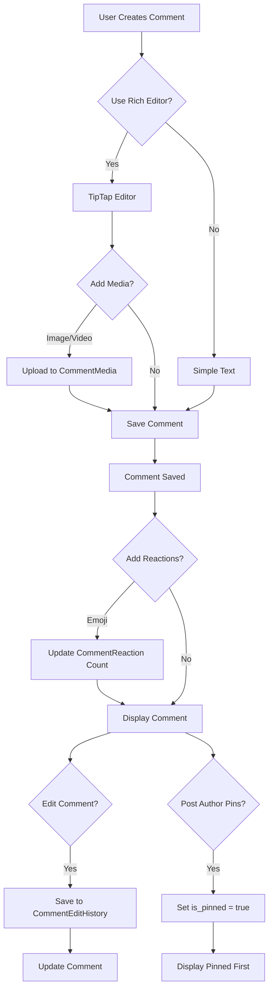

# Enhan

ced Comment Features Implementation

## Overview

Meningkatkan sistem komentar dengan 5 fitur utama:

1. **Media Attachments**: Upload gambar/video di komentar
2. **Rich Text Formatting**: Bold, italic, links menggunakan TipTap editor
3. **Emoji Reactions**: Emoji reactions selain upvote/downvote
4. **Edit History**: Tampilkan history edit komentar
5. **Comment Pinning**: Pin komentar penting (multiple pins oleh post author)

## Architecture Overview




## Implementation Details

### 1. Media Attachments

#### 1.1 Database Migration

**File:** `database/migrations/YYYY_MM_DD_HHMMSS_create_comment_media_table.php`

```php
Schema::create('comment_media', function (Blueprint $table) {
    $table->uuid('id')->primary();
    $table->uuid('comment_id');
    $table->string('file_path');
    $table->string('file_name');
    $table->string('mime_type');
    $table->unsignedBigInteger('file_size');
    $table->unsignedInteger('order')->default(0);
    $table->timestamps();
    
    $table->foreign('comment_id')->references('id')->on('comments')->onDelete('cascade');
    $table->index('comment_id');
});
```


#### 1.2 CommentMedia Model

**File:** `app/Models/CommentMedia.php` (NEW)

- Similar structure to `PostMedia`
- Relationship: `belongsTo(Comment::class)`
- Accessor: `getUrlAttribute()` untuk Storage URL

#### 1.3 Update Comment Model

**File:** `app/Models/Comment.php`

- Add relationship: `media(): HasMany CommentMedia`
- Add to fillable: (no changes needed, media handled separately)

#### 1.4 Image Upload API

**File:** `app/Http/Controllers/CommentController.php`

- Add method: `uploadImage(Request $request): JsonResponse`
- Similar to `PostController::uploadImage()`
- Store in `comments/images/temp/` directory

#### 1.5 Update Comment Store Method

**File:** `app/Http/Controllers/CommentController.php`

- Handle `images` array in validation
- Store images after comment creation
- Similar pattern to `PostController::storePostImages()`

### 2. Rich Text Formatting

#### 2.1 Update Comment Model

**File:** `app/Models/Comment.php`

- Change `content` field to support HTML (already text, no change needed)
- Add cast if needed: `'content' => 'string'` (default)

#### 2.2 Comment Rich Text Editor Component

**File:** `resources/js/Components/CommentRichTextEditor.vue` (NEW)

- Reuse TipTap editor from posts (simplified version)
- Include: Bold, Italic, Links, Image upload
- Smaller toolbar (less features than post editor)
- Inline image support

#### 2.3 Update Comment Form Components

**Files:**

- `resources/js/Components/CommentThread.vue`
- `resources/js/Pages/Posts/Show.vue`
- Replace `Textarea` with `CommentRichTextEditor`
- Handle HTML content display (use `v-html` with sanitization)

#### 2.4 Content Sanitization

**File:** `app/Http/Requests/StoreCommentRequest.php` (NEW) or update validation

- Sanitize HTML content
- Use Laravel's `Purifier` or similar
- Validate allowed HTML tags

### 3. Emoji Reactions

#### 3.1 Database Migration

**File:** `database/migrations/YYYY_MM_DD_HHMMSS_create_comment_reactions_table.php`

```php
Schema::create('comment_reactions', function (Blueprint $table) {
    $table->uuid('id')->primary();
    $table->uuid('comment_id');
    $table->string('emoji', 10); // Store emoji character
    $table->unsignedBigInteger('count')->default(0);
    $table->timestamps();
    
    $table->foreign('comment_id')->references('id')->on('comments')->onDelete('cascade');
    $table->unique(['comment_id', 'emoji']);
    $table->index('comment_id');
});
```


#### 3.2 CommentReaction Model

**File:** `app/Models/CommentReaction.php` (NEW)

- Relationships: `belongsTo(Comment::class)`
- Methods: `incrementCount()`, `decrementCount()`

#### 3.3 Update Comment Model

**File:** `app/Models/Comment.php`

- Add relationship: `reactions(): HasMany CommentReaction`
- Add method: `getReactionCount(string $emoji): int`

#### 3.4 Reaction Controller

**File:** `app/Http/Controllers/CommentReactionController.php` (NEW)

- Methods:
- `react(Request $request, Comment $comment)`: Add/remove reaction
- Validation: emoji must be in allowed list

#### 3.5 Allowed Emojis

**File:** `app/Constants/CommentReactions.php` (NEW) or config

- Define allowed emojis: 👍, ❤️, 😂, 🎉, 🔥, 💡, etc.
- Validation in controller

#### 3.6 Frontend Reaction Component

**File:** `resources/js/Components/CommentReactions.vue` (NEW)

- Display reaction buttons
- Show count per emoji
- Handle click to add/remove reaction
- Visual feedback for user's reactions

### 4. Edit History

#### 4.1 Database Migration

**File:** `database/migrations/YYYY_MM_DD_HHMMSS_create_comment_edit_history_table.php`

```php
Schema::create('comment_edit_history', function (Blueprint $table) {
    $table->uuid('id')->primary();
    $table->uuid('comment_id');
    $table->uuid('user_id');
    $table->text('content');
    $table->timestamp('edited_at');
    $table->timestamps();
    
    $table->foreign('comment_id')->references('id')->on('comments')->onDelete('cascade');
    $table->foreign('user_id')->references('id')->on('users')->onDelete('cascade');
    $table->index('comment_id');
});
```


#### 4.2 CommentEditHistory Model

**File:** `app/Models/CommentEditHistory.php` (NEW)

- Similar to `PostEditHistory`
- Relationships: `belongsTo(Comment::class)`, `belongsTo(User::class)`

#### 4.3 Update Comment Model

**File:** `app/Models/Comment.php`

- Add fields: `edited_at`, `edit_count`
- Add relationship: `editHistory(): HasMany CommentEditHistory`
- Add casts: `'edited_at' => 'datetime'`, `'edit_count' => 'integer'`

#### 4.4 Comment Edit Service

**File:** `app/Services/CommentEditService.php` (NEW)

- Method: `editComment(Comment $comment, array $data, string $userId): Comment`
- Save current state to history before updating
- Increment edit_count

#### 4.5 Update Comment Controller

**File:** `app/Http/Controllers/CommentController.php`

- Add method: `update(Request $request, Comment $comment)`
- Add method: `history(Request $request, Comment $comment)`
- Use `CommentEditService` for editing

#### 4.6 Edit History UI

**File:** `resources/js/Components/CommentEditHistory.vue` (NEW)

- Display edit history modal/dropdown
- Show previous versions with timestamps
- Compare versions (optional)

### 5. Comment Pinning

#### 5.1 Database Migration

**File:** `database/migrations/YYYY_MM_DD_HHMMSS_add_pinning_to_comments_table.php`

```php
Schema::table('comments', function (Blueprint $table) {
    $table->boolean('is_pinned')->default(false)->after('is_best_answer');
    $table->timestamp('pinned_at')->nullable()->after('is_pinned');
    $table->index('is_pinned');
});
```


#### 5.2 Update Comment Model

**File:** `app/Models/Comment.php`

- Add to fillable: `is_pinned`, `pinned_at`
- Add casts: `'is_pinned' => 'boolean'`, `'pinned_at' => 'datetime'`
- Add scopes: `pinned()`, `notPinned()`
- Add method: `isPinned(): bool`

#### 5.3 Pin/Unpin Controller Methods

**File:** `app/Http/Controllers/CommentController.php`

- Add method: `pin(Request $request, Comment $comment)`
- Add method: `unpin(Request $request, Comment $comment)`
- Authorization: Only post author can pin/unpin
- Allow multiple pins (no restriction)

#### 5.4 Update Comment Query

**File:** `app/Http/Controllers/PostController.php` (show method)

- Order comments: pinned first, then by upvotes/date
- Update query in `show()` method

#### 5.5 Pin UI Component

**File:** `resources/js/Components/CommentThread.vue`

- Add pin/unpin button (visible to post author only)
- Visual indicator for pinned comments
- Badge/icon for pinned status

## Routes

**File:** `routes/web.php`

```php
// Comment media upload
Route::post('/api/comments/upload-image', [CommentController::class, 'uploadImage'])
    ->middleware(['auth', 'throttle:10,1'])
    ->name('comments.upload-image');

// Comment editing
Route::put('/comments/{comment}', [CommentController::class, 'update'])
    ->middleware(['auth', 'throttle:10,5'])
    ->name('comments.update');
Route::get('/comments/{comment}/history', [CommentController::class, 'history'])
    ->middleware('auth')
    ->name('comments.history');

// Comment pinning
Route::post('/comments/{comment}/pin', [CommentController::class, 'pin'])
    ->middleware(['auth', 'throttle:10,5'])
    ->name('comments.pin');
Route::post('/comments/{comment}/unpin', [CommentController::class, 'unpin'])
    ->middleware(['auth', 'throttle:10,5'])
    ->name('comments.unpin');

// Comment reactions
Route::post('/comments/{comment}/reactions', [CommentReactionController::class, 'react'])
    ->middleware(['auth', 'throttle:30,5'])
    ->name('comments.reactions.react');
```


## Frontend Components Summary

### New Components

1. `resources/js/Components/CommentRichTextEditor.vue` - TipTap editor for comments
2. `resources/js/Components/CommentReactions.vue` - Emoji reaction buttons
3. `resources/js/Components/CommentEditHistory.vue` - Edit history display
4. `resources/js/Components/CommentMediaGallery.vue` - Display comment media

### Updated Components

1. `resources/js/Components/CommentThread.vue` - Add all new features
2. `resources/js/Pages/Posts/Show.vue` - Update comment form

## Backend Services Summary

### New Services

1. `app/Services/CommentEditService.php` - Comment editing with history

### New Models

1. `app/Models/CommentMedia.php`
2. `app/Models/CommentReaction.php`
3. `app/Models/CommentEditHistory.php`

### New Controllers

1. `app/Http/Controllers/CommentReactionController.php`

## Database Changes

### New Tables

1. `comment_media` - Media attachments
2. `comment_reactions` - Emoji reactions
3. `comment_edit_history` - Edit history

### Modified Tables

1. `comments` - Add `is_pinned`, `pinned_at`, `edited_at`, `edit_count`

## Validation & Security

- Image upload: Max 2MB per file, max 5 files per comment
- Video upload: Max 10MB per file, max 1 video per comment
- HTML sanitization for rich text content
- Emoji validation: Only allow predefined emojis
- Pin authorization: Only post author
- Edit authorization: Only comment author
- Rate limiting: Applied to all new endpoints

## Testing Considerations

- Media upload validation
- Rich text HTML sanitization
- Emoji reaction counting
- Edit history tracking
- Pin/unpin authorization
- Multiple pins per post
- Comment ordering (pinned first)

## Implementation Priority

### Phase 1 (Core Features)

1. Rich text formatting (TipTap editor)
2. Media attachments