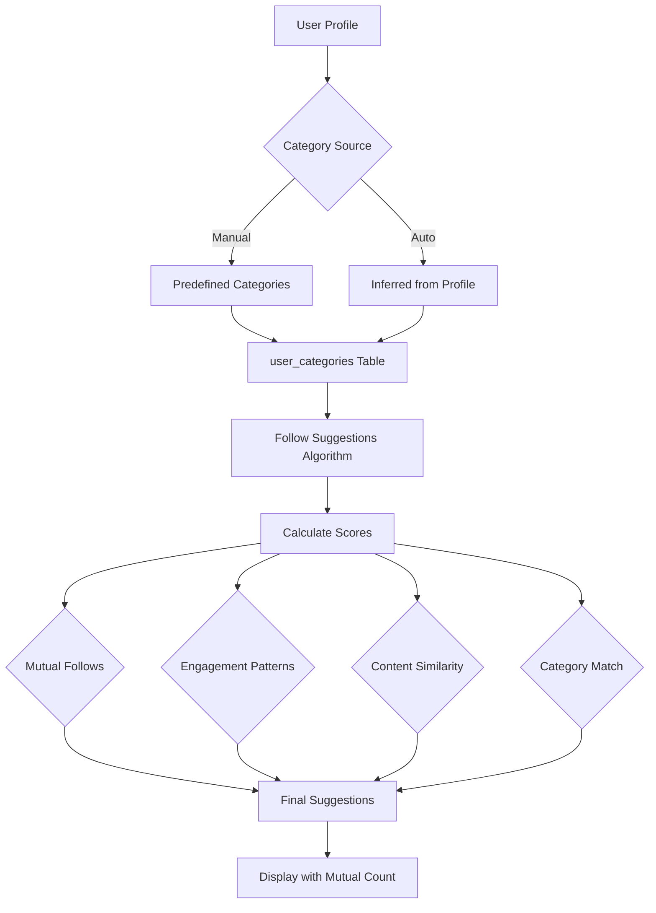

# En

hanced Follow System Implementation

## Overview

Meningkatkan sistem follow dengan 4 fitur utama:

1. **Follow Categories**: Kategori follow berdasarkan interest (predefined categories + inferred dari profile)
2. **AI-powered Suggestions**: Algoritma canggih untuk suggestions berdasarkan engagement patterns dan content similarity
3. **Mutual Connections**: Tampilkan mutual follows dengan UI yang lebih baik
4. **Follow Notifications**: Notifikasi yang sudah ada, ditambah informasi kategori

## Architecture Overview




## Implementation Details

### 1. Follow Categories

#### 1.1 Database Migrations

**File:** `database/migrations/YYYY_MM_DD_HHMMSS_create_categories_table.php`

- Create `categories` table dengan fields:
- `id` (uuid primary key)
- `name` (string, unique) - e.g., "Technology", "Business", "Design"
- `slug` (string, unique)
- `description` (text, nullable)
- `icon` (string, nullable) - untuk icon kategori
- `is_active` (boolean, default true)
- `sort_order` (integer, default 0)
- `timestamps`

**File:** `database/migrations/YYYY_MM_DD_HHMMSS_create_user_categories_table.php`

- Create `user_categories` pivot table:
- `id` (uuid primary key)
- `user_id` (uuid, foreign key)
- `category_id` (uuid, foreign key)
- `source` (enum: 'manual', 'inferred') - sumber kategori
- `confidence` (decimal, nullable) - untuk inferred categories
- `timestamps`
- Unique constraint on `[user_id, category_id]`

**File:** `database/migrations/YYYY_MM_DD_HHMMSS_add_category_to_follows_table.php`

- Add `category_id` (nullable uuid, foreign key) ke `follows` table
- Index pada `category_id`

#### 1.2 Category Constants & Seeder

**File:** `app/Constants/Categories.php` (NEW)Define predefined categories:

- Technology
- Business & Entrepreneurship
- Design & Creative
- Marketing & Sales
- Finance & Investment
- Education & Learning
- Health & Wellness
- Food & Beverage
- Travel & Lifestyle
- Other

**File:** `database/seeders/CategorySeeder.php` (NEW)Seed predefined categories dengan data default.

#### 1.3 Category Inference Service

**File:** `app/Services/CategoryInferenceService.php` (NEW)Methods:

- `inferCategoriesFromProfile(User $user): Collection` - Infer categories dari business_field, skills, posts
- `matchBusinessFieldToCategories(string $businessField): Collection` - Match business_field ke categories
- `matchSkillsToCategories(array $skills): Collection` - Match skills array ke categories
- `analyzePostsForCategories(User $user): Collection` - Analisis posts untuk menentukan categories
- `updateUserCategories(User $user): void` - Update user categories (manual + inferred)

#### 1.4 Models

**File:** `app/Models/Category.php` (NEW)

- Relationships: `users()` (belongsToMany), `follows()`
- Scopes: `active()`, `ordered()`

**File:** `app/Models/UserCategory.php` (NEW)

- Relationships: `user()`, `category()`
- Scopes untuk `manual` dan `inferred`

**Update:** `app/Models/User.php`

- Add relationships: `categories()`, `manualCategories()`, `inferredCategories()`
- Add methods: `getAllCategories()`, `hasCategory()`

**Update:** `app/Models/Follow.php`

- Add `category_id` to fillable
- Add relationship: `category()`

#### 1.5 Category Management Controller

**File:** `app/Http/Controllers/UserCategoryController.php` (NEW)Methods:

- `index()` - List user categories
- `store()` - Add category to user (manual)
- `destroy()` - Remove category from user
- `sync()` - Sync multiple categories

### 2. AI-powered Follow Suggestions

#### 2.1 Enhanced Follow Suggestion Service

**File:** `app/Services/FollowSuggestionService.php` (NEW)Methods:

- `getSuggestions(User $user, int $limit = 10): Collection` - Main method
- `calculateMutualFollowsScore(User $user, User $suggested): float` - Score berdasarkan mutual follows
- `calculateEngagementScore(User $user, User $suggested): float` - Score berdasarkan engagement patterns
- `calculateContentSimilarityScore(User $user, User $suggested): float` - Score berdasarkan content similarity
- `calculateCategoryMatchScore(User $user, User $suggested): float` - Score berdasarkan category match
- `calculateFinalScore(array $scores): float` - Combine semua scores dengan weights
- `getEngagementMetrics(User $user): array` - Calculate engagement metrics (post count, avg upvotes, etc.)

**Algorithm Details:**

- Mutual Follows (40% weight): Users yang difollow oleh mutual connections
- Engagement Patterns (25% weight): Similar engagement levels (post frequency, interaction patterns)
- Content Similarity (20% weight): Similar hashtags, purpose_types, keywords
- Category Match (15% weight): Shared categories/interests

**Update:** `app/Services/FollowService.php`

- Update `getFollowSuggestions()` to use `FollowSuggestionService`
- Keep backward compatibility

#### 2.2 Suggestion Controller

**File:** `app/Http/Controllers/FollowSuggestionController.php` (NEW)Methods:

- `index()` - Get AI-powered suggestions dengan scores breakdown
- `refresh()` - Regenerate suggestions (cache bust)

### 3. Mutual Connections

#### 3.1 Update FollowService

**Update:** `app/Services/FollowService.php`

- Existing `getMutualConnections()` method sudah ada, enhance dengan:
- Limit parameter
- Pagination support
- Include user details

#### 3.2 Mutual Connections Controller

**File:** `app/Http/Controllers/MutualConnectionController.php` (NEW)Methods:

- `index(User $user)` - Get mutual connections antara current user dan target user
- Return dengan pagination dan mutual follow count

#### 3.3 UI Components

**File:** `resources/js/Components/MutualConnections.vue` (NEW)

- Display mutual connections list
- Show mutual count badge
- Link to profiles

**Update:** `resources/js/Pages/Profile/Show.vue`

- Add mutual connections section (visible when viewing other user's profile)

**Update:** `resources/js/Pages/Profile/Followers.vue` dan `Following.vue`

- Add mutual connections indicator untuk setiap user di list

### 4. Follow Notifications Enhancement

#### 4.1 Update Notification

**Update:** `app/Notifications/NewFollowNotification.php`

- Add category information ke notification data
- Include mutual connections count jika ada
- Enhance message dengan category info

**Update:** `app/Services/NotificationService.php`

- Update `notifyNewFollow()` to include category and mutual info

#### 4.2 Notification UI

**Update:** Notification display components untuk menampilkan:

- Category badges (jika user follow berdasarkan category)
- Mutual connections count

### 5. Frontend Components

#### 5.1 Category Selection Component

**File:** `resources/js/Components/CategorySelector.vue` (NEW)

- Multi-select component untuk categories
- Show predefined categories dengan icons
- Show inferred categories dengan badge "Auto-detected"
- Allow manual add/remove

#### 5.2 Enhanced Follow Suggestions Page

**File:** `resources/js/Pages/Follow/Suggestions.vue` (NEW)

- Display AI-powered suggestions
- Show score breakdown (tooltip/modal)
- Show mutual connections count
- Show category matches
- Filter by category
- "Follow" button dengan category selection option

#### 5.3 Category Badges Component

**File:** `resources/js/Components/CategoryBadge.vue` (NEW)

- Reusable component untuk display category
- Support different sizes
- Show source (manual/inferred)

### 6. Routes

**File:** `routes/web.php`

```php
// User categories
Route::middleware('auth')->group(function () {
    Route::get('/user/categories', [UserCategoryController::class, 'index'])
        ->name('user.categories.index');
    Route::post('/user/categories', [UserCategoryController::class, 'store'])
        ->name('user.categories.store');
    Route::delete('/user/categories/{category}', [UserCategoryController::class, 'destroy'])
        ->name('user.categories.destroy');
    Route::post('/user/categories/sync', [UserCategoryController::class, 'sync'])
        ->name('user.categories.sync');
});

// Follow suggestions
Route::middleware('auth')->group(function () {
    Route::get('/follow/suggestions', [FollowSuggestionController::class, 'index'])
        ->name('follow.suggestions');
    Route::post('/follow/suggestions/refresh', [FollowSuggestionController::class, 'refresh'])
        ->name('follow.suggestions.refresh');
});

// Mutual connections
Route::middleware('auth')->group(function () {
    Route::get('/users/{user}/mutual-connections', [MutualConnectionController::class, 'index'])
        ->name('users.mutual-connections');
});
```


### 7. Background Jobs (Optional)

**File:** `app/Jobs/InferUserCategories.php` (NEW)

- Queue job untuk infer categories secara async
- Trigger ketika user update profile atau create posts

**Update:** `app/Console/Kernel.php` atau `routes/console.php`

- Scheduled job untuk refresh category inferences (daily/weekly)

## Database Changes Summary

### New Tables

1. `categories` - Predefined categories
2. `user_categories` - User-category relationships (manual + inferred)

### Modified Tables

1. `follows` - Add `category_id` column

## Testing Considerations

- Category inference accuracy
- Follow suggestion algorithm effectiveness
- Mutual connections calculation correctness
- Category-based follow filtering
- Performance dengan large datasets
- Cache invalidation untuk suggestions

## Implementation Priority

### Phase 1 (Core Categories)

1. Create categories table dan seeder
2. Create user_categories table
3. Create Category model dan relationships
4. Basic category selection UI

### Phase 2 (Inference & Suggestions)

5. Category inference service
6. Enhanced follow suggestions algorithm
7. Follow suggestions page dengan scores

### Phase 3 (Mutual & Notifications)