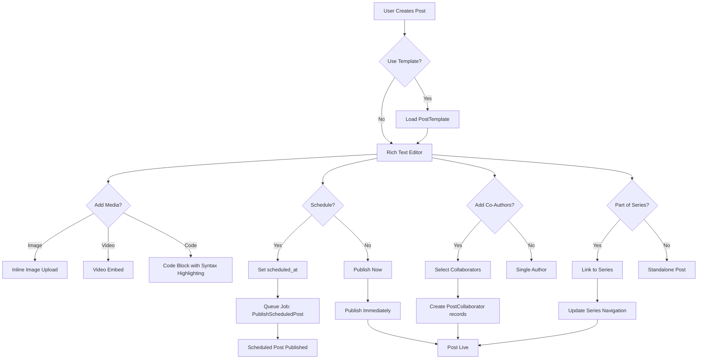

# Enhanc

ed Post Features Implementation

## Overview

Meningkatkan fitur Posts dengan integrasi penuh rich text editor TipTap, post templates untuk business posts, scheduled posts, post series navigation, dan post collaboration (co-authors). Fitur-fitur ini akan meningkatkan user experience dan functionality platform secara signifikan.

## Architecture Overview




## Implementation Details

### 1. Rich Text Editor Enhancements

#### 1.1 Install Required TipTap Extensions

**File:** `package.json`Tambahkan dependencies:

- `@tiptap/extension-image` - Image support
- `@tiptap/extension-youtube` - YouTube embed
- `@tiptap/extension-code-block-lowlight` - Code syntax highlighting
- `lowlight` - Syntax highlighting library
- `@tiptap/extension-link` - Link support (jika belum ada)

#### 1.2 Enhanced TipTap Editor Component

**File:** `resources/js/Components/RichTextEditor/TipTapEditor.vue`**Changes:**

- Add image upload extension dengan inline upload
- Add YouTube video embed extension
- Add code block dengan syntax highlighting (lowlight)
- Add image upload button di toolbar
- Add video embed button di toolbar
- Add code block button dengan language selector
- Handle image upload via API endpoint
- Store uploaded images di `PostMedia` table
- Embed images sebagai base64 atau URL

**Image Upload Flow:**

1. User klik image button di toolbar
2. File picker opens
3. Image uploaded ke `/api/posts/upload-image` endpoint
4. Response returns image URL
5. Image inserted ke editor sebagai `` tag

**Video Embed Flow:**

1. User klik video button di toolbar
2. Modal opens untuk input YouTube/Vimeo URL
3. URL validated dan converted ke embed format
4. Video embedded sebagai iframe

**Code Block Flow:**

1. User klik code block button
2. Language selector dropdown
3. Code block created dengan language attribute
4. Syntax highlighting applied via lowlight

#### 1.3 Image Upload API Endpoint

**File:** `app/Http/Controllers/PostController.php`**New Method:**

```php
public function uploadImage(Request $request): JsonResponse
{
    $request->validate([
        'image' => ['required', 'image', 'max:2048', 'mimes:jpeg,jpg,png,gif,webp'],
    ]);

    $image = $request->file('image');
    $fileName = Str::uuid() . '_' . time() . '.' . $image->getClientOriginalExtension();
    $filePath = 'posts/images/temp/' . $fileName;
    
    $image->storeAs('posts/images/temp', $fileName, 'public');
    
    return response()->json([
        'url' => Storage::url($filePath),
        'path' => $filePath,
    ]);
}
```

**Route:** `POST /api/posts/upload-image` (dalam `auth` middleware)

### 2. Post Templates Integration

#### 2.1 Update PostTemplate Model

**File:** `app/Models/PostTemplate.php`**Already exists** - No changes needed, but ensure:

- `title_template` dan `content_template` support placeholders
- `is_public` untuk share templates
- `usage_count` untuk tracking

#### 2.2 Template Selection Component

**File:** `resources/js/Components/PostTemplateSelector.vue` (NEW)**Features:**

- List templates (user's templates + public templates)
- Search/filter templates
- Preview template
- Apply template ke form
- Create new template dari current post

#### 2.3 Integrate Templates ke Post Create Form

**File:** `resources/js/Pages/Posts/Create.vue`**Changes:**

- Add template selector sebelum form
- Load template data saat template selected
- Pre-fill form dengan template content
- Support placeholders (e.g., `{{date}}`, `{{user_name}}`)

#### 2.4 Template Placeholder Service

**File:** `app/Services/PostTemplateService.php` (NEW)**Methods:**

- `processTemplate(string $template, User $user): string` - Replace placeholders
- `getAvailablePlaceholders(): array` - List available placeholders
- `createFromPost(Post $post, string $name, bool $isPublic = false): PostTemplate`

### 3. Scheduled Posts

#### 3.1 Database Migration

**File:** `database/migrations/YYYY_MM_DD_HHMMSS_add_scheduled_at_to_posts_table.php`

```php
Schema::table('posts', function (Blueprint $table) {
    $table->timestamp('scheduled_at')->nullable()->after('created_at');
    $table->enum('publish_status', ['draft', 'scheduled', 'published'])->default('published')->after('status');
    $table->index('scheduled_at');
    $table->index('publish_status');
});
```


#### 3.2 Update Post Model

**File:** `app/Models/Post.php`**Changes:**

- Add `scheduled_at` dan `publish_status` ke fillable
- Add casts untuk `scheduled_at` (datetime) dan `publish_status` (string)
- Add scopes: `scheduled()`, `draft()`, `published()`
- Add methods: `isScheduled()`, `isDraft()`, `canPublish()`

#### 3.3 Scheduled Post Job

**File:** `app/Jobs/PublishScheduledPost.php` (NEW)**Purpose:** Publish scheduled posts saat `scheduled_at` time reached**Logic:**

- Find posts where `scheduled_at <= now()` dan `publish_status = 'scheduled'`
- Update `publish_status` ke `'published'`
- Update `status` ke `'active'`
- Send notification ke author

#### 3.4 Scheduled Command

**File:** `app/Console/Commands/PublishScheduledPosts.php` (NEW)**Purpose:** Run setiap menit untuk check dan publish scheduled posts**Schedule:** `routes/console.php` atau `app/Console/Kernel.php`

```php
Schedule::command('posts:publish-scheduled')->everyMinute();
```


#### 3.5 Update Post Controller

**File:** `app/Http/Controllers/PostController.php`**Changes:**

- Update `store()` method untuk handle `scheduled_at`
- Set `publish_status` berdasarkan `scheduled_at`
- If scheduled, don't publish immediately
- Add validation untuk `scheduled_at` (must be future date)

#### 3.6 Update Post Create Form

**File:** `resources/js/Pages/Posts/Create.vue`**Changes:**

- Add "Schedule Post" toggle
- Add datetime picker untuk `scheduled_at`
- Show preview of scheduled time
- Disable publish button jika scheduled time invalid

### 4. Post Series Navigation

#### 4.1 Series Navigation Component

**File:** `resources/js/Components/PostSeriesNavigation.vue` (NEW)**Features:**

- Show series title/name
- List all posts dalam series dengan order
- Highlight current post
- Previous/Next navigation buttons
- Series progress indicator (e.g., "Part 2 of 5")
- Link ke series root

#### 4.2 Update Post Show Page

**File:** `resources/js/Pages/Posts/Show.vue`**Changes:**

- Load series data jika post part of series
- Display `PostSeriesNavigation` component di atas/bawah post
- Show series info di post header

#### 4.3 Series Management in Post Create/Edit

**File:** `resources/js/Pages/Posts/Create.vue` dan `Edit.vue`**Changes:**

- Add "Add to Series" option
- Show existing series list (user's series)
- Option untuk create new series
- Show series posts order
- Allow reordering posts dalam series

#### 4.4 Series Service Updates

**File:** `app/Services/PostSeriesService.php`**Already exists** - Add methods:

- `getSeriesNavigation(Post $post): array` - Get navigation data
- `getSeriesMetadata(Post $seriesRoot): array` - Get series info (total posts, etc.)

### 5. Post Collaboration (Co-Authors)

#### 5.1 Database Migration

**File:** `database/migrations/YYYY_MM_DD_HHMMSS_create_post_collaborators_table.php`

```php
Schema::create('post_collaborators', function (Blueprint $table) {
    $table->uuid('id')->primary();
    $table->uuid('post_id');
    $table->uuid('user_id');
    $table->enum('role', ['co_author', 'editor', 'contributor'])->default('co_author');
    $table->boolean('can_edit')->default(true);
    $table->boolean('can_publish')->default(false);
    $table->timestamp('invited_at');
    $table->timestamp('accepted_at')->nullable();
    $table->enum('status', ['pending', 'accepted', 'rejected'])->default('pending');
    $table->timestamps();
    
    $table->foreign('post_id')->references('id')->on('posts')->onDelete('cascade');
    $table->foreign('user_id')->references('id')->on('users')->onDelete('cascade');
    $table->unique(['post_id', 'user_id']);
    $table->index(['post_id', 'status']);
    $table->index('user_id');
});
```


#### 5.2 PostCollaborator Model

**File:** `app/Models/PostCollaborator.php` (NEW)**Relationships:**

- `post()` - BelongsTo Post
- `user()` - BelongsTo User

**Methods:**

- `accept()` - Accept collaboration invitation
- `reject()` - Reject invitation
- `canEdit()` - Check edit permission
- `canPublish()` - Check publish permission

#### 5.3 Update Post Model

**File:** `app/Models/Post.php`**Changes:**

- Add relationship: `collaborators()` - HasMany PostCollaborator
- Add relationship: `coAuthors()` - HasMany PostCollaborator where role = 'co_author'
- Add method: `isCollaborator(User $user): bool`
- Add method: `canUserEdit(User $user): bool`
- Add method: `canUserPublish(User $user): bool`

#### 5.4 Collaboration Service

**File:** `app/Services/PostCollaborationService.php` (NEW)**Methods:**

- `inviteCollaborator(Post $post, User $inviter, User $invitee, string $role, array $permissions): PostCollaborator`
- `acceptInvitation(PostCollaborator $collaboration): bool`
- `rejectInvitation(PostCollaborator $collaboration): bool`
- `removeCollaborator(Post $post, User $collaborator, User $remover): bool`
- `updatePermissions(PostCollaborator $collaboration, array $permissions): bool`
- `getCollaborators(Post $post): Collection`
- `canUserEdit(Post $post, User $user): bool`
- `canUserPublish(Post $post, User $user): bool`

#### 5.5 Collaboration Controller

**File:** `app/Http/Controllers/PostCollaborationController.php` (NEW)**Methods:**

- `invite(Request $request, Post $post)` - Invite collaborator
- `accept(Request $request, PostCollaborator $collaboration)` - Accept invitation
- `reject(Request $request, PostCollaborator $collaboration)` - Reject invitation
- `remove(Request $request, Post $post, User $collaborator)` - Remove collaborator
- `updatePermissions(Request $request, PostCollaborator $collaboration)` - Update permissions

#### 5.6 Collaboration Component

**File:** `resources/js/Components/PostCollaborationManager.vue` (NEW)**Features:**

- List current collaborators
- Search users untuk invite
- Invite collaborator dengan role selection
- Show pending invitations
- Accept/reject invitations
- Remove collaborators
- Update permissions

#### 5.7 Update Post Create/Edit Forms

**File:** `resources/js/Pages/Posts/Create.vue` dan `Edit.vue`**Changes:**

- Add collaboration section
- Integrate `PostCollaborationManager` component
- Show collaborators di post preview
- Handle collaboration permissions saat edit

#### 5.8 Update Post Policies

**File:** `app/Policies/PostPolicy.php` (if exists) atau create new**Changes:**

- Update `update()` method untuk check collaboration permissions
- Add `inviteCollaborator()` method
- Add `removeCollaborator()` method

#### 5.9 Collaboration Notifications

**File:** `app/Services/NotificationService.php`**New Methods:**

- `notifyCollaborationInvitation(PostCollaborator $collaboration)`
- `notifyCollaborationAccepted(PostCollaborator $collaboration)`
- `notifyCollaborationRejected(PostCollaborator $collaboration)`
- `notifyPostEditedByCollaborator(Post $post, User $collaborator)`

### 6. Routes

**File:** `routes/web.php`**New Routes:**

```php
// Image upload for rich text editor
Route::post('/api/posts/upload-image', [PostController::class, 'uploadImage'])
    ->middleware(['auth', 'throttle:10,1'])
    ->name('posts.upload-image');

// Post collaboration
Route::middleware('auth')->group(function () {
    Route::post('/posts/{post}/collaborators/invite', [PostCollaborationController::class, 'invite'])
        ->name('posts.collaborators.invite');
    Route::post('/posts/collaborators/{collaboration}/accept', [PostCollaborationController::class, 'accept'])
        ->name('posts.collaborators.accept');
    Route::post('/posts/collaborators/{collaboration}/reject', [PostCollaborationController::class, 'reject'])
        ->name('posts.collaborators.reject');
    Route::delete('/posts/{post}/collaborators/{user}', [PostCollaborationController::class, 'remove'])
        ->name('posts.collaborators.remove');
    Route::put('/posts/collaborators/{collaboration}/permissions', [PostCollaborationController::class, 'updatePermissions'])
        ->name('posts.collaborators.update-permissions');
});
```


### 7. Validation Updates

**File:** `app/Http/Requests/StorePostRequest.php`**Changes:**

- Add `scheduled_at` validation (nullable, date, after:now)
- Add `publish_status` validation
- Add `template_id` validation (nullable, exists:post_templates,id)
- Add `series_id` validation (nullable, exists:posts,id)
- Add `collaborators` validation (nullable, array)

**File:** `app/Http/Requests/UpdatePostRequest.php`**Same changes as StorePostRequest**

## Frontend Components Summary

### New Components

1. `resources/js/Components/RichTextEditor/EnhancedTipTapEditor.vue` - Enhanced editor dengan semua extensions
2. `resources/js/Components/PostTemplateSelector.vue` - Template selection
3. `resources/js/Components/PostSeriesNavigation.vue` - Series navigation
4. `resources/js/Components/PostCollaborationManager.vue` - Collaboration management
5. `resources/js/Components/ImageUploader.vue` - Inline image upload (enhance existing)
6. `resources/js/Components/VideoEmbedModal.vue` - Video embed modal
7. `resources/js/Components/CodeBlockLanguageSelector.vue` - Code language selector

### Updated Components

1. `resources/js/Pages/Posts/Create.vue` - Add semua fitur baru
2. `resources/js/Pages/Posts/Edit.vue` - Add semua fitur baru
3. `resources/js/Pages/Posts/Show.vue` - Add series navigation, show collaborators

## Backend Services Summary

### New Services

1. `app/Services/PostTemplateService.php` - Template processing
2. `app/Services/PostCollaborationService.php` - Collaboration management

### Updated Services

1. `app/Services/PostSeriesService.php` - Add navigation methods

### New Jobs

1. `app/Jobs/PublishScheduledPost.php` - Publish scheduled posts

### New Commands

1. `app/Console/Commands/PublishScheduledPosts.php` - Scheduled command

## Database Changes

### New Tables

1. `post_collaborators` - Collaboration relationships

### Modified Tables

1. `posts` - Add `scheduled_at`, `publish_status` columns

## Testing Considerations

### Unit Tests

- PostTemplateService tests
- PostCollaborationService tests
- PostSeriesService navigation tests
- Image upload validation tests

### Feature Tests

- Rich text editor image upload
- Video embed functionality
- Code syntax highlighting
- Template application
- Scheduled post publishing
- Series navigation
- Collaboration invitation flow
- Collaboration permissions

### Integration Tests

- End-to-end post creation dengan semua fitur
- Scheduled post publishing flow
- Collaboration workflow

## Implementation Priority

### Phase 1 (Core Rich Text Features)

1. Image upload inline
2. Video embed
3. Code syntax highlighting

### Phase 2 (Templates & Scheduling)

4. Post templates integration
5. Scheduled posts

### Phase 3 (Series & Collaboration)

6. Post series navigation
7. Post collaboration

## Notes

- TipTap extensions perlu di-install via npm
- Image uploads stored di `storage/app/public/posts/images/`
- Scheduled posts require queue worker running
- Collaboration notifications sent via existing NotificationService