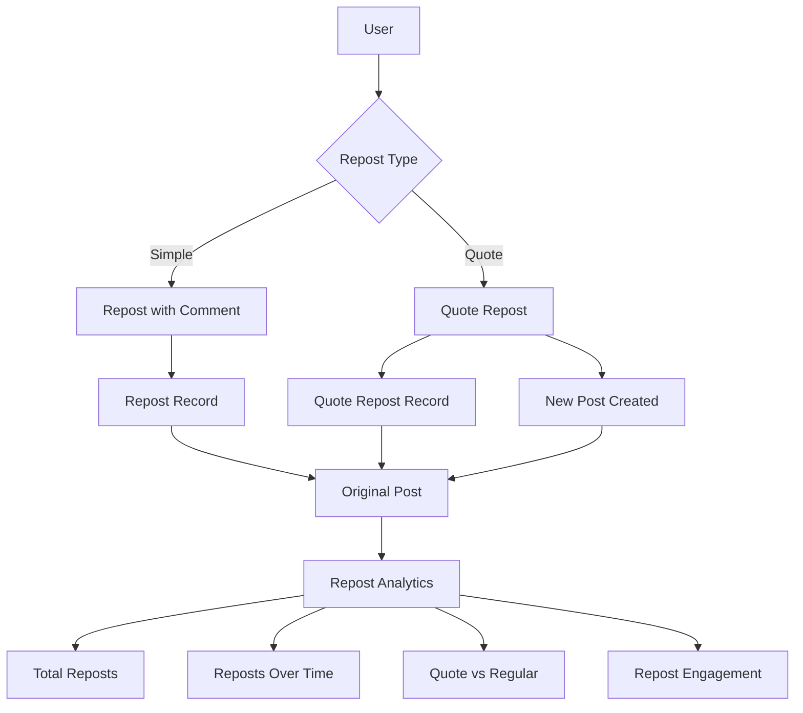

# Enhanced Repost System Implementation

## Overview

Meningkatkan sistem repost dengan 3 fitur utama:

1. **Repost dengan Komentar**: Tambahkan komentar saat repost (simple text comment)
2. **Quote Repost**: Repost dengan quote (Twitter-style quote tweet) - dapat ditampilkan sebagai embedded atau separate post
3. **Repost Analytics**: Analytics detail untuk melacak reposts dari post pengguna

## Architecture Overview




## Implementation Details

### 1. Repost dengan Komentar

#### 1.1 Database Migration

**File:** `database/migrations/YYYY_MM_DD_HHMMSS_add_comment_to_reposts_table.php`

- Add `comment` (text, nullable) ke `reposts` table
- Add `comment_updated_at` (timestamp, nullable)

#### 1.2 Update Repost Model

**Update:** `app/Models/Repost.php`

- Add `comment` to fillable
- Add `comment_updated_at` to casts (datetime)
- Add accessor: `hasComment()`, `commentPreview()`
- Add method: `updateComment()`

#### 1.3 Update Repost Controller

**Update:** `app/Http/Controllers/RepostController.php`

- Update `store()` method to accept `comment` parameter
- Add `updateComment()` method to update repost comment
- Add `removeComment()` method to remove comment

### 2. Quote Repost

#### 2.1 Database Migration

**File:** `database/migrations/YYYY_MM_DD_HHMMSS_add_quote_fields_to_reposts_table.php`

- Add `is_quote_repost` (boolean, default false)
- Add `quote_content` (text, nullable) - rich content untuk quote
- Add `quote_post_id` (nullable uuid, foreign key) - reference ke post yang dibuat untuk quote repost
- Add `display_mode` (enum: 'embedded', 'separate', default 'embedded')

**File:** `database/migrations/YYYY_MM_DD_HHMMSS_add_original_post_id_to_posts_table.php`

- Add `original_post_id` (nullable uuid, foreign key) - untuk quote repost posts
- Add `is_quote_repost` (boolean, default false) - flag untuk identify quote repost posts
- Index pada `original_post_id`, `is_quote_repost`

#### 2.2 Update Models

**Update:** `app/Models/Repost.php`

- Add `is_quote_repost`, `quote_content`, `quote_post_id`, `display_mode` to fillable
- Add relationships: `quotePost()` (belongsTo Post)
- Add methods: `isQuoteRepost()`, `getDisplayMode()`

**Update:** `app/Models/Post.php`

- Add `original_post_id`, `is_quote_repost` to fillable
- Add relationships: `originalPost()` (belongsTo), `quoteReposts()` (HasMany)
- Add methods: `isQuoteRepost()`, `getOriginalPost()`

#### 2.3 Quote Repost Service

**File:** `app/Services/QuoteRepostService.php` (NEW)

- `createQuoteRepost()` - Create quote repost dengan post baru
- `updateQuoteContent()` - Update quote content
- `deleteQuoteRepost()` - Delete quote repost dan post terkait
- `convertToEmbedded()` - Convert separate post to embedded
- `convertToSeparate()` - Convert embedded to separate post

#### 2.4 Update Repost Controller

**Update:** `app/Http/Controllers/RepostController.php`

- Add `storeQuote()` method untuk create quote repost
- Add `updateQuote()` method untuk update quote content
- Add `toggleDisplayMode()` method untuk switch antara embedded/separate
- Update `destroy()` untuk handle quote repost deletion

### 3. Repost Analytics

#### 3.1 Database Migration

**File:** `database/migrations/YYYY_MM_DD_HHMMSS_create_repost_analytics_table.php`

- Create `repost_analytics` table:
- `id` (uuid primary key)
- `post_id` (uuid, foreign key)
- `date` (date)
- `reposts_count` (integer, default 0)
- `quote_reposts_count` (integer, default 0)
- `reposts_with_comments_count` (integer, default 0)
- `unique_reposters_count` (integer, default 0)
- `timestamps`
- Unique constraint on `[post_id, date]`
- Index on `post_id`, `date`

#### 3.2 Repost Analytics Model

**File:** `app/Models/RepostAnalytics.php` (NEW)

- Relationships: `post()`
- Scopes: `forPost()`, `forDateRange()`, `latest()`
- Methods: `incrementMetrics()`, `getDailyStats()`

#### 3.3 Repost Analytics Service

**File:** `app/Services/RepostAnalyticsService.php` (NEW)

- `trackRepost()` - Track repost event
- `getRepostBreakdown()` - Get breakdown by type (regular, quote, with comment)
- `getRepostTimeline()` - Get reposts over time
- `getRepostersList()` - Get list of users who reposted
- `getRepostEngagement()` - Calculate engagement metrics
- `getTopReposters()` - Get users who reposted most
- `aggregateDailyStats()` - Aggregate daily statistics

#### 3.4 Repost Analytics Controller

**File:** `app/Http/Controllers/RepostAnalyticsController.php` (NEW)

- `show()` - Show repost analytics untuk post
- `breakdown()` - Get repost breakdown
- `timeline()` - Get repost timeline
- `reposters()` - Get list of reposters
- `engagement()` - Get engagement metrics
- `export()` - Export analytics data

### 4. Frontend Components

#### 4.1 Repost Components

**File:** `resources/js/Components/Repost/RepostButton.vue` (NEW/UPDATE)

- Button untuk repost dengan dropdown options:
- Simple repost
- Repost with comment
- Quote repost
- Show repost count
- Handle different repost types

**File:** `resources/js/Components/Repost/RepostCommentForm.vue` (NEW)

- Form untuk add/edit comment saat repost
- Text input dengan character limit
- Preview comment

**File:** `resources/js/Components/Repost/QuoteRepostEditor.vue` (NEW)

- Rich text editor untuk quote repost
- Display mode selector (embedded/separate)
- Preview original post
- Similar to post composer but for quotes

**File:** `resources/js/Components/Repost/QuoteRepostDisplay.vue` (NEW)

- Display quote repost dalam feed
- Support embedded dan separate display modes
- Show original post dengan quote content
- Interaction buttons (like, comment, etc.)

**File:** `resources/js/Components/Repost/RepostList.vue` (NEW)

- List users who reposted
- Show repost type (regular, quote, with comment)
- Filter by type
- Pagination

#### 4.2 Analytics Components

**File:** `resources/js/Components/Analytics/RepostAnalytics.vue` (NEW)

- Main analytics dashboard untuk reposts
- Charts untuk reposts over time
- Breakdown by type
- Engagement metrics
- Top reposters list

**File:** `resources/js/Components/Analytics/RepostTimeline.vue` (NEW)

- Timeline chart untuk reposts
- Filter by date range
- Show quote vs regular reposts

**File:** `resources/js/Components/Analytics/RepostBreakdown.vue` (NEW)

- Pie/bar chart untuk repost breakdown
- Regular vs Quote vs With Comment
- Percentage distribution

### 5. Updated Pages

#### 5.1 Post Display

**Update:** `resources/js/Pages/Posts/Show.vue`

- Integrate `RepostButton` dengan new features
- Display quote reposts properly
- Show repost analytics button untuk post author

**Update:** `resources/js/Components/PostCard.vue`

- Update repost button integration
- Display quote reposts dengan `QuoteRepostDisplay`
- Show repost count dengan link ke analytics

#### 5.2 Analytics Page

**File:** `resources/js/Pages/Analytics/RepostAnalytics.vue` (NEW)

- Full page untuk repost analytics
- All analytics components
- Export functionality
- Date range filters

### 6. Routes

**File:** `routes/web.php`

```php
// Repost routes
Route::middleware('auth')->group(function () {
    // Simple repost with comment
    Route::post('/posts/{post}/repost', [RepostController::class, 'store'])
        ->name('posts.repost');
    Route::put('/reposts/{repost}/comment', [RepostController::class, 'updateComment'])
        ->name('reposts.comment.update');
    Route::delete('/reposts/{repost}/comment', [RepostController::class, 'removeComment'])
        ->name('reposts.comment.remove');
    
    // Quote repost
    Route::post('/posts/{post}/quote-repost', [RepostController::class, 'storeQuote'])
        ->name('posts.quote-repost');
    Route::put('/reposts/{repost}/quote', [RepostController::class, 'updateQuote'])
        ->name('reposts.quote.update');
    Route::post('/reposts/{repost}/toggle-display', [RepostController::class, 'toggleDisplayMode'])
        ->name('reposts.toggle-display');
    
    // Repost analytics (author only)
    Route::get('/posts/{post}/reposts/analytics', [RepostAnalyticsController::class, 'show'])
        ->name('reposts.analytics');
    Route::get('/posts/{post}/reposts/breakdown', [RepostAnalyticsController::class, 'breakdown'])
        ->name('reposts.breakdown');
    Route::get('/posts/{post}/reposts/timeline', [RepostAnalyticsController::class, 'timeline'])
        ->name('reposts.timeline');
    Route::get('/posts/{post}/reposts/reposters', [RepostAnalyticsController::class, 'reposters'])
        ->name('reposts.reposters');
    Route::get('/posts/{post}/reposts/engagement', [RepostAnalyticsController::class, 'engagement'])
        ->name('reposts.engagement');
    Route::get('/posts/{post}/reposts/export', [RepostAnalyticsController::class, 'export'])
        ->name('reposts.export');
});
```


### 7. Policies

**Update:** `app/Policies/RepostPolicy.php` (NEW or UPDATE)

- `create()` - Can repost
- `updateComment()` - Can update own repost comment
- `updateQuote()` - Can update own quote repost
- `delete()` - Can delete own repost
- `viewAnalytics()` - Can view analytics (post author only)

### 8. Jobs & Events

**File:** `app/Jobs/TrackRepostAnalytics.php` (NEW)

- Queue job untuk track repost analytics
- Update daily statistics
- Calculate engagement metrics

**File:** `app/Events/PostReposted.php` (NEW)

- Event fired ketika post di-repost
- Dispatch `TrackRepostAnalytics` job

**Update:** `app/Models/Repost.php`

- Fire `PostReposted` event on created
- Fire event on deleted

### 9. Notifications

**Update:** `app/Notifications/PostRepostedNotification.php`

- Include repost type (regular, quote, with comment)
- Include comment preview jika ada
- Link ke quote repost jika quote

### 10. Database Changes Summary

### New Tables

1. `repost_analytics` - Daily analytics untuk reposts

### Modified Tables

1. `reposts` - Add `comment`, `comment_updated_at`, `is_quote_repost`, `quote_content`, `quote_post_id`, `display_mode`
2. `posts` - Add `original_post_id`, `is_quote_repost`

## Testing Considerations

- Quote repost creation dengan post baru
- Display mode switching (embedded/separate)
- Comment update/removal
- Analytics tracking accuracy
- Performance dengan large number of reposts
- Quote repost deletion (cascade to post)
- Analytics aggregation performance

## Implementation Priority

### Phase 1 (Repost dengan Komentar)

1. Add comment field to reposts
2. Update repost controller untuk handle comments
3. Update repost button dengan comment form
4. Display comments in repost list

### Phase 2 (Quote Repost)

5. Add quote repost fields
6. Create QuoteRepostService
7. Implement quote repost creation
8. Display quote reposts (embedded & separate)
9. Display mode toggle

### Phase 3 (Analytics)

10. Create analytics table & model
11. Implement analytics service
12. Create analytics controller
13. Build analytics UI components
14. Add analytics page