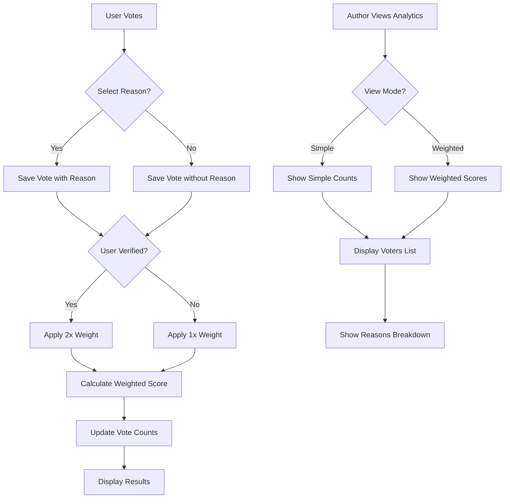

# Enhanced

Voting System Implementation

## Overview

Meningkatkan sistem voting dengan 3 fitur utama:

1. **Voting Reasons**: Alasan upvote/downvote (helpful, accurate, well-written, informative untuk upvote; misleading, inaccurate, spam, off-topic untuk downvote)
2. **Weighted Voting**: Vote dari verified users memiliki weight 2x
3. **Vote Analytics**: Author dapat melihat siapa yang vote dan mengapa, dengan toggle antara simple counts dan weighted scores

## Architecture Overview




## Implementation Details

### 1. Voting Reasons

#### 1.1 Database Migration

**File:** `database/migrations/YYYY_MM_DD_HHMMSS_add_reason_to_votes_tables.php`

- Add `reason` column (nullable string) to `post_votes` table
- Add `reason` column (nullable string) to `comment_votes` table
- Add index on `reason` for analytics queries

#### 1.2 Voting Reasons Constants

**File:** `app/Constants/VotingReasons.php` (NEW)Define allowed reasons:

- Upvote reasons: `helpful`, `accurate`, `well_written`, `informative`
- Downvote reasons: `misleading`, `inaccurate`, `spam`, `off_topic`

#### 1.3 Update Vote Models

**Files:**

- `app/Models/PostVote.php`
- `app/Models/CommentVote.php`
- Add `reason` to `$fillable`
- Add relationship methods if needed
- Add scopes for filtering by reason

#### 1.4 Update Vote Controller

**File:** `app/Http/Controllers/VoteController.php`

- Update `votePost()` and `voteComment()` methods to accept optional `reason` parameter
- Validate reason against allowed reasons based on vote type
- Store reason when provided

#### 1.5 Update Frontend Vote Components

**Files:**

- `resources/js/Components/VoteButton.vue`
- `resources/js/Components/CommentThread.vue` (for comment votes)
- Add reason selection modal/dropdown when voting
- Show reason selection UI (optional, can be skipped)
- Display selected reason in vote button tooltip

### 2. Weighted Voting

#### 2.1 Database Migration

**File:** `database/migrations/YYYY_MM_DD_HHMMSS_add_weighted_scores_to_posts_and_comments.php`

- Add `weighted_upvotes_score` (decimal) to `posts` table
- Add `weighted_downvotes_score` (decimal) to `posts` table
- Add `weighted_upvotes_score` (decimal) to `comments` table
- Add `weighted_downvotes_score` (decimal) to `comments` table
- Add indexes for sorting by weighted scores

#### 2.2 Vote Weight Service

**File:** `app/Services/VoteWeightService.php` (NEW)Methods:

- `calculateVoteWeight(User $user): float` - Returns 2.0 for verified users, 1.0 for others
- `updateWeightedScores(Post|Comment $votable): void` - Recalculate and update weighted scores
- `getWeightedUpvotes(Post|Comment $votable): float`
- `getWeightedDownvotes(Post|Comment $votable): float`

#### 2.3 Update Vote Controller

**File:** `app/Http/Controllers/VoteController.php`

- After creating/updating vote, call `VoteWeightService::updateWeightedScores()`
- Update both simple counts and weighted scores

#### 2.4 Update Models

**Files:**

- `app/Models/Post.php`
- `app/Models/Comment.php`
- Add weighted score fields to `$fillable` and `$casts`
- Add accessor methods: `getWeightedScoreAttribute()`, `getWeightedUpvotesAttribute()`, etc.
- Add scopes for sorting by weighted scores

### 3. Vote Analytics

#### 3.1 Vote Analytics Controller

**File:** `app/Http/Controllers/VoteAnalyticsController.php` (NEW)Methods:

- `showPostVotes(Request $request, Post $post)` - Get all votes for a post (author only)
- `showCommentVotes(Request $request, Comment $comment)` - Get all votes for a comment (author only)
- `getVoteBreakdown(Post|Comment $votable)` - Get breakdown by reason
- Authorization: Only post/comment author can view

#### 3.2 Vote Analytics Service

**File:** `app/Services/VoteAnalyticsService.php` (NEW)Methods:

- `getVoteBreakdown(Post|Comment $votable): array` - Group votes by reason
- `getVotersList(Post|Comment $votable, string $voteType): Collection` - Get list of voters with reasons
- `getWeightedBreakdown(Post|Comment $votable): array` - Weighted breakdown by reason

#### 3.3 Vote Analytics Frontend Page

**File:** `resources/js/Pages/Votes/Analytics.vue` (NEW)

- Display vote breakdown by reason
- Show list of voters with their reasons
- Toggle between simple counts and weighted scores
- Filter by vote type (upvote/downvote)
- Show user verification status

#### 3.4 Update Post/Comment Show Pages

**Files:**

- `resources/js/Pages/Posts/Show.vue`
- `resources/js/Components/CommentThread.vue`
- Add "View Analytics" button (visible to author only)
- Link to vote analytics page

### 4. Frontend Enhancements

#### 4.1 Vote Reason Selector Component

**File:** `resources/js/Components/VoteReasonSelector.vue` (NEW)

- Modal/dropdown for selecting vote reason
- Show different reasons based on vote type (upvote/downvote)
- Optional selection (can skip)
- Display selected reason

#### 4.2 Weighted Score Toggle Component

**File:** `resources/js/Components/WeightedScoreToggle.vue` (NEW)

- Toggle switch between simple and weighted views
- Update vote counts display based on toggle state
- Store preference in localStorage

#### 4.3 Update Vote Display Components

**Files:**

- `resources/js/Components/VoteButton.vue`
- `resources/js/Components/CommentThread.vue`
- Integrate `WeightedScoreToggle`
- Show weighted scores when toggle is on
- Display reason tooltip on hover

## Routes

**File:** `routes/web.php`

```php
// Vote analytics (author only)
Route::middleware('auth')->group(function () {
    Route::get('/posts/{post}/votes/analytics', [VoteAnalyticsController::class, 'showPostVotes'])
        ->name('votes.post.analytics');
    Route::get('/comments/{comment}/votes/analytics', [VoteAnalyticsController::class, 'showCommentVotes'])
        ->name('votes.comment.analytics');
});
```


## Database Changes

### Modified Tables

1. `post_votes` - Add `reason` column
2. `comment_votes` - Add `reason` column
3. `posts` - Add `weighted_upvotes_score`, `weighted_downvotes_score`
4. `comments` - Add `weighted_upvotes_score`, `weighted_downvotes_score`

## Verification Check

**File:** `app/Models/User.php`

- Use existing `is_verified_mentor` field or check if user has verification status
- If no verification field exists, add `is_verified` boolean field

## Validation & Security

- Reason validation: Only allow predefined reasons based on vote type
- Analytics authorization: Only post/comment author can view analytics
- Weight calculation: Verified users get 2x weight (configurable constant)
- Rate limiting: Existing rate limits apply

## Testing Considerations

- Weight calculation for verified vs non-verified users
- Reason validation and storage
- Analytics authorization checks
- Weighted score recalculation on vote changes
- Toggle between simple and weighted views
- Vote breakdown by reason accuracy

## Implementation Priority

### Phase 1 (Core Features)

1. Add reason column to vote tables
2. Update vote controller to accept and store reasons
3. Create voting reasons constants
4. Add reason selector in frontend

### Phase 2 (Weighted Voting)

5. Add weighted score columns
6. Create VoteWeightService
7. Update vote controller to calculate weighted scores
8. Add weighted score toggle in frontend

### Phase 3 (Analytics)

9. Create VoteAnalyticsController and Service
10. Build analytics page