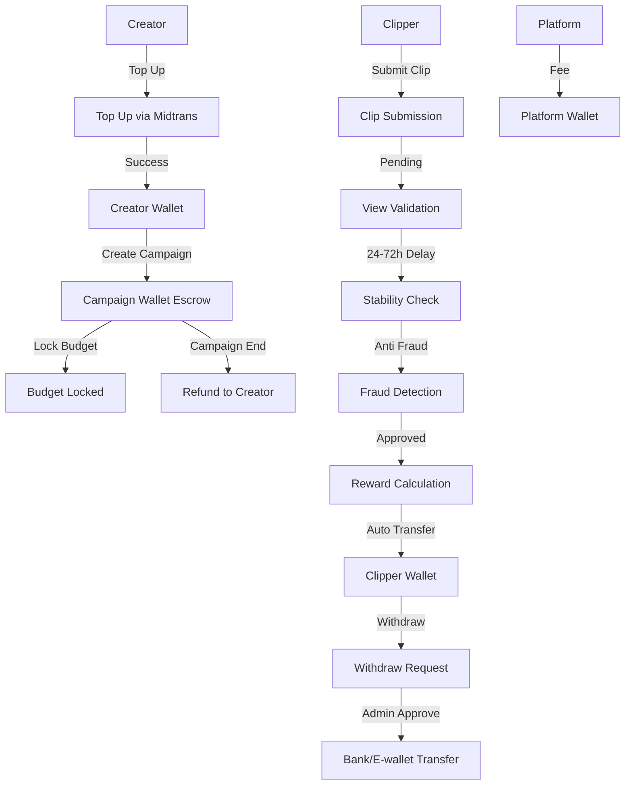

# Fitur Clipper dengan Sistem Escrow

## Overview

Implementasi sistem clipper lengkap dengan escrow payment untuk memastikan pembayaran otomatis ke clipper berdasarkan validasi views. Sistem ini mencakup wallet system, campaign management, view tracking, reward calculation, dan auto transfer.**Referensi**: [Ternak Klip](https://ternakklip.com/home) - Platform Content Distribution yang menghubungkan Brand/Influencer dengan Clippers.

### User Roles & Flow

1. **Brand/Influencer (Creator)**

- **Onboarding**: Register sebagai Brand dengan form lengkap (company info, business type, contact) → Admin approve
- Top up saldo via Midtrans (otomatis, tidak manual)
- Membuat campaign dengan budget dan CPM
- Dashboard analytics real-time untuk melihat views, ROI, dan performa campaign
- Budget di-lock ke escrow saat campaign aktif
- Notifikasi real-time untuk campaign updates

2. **Clipper (Content Creator)**

- **Onboarding**: Setup profile dengan platform info (username, follower count, portfolio) → Auto verified atau manual verification
- Melihat available campaigns (real-time, tidak perlu Discord)
- Submit clip ke campaign
- Tracking views otomatis (tidak manual)
- Menerima reward otomatis setelah clip approved
- Notifikasi real-time untuk reward, approval, dll
- Withdraw reward ke bank/e-wallet

3. **Admin (Platform)**

- **Brand Approval**: Review dan approve/reject Brand registration requests
- Manage campaigns dan clips
- Approve/reject clips
- Adjust reward jika perlu
- Handle disputes dan freeze wallet
- View ledger & audit logs
- Transparansi penuh untuk semua transaksi

## Arsitektur Sistem

### Flow Diagram




## Database Structure

### 1. User Role Extension

#### Update `users` table

- Add `clipper_role` (enum: brand, clipper, admin) atau extend existing `role` field
- Brand = Brand/Influencer yang membuat campaign (Creator)
- Clipper = Content Creator yang submit clip
- Admin = Platform admin

**Note**: User bisa memiliki multiple roles (contoh: bisa jadi Brand sekaligus Clipper)

### 2. Wallet Tables

#### `creator_wallets` table (untuk Brand/Influencer)

- `id` (uuid, primary)
- `user_id` (uuid, foreign to users)
- `balance_available` (decimal 15,2)
- `balance_locked` (decimal 15,2) - untuk campaign aktif
- `created_at`, `updated_at`

#### `campaign_wallets` table (Escrow)

- `id` (uuid, primary)
- `campaign_id` (uuid, foreign to campaigns)
- `total_budget` (decimal 15,2)
- `remaining_budget` (decimal 15,2)
- `locked_amount` (decimal 15,2)
- `created_at`, `updated_at`

#### `clipper_wallets` table

- `id` (uuid, primary)
- `user_id` (uuid, foreign to users)
- `balance_pending` (decimal 15,2)
- `balance_available` (decimal 15,2)
- `balance_withdrawn` (decimal 15,2)
- `created_at`, `updated_at`

#### `platform_wallets` table

- `id` (uuid, primary)
- `fee_balance` (decimal 15,2)
- `operational_balance` (decimal 15,2)
- `created_at`, `updated_at`

### 3. Campaign & Clip Tables

#### `campaigns` table

- `id` (uuid, primary)
- `creator_id` (uuid, foreign to users) - Brand/Influencer yang membuat campaign
- `title` (string)
- `description` (text)
- `cpm` (decimal 10,2) - harga per 1000 views (Cost Per Mille)
- `max_budget` (decimal 15,2) - total budget campaign
- `max_reward_per_clipper` (decimal 15,2, nullable) - batas maksimal reward per clipper
- `duration_days` (integer) - durasi campaign dalam hari
- `status` (enum: draft, active, paused, completed, cancelled)
- `started_at` (timestamp, nullable)
- `ended_at` (timestamp, nullable)
- `total_views` (integer, default 0) - total views dari semua clips
- `total_clips` (integer, default 0) - total clips yang di-submit
- `total_spent` (decimal 15,2, default 0) - total yang sudah dibayar ke clippers
- `created_at`, `updated_at`

#### `clips` table

- `id` (uuid, primary)
- `campaign_id` (uuid, foreign to campaigns)
- `clipper_id` (uuid, foreign to users)
- `content_url` (string) - URL konten (video/image)
- `platform` (enum: tiktok, instagram, youtube, other)
- `platform_content_id` (string, nullable) - ID konten di platform
- `status` (enum: pending, approved, rejected, paid)
- `valid_views` (integer, default 0)
- `estimated_reward` (decimal 15,2, default 0)
- `pending_reward` (decimal 15,2, default 0)
- `approved_reward` (decimal 15,2, default 0)
- `rejected_reward` (decimal 15,2, default 0)
- `submitted_at` (timestamp)
- `approved_at` (timestamp, nullable)
- `rejected_at` (timestamp, nullable)
- `paid_at` (timestamp, nullable)
- `rejection_reason` (text, nullable)
- `created_at`, `updated_at`

#### `clip_view_tracking` table

- `id` (uuid, primary)
- `clip_id` (uuid, foreign to clips)
- `views_count` (integer)
- `tracked_at` (timestamp)
- `stability_score` (decimal 5,2, nullable) - untuk detect spike
- `is_valid` (boolean, default true)
- `created_at`, `updated_at`

### 3. Ledger & Audit Tables

#### `ledger_entries` table

- `id` (uuid, primary)
- `transaction_id` (string, unique)
- `from_wallet_type` (enum: creator, campaign, clipper, platform)
- `from_wallet_id` (uuid, nullable)
- `to_wallet_type` (enum: creator, campaign, clipper, platform)
- `to_wallet_id` (uuid, nullable)
- `amount` (decimal 15,2)
- `reason` (enum: reward, fee, refund, topup, withdrawal, campaign_lock, campaign_unlock)
- `reference_type` (string, nullable) - clip, campaign, withdrawal, dll
- `reference_id` (uuid, nullable)
- `metadata` (json, nullable) - data tambahan
- `admin_id` (uuid, nullable, foreign to users) - jika manual adjustment
- `created_at`, `updated_at`

#### `audit_logs` table

- `id` (uuid, primary)
- `user_id` (uuid, nullable, foreign to users)
- `admin_id` (uuid, nullable, foreign to users)
- `action` (string) - freeze_wallet, approve_clip, reject_clip, adjust_reward, dll
- `target_type` (string) - wallet, clip, campaign
- `target_id` (uuid)
- `old_value` (json, nullable)
- `new_value` (json, nullable)
- `notes` (text, nullable)
- `ip_address` (string, nullable)
- `user_agent` (text, nullable)
- `created_at`

### 4. Top Up & Payment Tables

#### `top_ups` table

- `id` (uuid, primary)
- `user_id` (uuid, foreign to users)
- `amount` (decimal 15,2)
- `status` (enum: pending_payment, success, failed, cancelled)
- `payment_method` (enum: ewallet, virtual_account, credit_card)
- `midtrans_order_id` (string, nullable)
- `midtrans_transaction_id` (string, nullable)
- `paid_at` (timestamp, nullable)
- `created_at`, `updated_at`

### 5. Clipper Withdrawals

Extend `withdrawals` table dengan field tambahan:

- `user_type` (enum: seller, clipper) - untuk membedakan withdrawal seller vs clipper
- Atau buat table terpisah `clipper_withdrawals` dengan struktur serupa

## Backend Implementation

### Models

#### `app/Models/CreatorWallet.php`

- Relationship: `belongsTo(User::class)`
- Methods: `lockAmount()`, `unlockAmount()`, `addBalance()`, `deductBalance()`

#### `app/Models/CampaignWallet.php`

- Relationship: `belongsTo(Campaign::class)`
- Methods: `lockBudget()`, `releaseBudget()`, `deductBudget()`, `refund()`

#### `app/Models/ClipperWallet.php`

- Relationship: `belongsTo(User::class)`
- Methods: `addReward()`, `movePendingToAvailable()`, `lockForWithdrawal()`

#### `app/Models/PlatformWallet.php`

- Methods: `addFee()`, `getTotalBalance()`

#### `app/Models/Campaign.php`

- Relationships: `belongsTo(User::class, 'creator_id')`, `hasMany(Clip::class)`, `hasOne(CampaignWallet::class)`
- Methods: `activate()`, `pause()`, `complete()`, `cancel()`, `canActivate()`, `getRemainingBudget()`

#### `app/Models/Clip.php`

- Relationships: `belongsTo(Campaign::class)`, `belongsTo(User::class, 'clipper_id')`, `hasMany(ClipViewTracking::class)`
- Methods: `approve()`, `reject()`, `calculateReward()`, `markAsPaid()`

#### `app/Models/ClipViewTracking.php`

- Relationship: `belongsTo(Clip::class)`
- Methods untuk tracking dan validasi views

#### `app/Models/LedgerEntry.php`

- Methods: `createEntry()` - static method untuk create ledger entry
- Relationship ke berbagai wallet types

#### `app/Models/AuditLog.php`

- Methods: `logAction()` - static method untuk logging

#### `app/Models/TopUp.php`

- Relationship: `belongsTo(User::class)`
- Methods: `markAsPaid()`, `markAsFailed()`

### Services

#### `app/Services/WalletService.php`

- `getCreatorWallet(User $user): CreatorWallet`
- `getClipperWallet(User $user): ClipperWallet`
- `getCampaignWallet(Campaign $campaign): CampaignWallet`
- `getPlatformWallet(): PlatformWallet`
- `transferBetweenWallets()` - generic transfer method

#### `app/Services/EscrowService.php`

- `lockCampaignBudget(Campaign $campaign): bool` - lock budget dari creator wallet ke campaign wallet
- `releaseCampaignBudget(Campaign $campaign): bool` - release jika campaign cancelled
- `refundRemainingBudget(Campaign $campaign): bool` - refund sisa budget ke creator

#### `app/Services/RewardCalculationService.php`

- `calculateReward(Clip $clip, int $validViews): float` - hitung reward berdasarkan CPM
- `estimateReward(Clip $clip, int $views): float` - estimasi reward
- `applyMaxRewardLimit(float $reward, Campaign $campaign): float` - apply max reward per clipper

#### `app/Services/ViewValidationService.php`

- `trackViews(Clip $clip, int $views): ClipViewTracking` - track views per interval
- `validateViews(Clip $clip): bool` - validasi views setelah delay
- `checkStability(Clip $clip): float` - cek stability score
- `detectFraud(Clip $clip): bool` - detect fraud patterns
- `approveViews(Clip $clip, int $validViews): bool` - final approval

#### `app/Services/AutoTransferService.php`

- `transferRewardToClipper(Clip $clip): bool` - auto transfer reward dari campaign wallet ke clipper wallet
- `deductPlatformFee(float $amount): float` - potong platform fee
- `processApprovedClips(): int` - batch process approved clips

#### `app/Services/LedgerService.php`

- `createEntry()` - create ledger entry dengan validasi
- `getWalletHistory()` - history transaksi wallet
- `getAuditTrail()` - audit trail untuk dispute

#### `app/Services/TopUpService.php`

- `createTopUp(User $user, float $amount, string $paymentMethod): TopUp` - create top up request
- `processTopUpSuccess(TopUp $topUp): bool` - process setelah payment success
- `addToCreatorWallet(User $user, float $amount): bool` - tambah saldo ke creator wallet

#### `app/Services/CampaignService.php`

- `createCampaign(User $creator, array $data): Campaign` - create campaign dengan validasi budget
- `activateCampaign(Campaign $campaign): bool` - activate campaign (lock budget)
- `pauseCampaign(Campaign $campaign): bool` - pause campaign
- `completeCampaign(Campaign $campaign): bool` - complete campaign (refund sisa budget)

#### `app/Services/CampaignAnalyticsService.php`

- `getCampaignStats(Campaign $campaign): array` - stats campaign (total views, clips, spent, ROI)
- `getViewsChart(Campaign $campaign, string $period): array` - chart views over time
- `getTopClips(Campaign $campaign, int $limit): Collection` - top performing clips
- `getROI(Campaign $campaign): float` - calculate ROI (Return on Investment)
- `getBrandDashboardStats(User $brand): array` - overall stats untuk Brand (all campaigns)

#### `app/Services/ClipService.php`

- `submitClip(User $clipper, Campaign $campaign, array $data): Clip` - submit clip
- `approveClip(Clip $clip, ?User $admin = null): bool` - approve clip (trigger auto transfer)
- `rejectClip(Clip $clip, string $reason, ?User $admin = null): bool` - reject clip

### Controllers

#### `app/Http/Controllers/Clipper/TopUpController.php`

- `index()` - list top up history
- `create()` - show top up form
- `store()` - create top up request (redirect ke Midtrans)
- `webhook()` - handle Midtrans webhook untuk top up

#### `app/Http/Controllers/Clipper/CampaignController.php`

- `index()` - list campaigns (creator view)
- `create()` - show create campaign form
- `store()` - create campaign
- `show($id)` - campaign detail
- `edit($id)` - edit campaign (draft only)
- `update($id)` - update campaign
- `activate($id)` - activate campaign
- `pause($id)` - pause campaign
- `cancel($id)` - cancel campaign

#### `app/Http/Controllers/Clipper/ClipController.php`

- `index()` - list clips (clipper view - clips yang di-submit)
- `availableCampaigns()` - list available campaigns untuk submit clip
- `create($campaignId)` - show submit clip form
- `store()` - submit clip
- `show($id)` - clip detail dengan view tracking
- `trackViews($id)` - API endpoint untuk track views (dipanggil oleh cron/job)

#### `app/Http/Controllers/Clipper/ClipperWalletController.php`

- `index()` - show clipper wallet balance
- `history()` - wallet transaction history

#### `app/Http/Controllers/Clipper/CreatorWalletController.php`

- `index()` - show creator wallet balance
- `history()` - wallet transaction history

#### `app/Http/Controllers/Clipper/CampaignAnalyticsController.php`

- `index()` - Brand dashboard dengan overall stats
- `show($campaignId)` - campaign analytics detail dengan charts
- `getViewsChart($campaignId)` - API untuk views chart data
- `getROI($campaignId)` - API untuk ROI calculation

#### `app/Http/Controllers/Admin/AdminCampaignController.php`

- `index()` - list all campaigns
- `show($id)` - campaign detail dengan clips
- `approve($id)` - approve campaign
- `reject($id)` - reject campaign

#### `app/Http/Controllers/Admin/AdminClipController.php`

- `index()` - list all clips dengan filter
- `show($id)` - clip detail dengan view tracking
- `approve($id)` - approve clip (manual override)
- `reject($id)` - reject clip dengan reason
- `adjustReward($id)` - adjust reward (dengan audit log)

#### `app/Http/Controllers/Admin/AdminWalletController.php`

- `freezeWallet()` - freeze wallet (creator/clipper)
- `unfreezeWallet()` - unfreeze wallet
- `adjustBalance()` - manual balance adjustment (dengan audit log)
- `viewLedger()` - view ledger entries dengan filter
- `viewAuditLog()` - view audit logs

### Jobs & Commands

#### `app/Jobs/ProcessTopUpWebhook.php`

- Handle Midtrans webhook untuk top up

#### `app/Jobs/TrackClipViews.php`

- Job untuk track views tiap X jam (via API atau scraping)
- Dispatch via scheduled command

#### `app/Jobs/ValidateClipViews.php`

- Job untuk validate views setelah delay 24-72 jam
- Check stability dan fraud
- Auto approve jika valid

#### `app/Jobs/AutoTransferRewards.php`

- Job untuk auto transfer reward ke clipper wallet
- Run tiap X menit/jam
- Process approved clips yang belum dibayar

#### `app/Jobs/ProcessCampaignCompletion.php`

- Job untuk process campaign completion
- Refund remaining budget
- Update campaign status

#### `app/Console/Commands/TrackAllClipViews.php`

- Scheduled command untuk track views semua active clips
- Run tiap 6-12 jam

#### `app/Console/Commands/ValidatePendingClips.php`

- Scheduled command untuk validate pending clips
- Run tiap 1-2 jam

#### `app/Console/Commands/AutoTransferPendingRewards.php`

- Scheduled command untuk auto transfer rewards
- Run tiap 15-30 menit

#### `app/Console/Commands/CompleteExpiredCampaigns.php`

- Scheduled command untuk complete expired campaigns
- Run daily

### Middleware

#### `app/Http/Middleware/EnsureUserIsCreator.php`

- Check user memiliki creator wallet

#### `app/Http/Middleware/EnsureUserIsClipper.php`

- Check user memiliki clipper wallet

### Routes

Update `routes/web.php`:

```php
// Top Up
Route::middleware(['auth'])->group(function () {
    Route::prefix('clipper')->name('clipper.')->group(function () {
        // Top Up
        Route::resource('top-ups', TopUpController::class);
        Route::post('top-ups/webhook', [TopUpController::class, 'webhook'])->name('top-ups.webhook');
        
        // Campaigns (Creator)
        Route::resource('campaigns', CampaignController::class);
        Route::post('campaigns/{campaign}/activate', [CampaignController::class, 'activate'])->name('campaigns.activate');
        Route::post('campaigns/{campaign}/pause', [CampaignController::class, 'pause'])->name('campaigns.pause');
        Route::post('campaigns/{campaign}/cancel', [CampaignController::class, 'cancel'])->name('campaigns.cancel');
        
        // Clips (Clipper)
        Route::get('campaigns/available', [ClipController::class, 'availableCampaigns'])->name('campaigns.available');
        Route::resource('clips', ClipController::class);
        Route::post('clips/{clip}/track-views', [ClipController::class, 'trackViews'])->name('clips.track-views');
        
        // Wallets
        Route::get('wallet/creator', [CreatorWalletController::class, 'index'])->name('wallet.creator');
        Route::get('wallet/clipper', [ClipperWalletController::class, 'index'])->name('wallet.clipper');
        Route::get('wallet/creator/history', [CreatorWalletController::class, 'history'])->name('wallet.creator.history');
        Route::get('wallet/clipper/history', [ClipperWalletController::class, 'history'])->name('wallet.clipper.history');
        
        // Campaign Analytics (Brand Dashboard)
        Route::get('campaigns/analytics', [CampaignAnalyticsController::class, 'index'])->name('campaigns.analytics');
        Route::get('campaigns/{campaign}/analytics', [CampaignAnalyticsController::class, 'show'])->name('campaigns.analytics.show');
        Route::get('campaigns/{campaign}/analytics/views-chart', [CampaignAnalyticsController::class, 'getViewsChart'])->name('campaigns.analytics.views-chart');
        Route::get('campaigns/{campaign}/analytics/roi', [CampaignAnalyticsController::class, 'getROI'])->name('campaigns.analytics.roi');
    });
});

// Admin
Route::middleware(['auth', 'admin'])->prefix('admin')->name('admin.')->group(function () {
    Route::resource('campaigns', AdminCampaignController::class)->only(['index', 'show']);
    Route::resource('clips', AdminClipController::class)->only(['index', 'show']);
    Route::post('clips/{clip}/approve', [AdminClipController::class, 'approve'])->name('clips.approve');
    Route::post('clips/{clip}/reject', [AdminClipController::class, 'reject'])->name('clips.reject');
    Route::post('clips/{clip}/adjust-reward', [AdminClipController::class, 'adjustReward'])->name('clips.adjust-reward');
    
    // Brand Approvals
    Route::get('brand-approvals', [AdminBrandApprovalController::class, 'index'])->name('brand-approvals.index');
    Route::get('brand-approvals/{registration}', [AdminBrandApprovalController::class, 'show'])->name('brand-approvals.show');
    Route::post('brand-approvals/{registration}/approve', [AdminBrandApprovalController::class, 'approve'])->name('brand-approvals.approve');
    Route::post('brand-approvals/{registration}/reject', [AdminBrandApprovalController::class, 'reject'])->name('brand-approvals.reject');
    
    Route::prefix('wallets')->name('wallets.')->group(function () {
        Route::post('freeze', [AdminWalletController::class, 'freezeWallet'])->name('freeze');
        Route::post('unfreeze', [AdminWalletController::class, 'unfreezeWallet'])->name('unfreeze');
        Route::post('adjust-balance', [AdminWalletController::class, 'adjustBalance'])->name('adjust-balance');
        Route::get('ledger', [AdminWalletController::class, 'viewLedger'])->name('ledger');
        Route::get('audit-log', [AdminWalletController::class, 'viewAuditLog'])->name('audit-log');
    });
});
```


## Frontend Implementation

### Pages

#### `resources/js/Pages/Clipper/TopUps/Index.vue`

- List top up history dengan status

#### `resources/js/Pages/Clipper/TopUps/Create.vue`

- Form top up dengan pilihan payment method
- Redirect ke Midtrans payment

#### `resources/js/Pages/Clipper/Campaigns/Index.vue`

- List campaigns (creator view)
- Filter: all, draft, active, completed, cancelled
- Show budget, remaining budget, total clips

#### `resources/js/Pages/Clipper/Campaigns/Create.vue`

- Form create campaign
- Fields: title, description, CPM, max budget, max reward per clipper, duration

#### `resources/js/Pages/Clipper/Campaigns/Show.vue`

- Campaign detail untuk Brand
- Show clips yang di-submit
- Show budget usage (total, spent, remaining)
- Show total views dan clips count
- Actions: activate, pause, cancel
- Link ke analytics page

#### `resources/js/Pages/Clipper/Campaigns/Analytics.vue`

- Brand dashboard analytics
- Overall stats: total campaigns, total views, total spent, average ROI
- Campaign list dengan quick stats
- Views chart (line chart over time)
- Top performing clips
- ROI calculation per campaign

#### `resources/js/Pages/Clipper/Clips/Index.vue`

- List clips yang di-submit (clipper view)
- Show status, reward, views
- **REUSE**: Infinite scroll pattern dari Marketplace/Index.vue

#### `resources/js/Pages/Clipper/Clips/AvailableCampaigns.vue`

- List available campaigns untuk submit clip
- Filter dan search
- **REUSE**: Infinite scroll pattern dari Marketplace/Index.vue
- **REUSE**: ProductCard pattern untuk campaign cards

#### `resources/js/Pages/Clipper/Clips/Create.vue`

- Form submit clip
- Fields: campaign (select), content URL, platform, platform content ID

#### `resources/js/Pages/Clipper/Clips/Show.vue`

- Clip detail dengan view tracking chart
- Show reward calculation
- Show validation status

#### `resources/js/Pages/Clipper/Wallet/Creator.vue`

- Creator wallet balance
- Available balance, locked balance
- Recent transactions

#### `resources/js/Pages/Clipper/Wallet/Clipper.vue`

- Clipper wallet balance
- Pending, available, withdrawn
- Recent transactions
- Withdraw button

#### `resources/js/Pages/Admin/Campaigns/Index.vue`

- Admin view all campaigns
- Filter dan search

#### `resources/js/Pages/Admin/Campaigns/Show.vue`

- Admin campaign detail dengan semua clips

#### `resources/js/Pages/Admin/Clips/Index.vue`

- Admin view all clips
- Filter: pending, approved, rejected
- Bulk actions

#### `resources/js/Pages/Admin/Clips/Show.vue`

- Admin clip detail
- View tracking chart
- Actions: approve, reject, adjust reward

#### `resources/js/Pages/Admin/Wallets/Ledger.vue`

- Ledger entries dengan filter
- Search by transaction ID, wallet type, reason

#### `resources/js/Pages/Admin/Wallets/AuditLog.vue`

- Audit logs dengan filter
- Show admin actions

### Components

#### `resources/js/Components/Clipper/CampaignCard.vue`

- Card untuk display campaign di list

#### `resources/js/Components/Clipper/ClipCard.vue`

- Card untuk display clip di list
- **REUSE**: ProductCard.vue pattern dan styling
- Adapt untuk clip-specific data (views, reward, status)

#### `resources/js/Components/Clipper/WalletBalance.vue`

- Widget untuk show wallet balance

#### `resources/js/Components/Clipper/ViewTrackingChart.vue`

- Chart untuk track views over time

#### `resources/js/Components/Clipper/RewardCalculator.vue`

- Calculator untuk estimasi reward berdasarkan views

#### `resources/js/Components/Clipper/CampaignAnalyticsChart.vue`

- Chart component untuk Brand dashboard
- Views chart (line chart)
- ROI chart (bar chart)
- Spending chart (pie chart)

#### `resources/js/Components/Admin/ClipApprovalPanel.vue`

- Panel untuk approve/reject clip

#### `resources/js/Components/Admin/RewardAdjustmentForm.vue`

- Form untuk adjust reward dengan reason

## Configuration

### Environment Variables

Add to `.env`:

```env
# Clipper System
CLIPPER_PLATFORM_FEE_PERCENT=5
CLIPPER_MIN_WITHDRAWAL=50000
CLIPPER_VIEW_TRACKING_INTERVAL_HOURS=6
CLIPPER_VIEW_VALIDATION_DELAY_HOURS=24
CLIPPER_AUTO_TRANSFER_INTERVAL_MINUTES=15
```


### Config File

#### `config/clipper.php`

```php
return [
    'platform_fee_percent' => env('CLIPPER_PLATFORM_FEE_PERCENT', 5),
    'min_withdrawal' => env('CLIPPER_MIN_WITHDRAWAL', 50000),
    'view_tracking_interval_hours' => env('CLIPPER_VIEW_TRACKING_INTERVAL_HOURS', 6),
    'view_validation_delay_hours' => env('CLIPPER_VIEW_VALIDATION_DELAY_HOURS', 24),
    'auto_transfer_interval_minutes' => env('CLIPPER_AUTO_TRANSFER_INTERVAL_MINUTES', 15),
];
```


## Scheduled Tasks

Update `app/Console/Kernel.php` atau `routes/console.php`:

```php
Schedule::command('clipper:track-views')->everySixHours();
Schedule::command('clipper:validate-pending-clips')->hourly();
Schedule::command('clipper:auto-transfer-rewards')->everyFifteenMinutes();
Schedule::command('clipper:complete-expired-campaigns')->daily();
```


## Key Features Implementation

### 1. User Role System

- User bisa memiliki role: `brand` (Brand/Influencer), `clipper` (Content Creator), atau `admin`
- User bisa memiliki multiple roles (contoh: Brand sekaligus Clipper)
- Brand = Creator yang top up dan buat campaign
- Clipper = Content Creator yang submit clip ke campaign

### 2. Wallet System

- Semua wallet menggunakan ledger-based system
- Setiap transaksi dicatat di `ledger_entries`
- Wallet balance dihitung dari ledger (immutable)
- Creator Wallet untuk Brand/Influencer
- Clipper Wallet untuk Content Creator
- Campaign Wallet sebagai Escrow
- Platform Wallet untuk fee platform

### 3. Top Up Flow

- Brand/Influencer top up via Midtrans (E-wallet, Virtual Account, Credit Card)
- Setelah payment success, saldo masuk ke Creator Wallet
- Record di ledger
- Brand bisa lihat top up history

### 4. Campaign Creation & Escrow

- Brand/Influencer buat campaign dengan:
- Title, description
- CPM (harga per 1000 views)
- Max budget
- Max reward per clipper (optional)
- Duration (hari)
- Saat activate, budget di-lock dari Creator Wallet ke Campaign Wallet (Escrow)
- Campaign tidak bisa aktif tanpa saldo cukup
- Brand bisa pause, cancel, atau complete campaign

### 5. Clip Submission

- Clipper melihat available campaigns (active campaigns)
- Clipper submit clip dengan:
- Content URL (video/image)
- Platform (TikTok, Instagram, YouTube, Other)
- Platform Content ID (optional)
- Clip status: pending
- Auto track views mulai dari submission
- Clipper bisa lihat status dan reward estimate

### 6. View Validation

- Track views tiap X jam
- Delay 24-72 jam untuk stability check
- Anti fraud detection (spike, duplicate, spam)
- Auto approve atau manual admin approval

### 7. Reward Calculation

- Formula: `reward = (valid_views / 1000) × CPM`
- Apply max reward per clipper jika ada
- Potong platform fee

### 8. Auto Transfer

- Setelah clip approved, auto transfer dari Campaign Wallet ke Clipper Wallet
- Potong platform fee ke Platform Wallet
- Record di ledger

### 9. Withdraw System

- Clipper request withdraw dari Clipper Wallet
- Min withdrawal amount
- Admin approval (reuse existing withdrawal system atau extend)

### 10. Refund & Campaign Completion

- Saat campaign selesai, sisa budget di-refund ke Creator Wallet
- Jika campaign cancelled, budget di-release kembali

### 11. Brand Dashboard & Analytics

- Brand bisa lihat dashboard analytics dengan:
- Overall stats:
    - Total campaigns (active, completed, cancelled)
    - Total views dari semua campaigns
    - Total spent (total yang dibayar ke clippers)
    - Average ROI (Return on Investment)
- Views chart over time (line chart)
- Top performing clips
- Campaign list dengan quick stats
- Per-campaign analytics:
    - Total views, clips count
    - Budget usage (spent vs remaining)
    - ROI per campaign
    - Views chart per campaign
    - Top clips per campaign

### 12. Admin Control

- **Brand Approval**: Review dan approve/reject Brand registration requests (menggantikan proses manual)
- Freeze/unfreeze wallet
- Approve/reject clip
- Adjust reward (dengan audit log)
- View ledger & audit logs
- **Transparansi**: Semua aksi admin tercatat di audit log

### 13. Notification System (Menggantikan Discord untuk komunikasi)

- **Real-time notifications** untuk:
- Brand: Registration approved/rejected, campaign updates, budget alerts
- Clipper: New campaigns available, clip approved/rejected, reward received, campaign ended
- Admin: New Brand registration, new clip submission, withdrawal requests
- Notification bell di header dengan unread count
- Email notifications untuk important events
- **Transparansi**: Semua notifications tercatat dan bisa dilihat history

### 14. Integration dengan Forum & Marketplace

- Brand bisa share campaign di forum (jika perlu)
- Clipper bisa discuss campaign di forum
- Link campaign ke marketplace (jika relevan)
- User profile terintegrasi dengan forum profile

## Security & Validation

- Authorization: hanya creator bisa manage campaign mereka, hanya clipper bisa submit clip
- Validation: budget cukup, campaign aktif, clip valid
- Fraud detection: view spike, duplicate content, spam account
- Audit trail: semua aksi admin tercatat
- Ledger immutable: tidak bisa edit/delete ledger entries

## Testing Considerations

### Manual Testing

- Test top up flow dengan Midtrans sandbox
- Test campaign creation dan budget locking
- Test clip submission dan view tracking
- Test reward calculation accuracy
- Test auto transfer flow
- Test refund flow
- Test admin actions dengan audit log
- Test edge cases: budget habis, campaign cancelled, clip rejected

### Automated Testing

See "Testing Considerations (Expanded)" section di bawah untuk detail unit tests, feature tests, dan integration tests.

## Migration Strategy

1. Create wallet tables
2. Create campaign & clip tables
3. Create ledger & audit tables
4. Migrate existing user balance ke Creator Wallet (jika perlu)
5. Create clipper wallets untuk existing users (optional)
6. Setup scheduled commands
7. Test dengan sample data

## View Tracking Strategy

### Platform APIs & Implementation

#### TikTok

- **Option 1**: TikTok Official API (jika available)
- Rate limit: Check TikTok API documentation
- Authentication: OAuth 2.0
- Endpoint: `/video/query/` untuk get video stats
- **Option 2**: TikTok Web Scraping (fallback)
- Use headless browser (Puppeteer/Playwright)
- Parse video page untuk view count
- Rate limit: Max 1 request per 5-10 seconds per video
- Error handling: Retry dengan exponential backoff

#### Instagram

- **Option 1**: Instagram Basic Display API / Graph API
- Rate limit: 200 requests/hour per access token
- Authentication: OAuth 2.0
- Endpoint: `/{media-id}` untuk get media insights
- **Option 2**: Instagram Scraping (fallback)
- Similar to TikTok scraping
- More strict rate limiting (Instagram lebih agresif)

#### YouTube

- **Option 1**: YouTube Data API v3
- Rate limit: 10,000 units/day (default quota)
- Authentication: API Key atau OAuth 2.0
- Endpoint: `videos.list` dengan `statistics` part
- Cost: 1 unit per request
- **Option 2**: YouTube Scraping
- Parse video page untuk view count
- Less reliable, use as last resort

### Implementation Service

#### `app/Services/ViewTrackingApiService.php`

- `trackTikTokViews(string $contentId): int` - track TikTok views
- `trackInstagramViews(string $contentId): int` - track Instagram views
- `trackYouTubeViews(string $contentId): int` - track YouTube views
- `trackViews(Clip $clip): int` - generic method berdasarkan platform
- `handleApiError(string $platform, \Exception $e): void` - error handling
- `checkRateLimit(string $platform): bool` - check rate limit
- `getFallbackViews(Clip $clip): ?int` - fallback jika API down

### Error Handling Strategy

1. **API Down**: Use last known views + estimated growth
2. **Rate Limit Exceeded**: Queue untuk retry later
3. **Invalid Content ID**: Mark clip untuk manual review
4. **Network Error**: Retry dengan exponential backoff (max 3 retries)

### Rate Limiting

- **Per Platform**:
- TikTok: 1 request per 10 seconds per video
- Instagram: 1 request per 5 seconds per post
- YouTube: Respect API quota (10,000/day)
- **Per Clipper**: Max 10 tracking requests per hour
- **Global**: Max 100 tracking requests per minute (across all platforms)

### Caching Strategy

- Cache view counts untuk 1-6 hours (depending on platform)
- Use Redis untuk cache
- Invalidate cache saat manual refresh requested

## Performance Optimization

### Database Indexes

Add indexes untuk frequently queried columns:

```php
// campaigns table
$table->index(['creator_id', 'status']);
$table->index('status');
$table->index('started_at');
$table->index('ended_at');

// clips table
$table->index(['campaign_id', 'status']);
$table->index(['clipper_id', 'status']);
$table->index('status');
$table->index('submitted_at');

// ledger_entries table
$table->index(['from_wallet_type', 'from_wallet_id']);
$table->index(['to_wallet_type', 'to_wallet_id']);
$table->index(['reference_type', 'reference_id']);
$table->index('created_at');
$table->index('transaction_id'); // unique index

// clip_view_tracking table
$table->index(['clip_id', 'tracked_at']);
$table->index('tracked_at');

// notifications table
$table->index(['user_id', 'read_at']);
$table->index(['user_id', 'created_at']);
```


### Caching Strategy

#### Redis Cache Keys

- `campaign:stats:{campaign_id}` - Campaign statistics (TTL: 5 minutes)
- `brand:dashboard:{user_id}` - Brand dashboard stats (TTL: 10 minutes)
- `clip:views:{clip_id}` - Clip views (TTL: 1 hour)
- `campaign:available` - Available campaigns list (TTL: 5 minutes)
- `clipper:profile:{user_id}` - Clipper profile (TTL: 30 minutes)

#### Cache Invalidation

- Invalidate campaign stats saat clip approved/rejected
- Invalidate brand dashboard saat campaign updated
- Invalidate clip views saat new tracking data available

### Queue Optimization

- Use separate queues untuk different job types:
- `high` - Critical jobs (transfers, webhooks)
- `default` - Normal jobs (notifications, analytics)
- `low` - Background jobs (view tracking, cleanup)
- Set appropriate timeout dan retry limits

### Database Query Optimization

- Use eager loading untuk relationships
- Paginate large result sets
- Use database transactions untuk critical operations
- Avoid N+1 queries dengan proper eager loading

## Error Handling & Edge Cases

### Critical Error Scenarios

#### 1. View Tracking API Down

- **Scenario**: TikTok/Instagram/YouTube API tidak accessible
- **Handling**:
- Use last known views count
- Mark clip dengan flag `tracking_paused`
- Queue untuk retry later
- Notify admin jika down > 24 hours
- **Fallback**: Manual entry oleh admin

#### 2. Failed Auto Transfer

- **Scenario**: Transfer dari Campaign Wallet ke Clipper Wallet gagal
- **Handling**:
- Retry dengan exponential backoff (3 attempts)
- Log error dengan full context
- Notify admin jika semua retry gagal
- Mark clip dengan status `transfer_failed`
- Manual intervention required

#### 3. Campaign Budget Habis Mid-Campaign

- **Scenario**: Budget habis sebelum campaign ended
- **Handling**:
- Auto pause campaign
- Notify Brand
- Reject pending clips yang belum approved
- Approved clips tetap dibayar (dari remaining budget atau refund)
- Option untuk Brand top up dan resume

#### 4. Partial Refund (Campaign Cancelled)

- **Scenario**: Campaign cancelled dengan clips sudah approved tapi belum paid
- **Handling**:
- Approved clips tetap dibayar (honor commitment)
- Pending clips dibatalkan
- Remaining budget di-refund ke Creator Wallet
- Record di ledger dengan reason `campaign_cancelled_partial_refund`

#### 5. Duplicate Clip Detection

- **Scenario**: Clipper submit same content ke multiple campaigns
- **Handling**:
- Check content URL similarity
- Check platform_content_id
- Reject duplicate dengan reason
- Notify clipper

#### 6. View Spike Detection (Fraud)

- **Scenario**: Views naik drastis dalam waktu singkat (suspicious)
- **Handling**:
- Flag clip untuk manual review
- Calculate stability score
- Hold reward payment sampai verified
- Notify admin

#### 7. Midtrans Webhook Failure

- **Scenario**: Top up webhook gagal atau tidak terkirim
- **Handling**:
- Poll Midtrans API untuk check status
- Retry webhook processing
- Manual reconciliation jika perlu
- Notify user jika payment success tapi saldo belum masuk

#### 8. Concurrent Transfer Race Condition

- **Scenario**: Multiple transfers untuk same clip (race condition)
- **Handling**:
- Use database locks (pessimistic locking)
- Check clip status sebelum transfer
- Use unique constraint untuk prevent duplicate transfers
- Transaction rollback jika conflict

### Retry Mechanism

#### Exponential Backoff Strategy

```php
// Retry configuration
'max_retries' => 3,
'initial_delay' => 60, // seconds
'max_delay' => 3600, // 1 hour
'multiplier' => 2, // double delay each retry
```


#### Retryable Operations

- View tracking API calls
- Auto transfer rewards
- Midtrans webhook processing
- Email notifications

## Security Checklist

### Authentication & Authorization

- [ ] All routes protected dengan `auth` middleware
- [ ] Admin routes protected dengan `admin` middleware
- [ ] Brand-only routes protected dengan `EnsureUserIsCreator` middleware
- [ ] Clipper-only routes protected dengan `EnsureUserIsClipper` middleware
- [ ] Policy checks untuk resource ownership (Brand hanya bisa edit campaign mereka)

### Input Validation

- [ ] Validate all form inputs dengan Laravel Form Requests
- [ ] Sanitize user input untuk prevent XSS
- [ ] Validate file uploads (size, type, content)
- [ ] Validate URLs untuk content_url (prevent SSRF)
- [ ] Validate amounts (min/max, decimal precision)

### Rate Limiting

- [ ] Rate limit untuk view tracking API (per platform, per user)
- [ ] Rate limit untuk top up requests (prevent abuse)
- [ ] Rate limit untuk clip submissions (prevent spam)
- [ ] Rate limit untuk withdrawal requests

### CSRF Protection

- [ ] CSRF tokens untuk all forms
- [ ] Verify CSRF untuk POST/PUT/DELETE requests
- [ ] Exclude webhook endpoints dari CSRF (Midtrans)

### SQL Injection Prevention

- [ ] Use Eloquent ORM (already protected)
- [ ] Use parameterized queries jika raw queries needed
- [ ] Never concatenate user input ke SQL queries

### XSS Prevention

- [ ] Escape all user-generated content di views
- [ ] Use Vue.js built-in escaping
- [ ] Sanitize rich text content jika ada

### File Upload Security

- [ ] Validate file types (whitelist approach)
- [ ] Scan files untuk malware (optional, but recommended)
- [ ] Store files outside web root atau use signed URLs
- [ ] Limit file size

### API Security

- [ ] Rate limiting untuk API endpoints
- [ ] API authentication jika public API needed
- [ ] Validate API request signatures (Midtrans webhook)
- [ ] Log all API access

### Data Protection

- [ ] Encrypt sensitive data (PII) di database
- [ ] Use HTTPS untuk all communications
- [ ] Secure session storage
- [ ] Implement proper password hashing (Laravel default)

### Audit & Monitoring

- [ ] Log all admin actions
- [ ] Log all financial transactions
- [ ] Monitor untuk suspicious activities
- [ ] Alert untuk critical errors

## Monitoring & Alerting

### Logging Strategy

#### Log Levels

- **INFO**: Normal operations (campaign created, clip submitted)
- **WARNING**: Non-critical issues (API rate limit, retry needed)
- **ERROR**: Errors that need attention (failed transfer, API down)
- **CRITICAL**: Critical issues (data corruption, security breach)

#### Structured Logging

Use structured logging format:

```php
Log::info('Clip approved', [
    'clip_id' => $clip->id,
    'clipper_id' => $clip->clipper_id,
    'campaign_id' => $clip->campaign_id,
    'reward_amount' => $clip->approved_reward,
    'admin_id' => auth()->id(),
]);
```


#### Log Channels

- `daily` - General application logs
- `clipper` - Clipper system specific logs
- `financial` - Financial transactions (ledger, transfers)
- `security` - Security events (failed logins, suspicious activities)

### Error Tracking

#### Setup Sentry/Bugsnag

- Track all exceptions dan errors
- Group similar errors
- Alert untuk new error types
- Track error frequency dan trends

#### Critical Errors to Alert

- Failed auto transfers (after all retries)
- View tracking API down > 1 hour
- Database connection errors
- Payment gateway errors
- Security breaches

### Performance Monitoring

#### Metrics to Track

- API response times
- Database query performance
- Queue job processing time
- Cache hit rates
- Memory usage
- CPU usage

#### Tools

- Laravel Telescope (development)
- New Relic / Datadog (production)
- Custom metrics dashboard

### Alerting Rules

#### Email Alerts

- Critical errors (immediate)
- Failed transfers (after retries)
- API down > 1 hour
- Budget alerts (campaign budget < 10%)

#### SMS/Push Alerts (Optional)

- Critical system failures
- Security breaches
- Payment gateway down

### Health Checks

#### Endpoints to Monitor

- `/health` - Application health
- `/health/database` - Database connection
- `/health/queue` - Queue workers status
- `/health/cache` - Cache connection
- `/health/storage` - Storage disk space

## Backup Strategy

### Critical Data to Backup

#### High Priority (Daily Backup)

- `ledger_entries` - All financial transactions (immutable, critical)
- `audit_logs` - All admin actions
- `campaigns` - Campaign data
- `clips` - Clip submissions
- `clip_view_tracking` - View tracking history

#### Medium Priority (Weekly Backup)

- `brand_registrations` - Brand registration data
- `clipper_profiles` - Clipper profiles
- `notifications` - Notification history
- `top_ups` - Top up history

#### Low Priority (Monthly Backup)

- Analytics aggregated data
- Cache data (can be regenerated)

### Backup Methods

#### Database Backup

- Daily automated database dump
- Store backups di cloud storage (S3, Google Cloud Storage)
- Encrypt backups
- Test restore process monthly

#### Application Backup

- Code repository (Git)
- Environment configuration
- Uploaded files (content URLs, images)

### Recovery Plan

#### Data Corruption

1. Stop application
2. Restore from latest backup
3. Replay transactions dari audit log jika perlu
4. Verify data integrity
5. Resume operations

#### Disaster Recovery

1. Restore database dari backup
2. Restore application code
3. Restore uploaded files
4. Verify all services
5. Test critical flows
6. Resume operations

### Backup Retention

- Daily backups: Keep 30 days
- Weekly backups: Keep 12 weeks
- Monthly backups: Keep 12 months

## API Documentation

### Internal API Endpoints

#### View Tracking API

```javascript
POST /api/clipper/clips/{clip}/track-views
Headers: Authorization: Bearer {token}
Body: { "platform": "tiktok", "content_id": "..." }
Response: { "views": 1000, "tracked_at": "..." }
```


#### Analytics API

```javascript
GET /api/clipper/campaigns/{campaign}/analytics
Headers: Authorization: Bearer {token}
Response: { "total_views": 10000, "total_clips": 5, "roi": 1.5 }
```


### Webhook Endpoints

#### Midtrans Webhook

```javascript
POST /clipper/top-ups/webhook
Headers: X-Midtrans-Signature: {signature}
Body: { Midtrans webhook payload }
```

**Verification**:

- Verify webhook signature
- Check transaction status
- Process payment success/failure

### Rate Limits

- View Tracking: 10 requests/hour per user
- Analytics API: 60 requests/hour per user
- Webhook: No rate limit (but verify signature)

## Testing Considerations (Expanded)

### Unit Tests

#### Services

- `WalletServiceTest` - Test balance operations, transfers
- `EscrowServiceTest` - Test budget locking, refunds
- `RewardCalculationServiceTest` - Test reward calculations accuracy
- `ViewValidationServiceTest` - Test view validation logic
- `AutoTransferServiceTest` - Test auto transfer flow

#### Models

- `CampaignTest` - Test campaign state transitions
- `ClipTest` - Test clip approval/rejection
- `LedgerEntryTest` - Test ledger entry creation

### Feature Tests

#### Controllers

- `TopUpControllerTest` - Test top up flow dengan Midtrans mock
- `CampaignControllerTest` - Test campaign CRUD operations
- `ClipControllerTest` - Test clip submission dan approval
- `AdminBrandApprovalControllerTest` - Test brand approval flow

#### Integration Tests

- `EscrowFlowTest` - End-to-end test: Top up → Campaign → Clip → Reward
- `ViewTrackingTest` - Test view tracking dengan mock API
- `AutoTransferTest` - Test auto transfer dengan queue
- `RefundFlowTest` - Test campaign cancellation dan refund

### Test Data

- Factory classes untuk all models
- Seeders untuk test data
- Mock services untuk external APIs

### Edge Cases to Test

- Budget habis mid-campaign
- Concurrent clip submissions
- Failed transfers dengan retry
- View tracking API down
- Duplicate content detection
- Fraud detection (view spikes)

## Integration dengan Existing Systems

### Reuse Existing Components & Services

#### 1. Notification System (REUSE)

- **Extend**: `app/Services/NotificationService.php` (jangan buat service baru)
- Add methods: `notifyNewCampaign()`, `notifyClipApproved()`, `notifyRewardReceived()`, `notifyCampaignEnded()`, `notifyBrandApproved()`
- **Extend**: Laravel notifications table (jangan buat table baru)
- Add notification types: `new_campaign`, `clip_approved`, `reward_received`, `campaign_ended`, `brand_approved`
- **Extend**: `resources/js/Components/Notifications/NotificationBell.vue`
- Add support untuk clipper notification types
- Filter notifications by type
- Display clipper-specific notification icons

#### 2. Withdrawal System (REUSE)

- **Extend**: `withdrawals` table dengan `user_type` field (enum: seller, clipper)
- **Extend**: `app/Http/Controllers/Marketplace/WithdrawalController.php`
- Update `index()` untuk filter by `user_type`
- Update `create()` dan `store()` untuk support clipper withdrawal
- Reuse existing withdrawal approval flow
- **Extend**: `app/Models/Withdrawal.php`
- Add scopes: `scopeForClipper()`, `scopeForSeller()`
- Reuse existing `approve()`, `reject()`, `complete()` methods
- **Reuse**: Existing withdrawal admin dashboard dengan filter untuk clipper withdrawals

#### 3. Balance System (INTEGRATE)

- **Option 1**: Create adapter untuk reuse `BalanceService` logic
- **Option 2**: Extend `BalanceService` dengan wallet-specific methods
- **Option 3**: Use `BalanceService` untuk backward compatibility dengan existing `user.balance` field
- Maintain consistency antara `user.balance` dan wallet balances
- Consider migration strategy untuk existing balance data

#### 4. Floating Action Button (EXTEND)

- **Extend**: `resources/js/Components/FloatingActionButton.vue`
- Add options: "Create Campaign" (untuk Brand) dan "Submit Clip" (untuk Clipper)
- Conditional display berdasarkan user role (Brand/Clipper)
- Reuse existing menu pattern dan modal structure
- Import `CreateCampaignModal` dan `SubmitClipModal`

#### 5. Infinite Scroll Pattern (REUSE)

- **Reuse**: Pattern dari `Marketplace/Index.vue` untuk:
- `Campaigns/Index.vue` - Brand campaign list
- `Clips/Index.vue` - Clipper clip list
- `AvailableCampaigns.vue` - Available campaigns untuk clipper
- Reuse Intersection Observer implementation
- Reuse loading states dan pagination logic
- Reuse sentinel element pattern

#### 6. Component Patterns (REUSE)

- **Reuse**: `ProductCard.vue` pattern untuk `ClipCard.vue`
- Adapt untuk clip-specific data (views, reward, status)
- Reuse styling dan layout structure
- **Reuse**: `ProductForm.vue` pattern untuk campaign/clip forms
- Reuse validation patterns
- Reuse file upload handling
- **Reuse**: Search/Filter components dari marketplace
- Reuse search bar component
- Reuse filter sidebar pattern
- **Reuse**: Modal patterns untuk create/edit forms

#### 7. Profile System (INTEGRATE)

- **Extend**: `Profile/Show.vue` dengan tabs untuk Brand/Clipper info
- Existing tabs: Posts, Analytics, About
- New tabs: Brand Info (jika Brand), Clipper Info (jika Clipper)
- **Reuse**: Existing business profile components
- Integrate Brand/Clipper data dengan existing profile
- Reuse profile header dan styling

#### 8. File Upload Validation (REUSE)

- **Reuse**: File upload validation pattern dari marketplace
- Apply untuk clip content URL validation:
- Validate URL format
- Prevent SSRF attacks
- Check URL accessibility
- Validate platform URLs (TikTok, Instagram, YouTube)
- Reuse SSRF prevention logic dari marketplace

#### 9. Campaign-Post Integration (NEW)

- Brand bisa share campaign sebagai post di forum
- Create post dengan link ke campaign detail
- Clipper bisa discuss campaign di forum
- Link campaign ke marketplace (jika relevan)
- Integration dengan existing Post system

## Dependencies

- Existing: MidtransService (untuk top up)
- Existing: BalanceService (bisa extend atau buat WalletService baru)
- Existing: Forum system (untuk integration)
- Existing: Marketplace system (untuk integration)
- New: View tracking API atau scraping service (untuk track views dari platform)