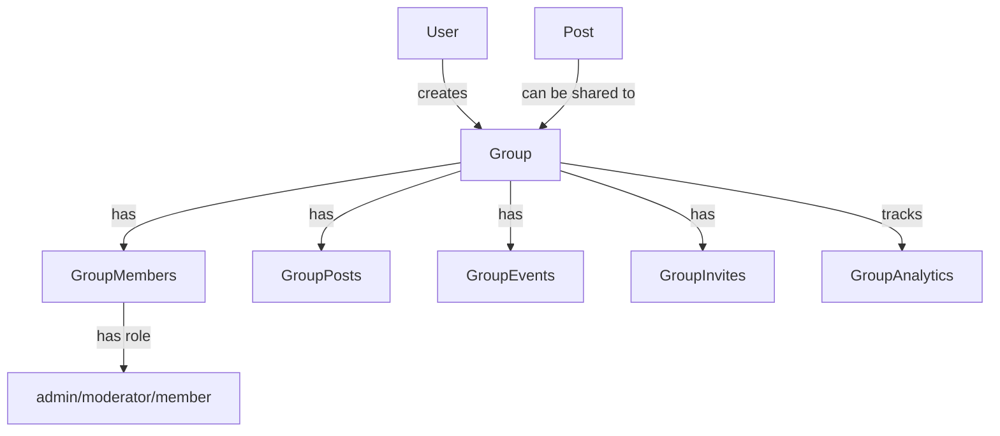

# Groups/Communities Feature Implementation Plan

## Overview

Implement a complete Groups/Communities system that enables users to create groups with privacy settings (public/private/secret), manage memberships with roles (admin/moderator/member), post content (both group-only posts and shared regular posts), organize group events, invite members, discover groups, and track analytics.

## Architecture Overview




## Database Schema

### 1. Groups Table (`groups`)

- `id` (uuid, primary)
- `name` (string)
- `slug` (string, unique, indexed)
- `description` (text, nullable)
- `avatar` (string, nullable)
- `cover_image` (string, nullable)
- `privacy` (enum: public/private/secret)
- `created_by` (uuid, foreign to users)
- `settings` (json: allow_member_posts, require_approval, etc.)
- `members_count` (integer, default 0)
- `posts_count` (integer, default 0)
- `is_active` (boolean, default true)
- `timestamps`

### 2. Group Members Table (`group_members`)

- `id` (uuid, primary)
- `group_id` (uuid, foreign to groups, cascade delete)
- `user_id` (uuid, foreign to users, cascade delete)
- `role` (enum: admin/moderator/member)
- `status` (enum: active/banned/pending)
- `joined_at` (timestamp)
- `invited_by` (uuid, foreign to users, nullable)
- `timestamps`
- Unique constraint: (group_id, user_id)
- Indexes: group_id, user_id, role, status

### 3. Group Posts Table (`group_posts`)

- `id` (uuid, primary)
- `group_id` (uuid, foreign to groups, cascade delete)
- `user_id` (uuid, foreign to users, cascade delete)
- `post_id` (uuid, foreign to posts, nullable - for shared posts)
- `title` (string, nullable)
- `content` (text, nullable)
- `type` (enum: original/shared)
- `is_pinned` (boolean, default false)
- `pinned_at` (timestamp, nullable)
- `status` (enum: active/moderated/deleted)
- `timestamps`
- Indexes: group_id, user_id, post_id, is_pinned, created_at

### 4. Group Events Table (`group_events`)

- `id` (uuid, primary)
- `group_id` (uuid, foreign to groups, cascade delete)
- `created_by` (uuid, foreign to users)
- `title` (string)
- `description` (text, nullable)
- `start_date` (datetime)
- `end_date` (datetime, nullable)
- `location` (string, nullable)
- `is_virtual` (boolean, default false)
- `virtual_link` (string, nullable)
- `max_attendees` (integer, nullable)
- `rsvp_required` (boolean, default false)
- `status` (enum: upcoming/ongoing/completed/cancelled)
- `timestamps`
- Indexes: group_id, start_date, status

### 5. Group Event Attendees Table (`group_event_attendees`)

- `id` (uuid, primary)
- `event_id` (uuid, foreign to group_events, cascade delete)
- `user_id` (uuid, foreign to users, cascade delete)
- `rsvp_status` (enum: going/maybe/not_going)
- `attended` (boolean, default false)
- `timestamps`
- Unique constraint: (event_id, user_id)
- Indexes: event_id, user_id, rsvp_status

### 6. Group Invites Table (`group_invites`)

- `id` (uuid, primary)
- `group_id` (uuid, foreign to groups, cascade delete)
- `invited_by` (uuid, foreign to users)
- `email` (string, nullable - for email invites)
- `user_id` (uuid, foreign to users, nullable - for direct user invites)
- `token` (string, unique, indexed)
- `status` (enum: pending/accepted/declined/expired)
- `expires_at` (timestamp)
- `timestamps`
- Indexes: group_id, email, user_id, token, status

### 7. Update Posts Table

- Add `group_id` (uuid, foreign to groups, nullable, indexed)
- Add `is_group_post` (boolean, default false, indexed)

### 8. Group Analytics Table (`group_analytics`)

- `id` (uuid, primary)
- `group_id` (uuid, foreign to groups, cascade delete)
- `date` (date, indexed)
- `members_count` (integer)
- `posts_count` (integer)
- `events_count` (integer)
- `views_count` (integer)
- `engagement_score` (decimal)
- `timestamps`
- Unique constraint: (group_id, date)

## Models

### Core Models

1. **Group** (`app/Models/Group.php`)

- Relationships: creator, members, posts, events, invites, analytics
- Methods: `isPublic()`, `isPrivate()`, `isSecret()`, `canUserJoin()`, `canUserPost()`, `getMemberRole()`
- Scopes: `public()`, `private()`, `active()`, `forUser()`

2. **GroupMember** (`app/Models/GroupMember.php`)

- Relationships: group, user, inviter
- Methods: `isAdmin()`, `isModerator()`, `canModerate()`, `canInvite()`

3. **GroupPost** (`app/Models/GroupPost.php`)

- Relationships: group, user, post (for shared posts)
- Methods: `isShared()`, `isOriginal()`

4. **GroupEvent** (`app/Models/GroupEvent.php`)

- Relationships: group, creator, attendees
- Methods: `isUpcoming()`, `isOngoing()`, `canRSVP()`, `getAttendeesCount()`

5. **GroupEventAttendee** (`app/Models/GroupEventAttendee.php`)

- Relationships: event, user

6. **GroupInvite** (`app/Models/GroupInvite.php`)

- Relationships: group, inviter, user (if direct invite)
- Methods: `isExpired()`, `accept()`, `decline()`

7. **GroupAnalytics** (`app/Models/GroupAnalytics.php`)

- Relationships: group

### Update Existing Models

- **Post** model: Add `group()` relationship, `groupPosts()` relationship, `canBeSharedToGroup()` method
- **User** model: Add `groups()`, `groupMemberships()`, `createdGroups()` relationships

## Services

### 1. GroupService (`app/Services/GroupService.php`)

- `createGroup(User $user, array $data): Group`
- `updateGroup(Group $group, array $data): Group`
- `deleteGroup(Group $group): void`
- `getGroupBySlug(string $slug): Group`
- `searchGroups(array $filters): Collection`
- `getTrendingGroups(int $limit = 10): Collection`
- `getRecommendedGroups(User $user, int $limit = 10): Collection`

### 2. GroupMembershipService (`app/Services/GroupMembershipService.php`)

- `joinGroup(Group $group, User $user, ?User $inviter = null): GroupMember`
- `leaveGroup(Group $group, User $user): void`
- `updateMemberRole(GroupMember $member, string $role, User $actor): void`
- `removeMember(GroupMember $member, User $actor): void`
- `banMember(GroupMember $member, User $actor): void`
- `unbanMember(GroupMember $member, User $actor): void`
- `approveMember(GroupMember $member, User $actor): void`
- `getMemberRole(Group $group, User $user): ?string`
- `canUserJoin(Group $group, User $user): bool`
- `canUserPost(Group $group, User $user): bool`

### 3. GroupPostService (`app/Services/GroupPostService.php`)

- `createGroupPost(Group $group, User $user, array $data): GroupPost`
- `sharePostToGroup(Post $post, Group $group, User $user): GroupPost`
- `pinPost(GroupPost $groupPost, User $user): void`
- `unpinPost(GroupPost $groupPost, User $user): void`
- `deleteGroupPost(GroupPost $groupPost, User $user): void`
- `getGroupPosts(Group $group, array $filters = []): Collection`

### 4. GroupEventService (`app/Services/GroupEventService.php`)

- `createEvent(Group $group, User $user, array $data): GroupEvent`
- `updateEvent(GroupEvent $event, array $data): GroupEvent`
- `deleteEvent(GroupEvent $event, User $user): void`
- `rsvpToEvent(GroupEvent $event, User $user, string $status): GroupEventAttendee`
- `getUpcomingEvents(Group $group): Collection`
- `getEventAttendees(GroupEvent $event): Collection`

### 5. GroupInviteService (`app/Services/GroupInviteService.php`)

- `inviteByEmail(Group $group, User $inviter, string $email): GroupInvite`
- `inviteUser(Group $group, User $inviter, User $user): GroupInvite`
- `acceptInvite(GroupInvite $invite, User $user): GroupMember`
- `declineInvite(GroupInvite $invite, User $user): void`
- `resendInvite(GroupInvite $invite): GroupInvite`
- `getPendingInvites(Group $group): Collection`

### 6. GroupAnalyticsService (`app/Services/GroupAnalyticsService.php`)

- `recordDailyAnalytics(Group $group): void`
- `getAnalytics(Group $group, ?Carbon $startDate = null, ?Carbon $endDate = null): Collection`
- `getEngagementScore(Group $group): float`
- `getGrowthMetrics(Group $group, int $days = 30): array`

### 7. GroupSearchService (`app/Services/GroupSearchService.php`)

- `search(string $query, array $filters = []): Collection`
- `discoverGroups(User $user, array $preferences = []): Collection`
- `getGroupsByCategory(Category $category): Collection`

## Controllers

### 1. GroupController (`app/Http/Controllers/GroupController.php`)

- `index()` - List groups (discover, my groups, trending)
- `create()` - Show create form
- `store()` - Create new group
- `show()` - Show group details
- `edit()` - Show edit form
- `update()` - Update group
- `destroy()` - Delete group
- `settings()` - Group settings page

### 2. GroupMemberController (`app/Http/Controllers/GroupMemberController.php`)

- `join()` - Join group
- `leave()` - Leave group
- `index()` - List members
- `updateRole()` - Update member role
- `remove()` - Remove member
- `ban()` - Ban member
- `unban()` - Unban member
- `approve()` - Approve pending member

### 3. GroupPostController (`app/Http/Controllers/GroupPostController.php`)

- `index()` - List group posts
- `store()` - Create group post or share post
- `show()` - Show group post
- `pin()` - Pin post
- `unpin()` - Unpin post
- `destroy()` - Delete group post

### 4. GroupEventController (`app/Http/Controllers/GroupEventController.php`)

- `index()` - List group events
- `create()` - Show create form
- `store()` - Create event
- `show()` - Show event details
- `edit()` - Show edit form
- `update()` - Update event
- `destroy()` - Delete event
- `rsvp()` - RSVP to event

### 5. GroupInviteController (`app/Http/Controllers/GroupInviteController.php`)

- `index()` - List invites (sent/received)
- `store()` - Send invite
- `accept()` - Accept invite
- `decline()` - Decline invite
- `resend()` - Resend invite
- `destroy()` - Cancel invite

### 6. GroupAnalyticsController (`app/Http/Controllers/GroupAnalyticsController.php`)

- `index()` - Show analytics dashboard
- `export()` - Export analytics data

## Policies

### GroupPolicy (`app/Policies/GroupPolicy.php`)

- `view()` - Can view group (based on privacy)
- `create()` - Can create groups
- `update()` - Can update (admin only)
- `delete()` - Can delete (admin/creator only)
- `manageMembers()` - Can manage members (admin/moderator)
- `post()` - Can post to group
- `moderate()` - Can moderate content (admin/moderator)
- `invite()` - Can invite members

## Form Requests

- `StoreGroupRequest` - Validation for creating groups
- `UpdateGroupRequest` - Validation for updating groups
- `InviteMemberRequest` - Validation for invites
- `StoreGroupPostRequest` - Validation for group posts
- `StoreGroupEventRequest` - Validation for events
- `UpdateMemberRoleRequest` - Validation for role updates

## Routes

Add to `routes/web.php`:

```php
Route::middleware('auth')->prefix('groups')->name('groups.')->group(function () {
    // Group CRUD
    Route::get('/', [GroupController::class, 'index'])->name('index');
    Route::get('/create', [GroupController::class, 'create'])->name('create');
    Route::post('/', [GroupController::class, 'store'])->name('store');
    Route::get('/{group:slug}', [GroupController::class, 'show'])->name('show');
    Route::get('/{group:slug}/edit', [GroupController::class, 'edit'])->name('edit');
    Route::put('/{group:slug}', [GroupController::class, 'update'])->name('update');
    Route::delete('/{group:slug}', [GroupController::class, 'destroy'])->name('destroy');
    Route::get('/{group:slug}/settings', [GroupController::class, 'settings'])->name('settings');
    
    // Members
    Route::get('/{group:slug}/members', [GroupMemberController::class, 'index'])->name('members.index');
    Route::post('/{group:slug}/join', [GroupMemberController::class, 'join'])->name('members.join');
    Route::post('/{group:slug}/leave', [GroupMemberController::class, 'leave'])->name('members.leave');
    Route::put('/{group:slug}/members/{member}', [GroupMemberController::class, 'updateRole'])->name('members.update-role');
    Route::delete('/{group:slug}/members/{member}', [GroupMemberController::class, 'remove'])->name('members.remove');
    Route::post('/{group:slug}/members/{member}/ban', [GroupMemberController::class, 'ban'])->name('members.ban');
    Route::post('/{group:slug}/members/{member}/unban', [GroupMemberController::class, 'unban'])->name('members.unban');
    Route::post('/{group:slug}/members/{member}/approve', [GroupMemberController::class, 'approve'])->name('members.approve');
    
    // Posts
    Route::get('/{group:slug}/posts', [GroupPostController::class, 'index'])->name('posts.index');
    Route::post('/{group:slug}/posts', [GroupPostController::class, 'store'])->name('posts.store');
    Route::get('/{group:slug}/posts/{groupPost}', [GroupPostController::class, 'show'])->name('posts.show');
    Route::post('/{group:slug}/posts/{groupPost}/pin', [GroupPostController::class, 'pin'])->name('posts.pin');
    Route::post('/{group:slug}/posts/{groupPost}/unpin', [GroupPostController::class, 'unpin'])->name('posts.unpin');
    Route::delete('/{group:slug}/posts/{groupPost}', [GroupPostController::class, 'destroy'])->name('posts.destroy');
    
    // Events
    Route::get('/{group:slug}/events', [GroupEventController::class, 'index'])->name('events.index');
    Route::get('/{group:slug}/events/create', [GroupEventController::class, 'create'])->name('events.create');
    Route::post('/{group:slug}/events', [GroupEventController::class, 'store'])->name('events.store');
    Route::get('/{group:slug}/events/{event}', [GroupEventController::class, 'show'])->name('events.show');
    Route::get('/{group:slug}/events/{event}/edit', [GroupEventController::class, 'edit'])->name('events.edit');
    Route::put('/{group:slug}/events/{event}', [GroupEventController::class, 'update'])->name('events.update');
    Route::delete('/{group:slug}/events/{event}', [GroupEventController::class, 'destroy'])->name('events.destroy');
    Route::post('/{group:slug}/events/{event}/rsvp', [GroupEventController::class, 'rsvp'])->name('events.rsvp');
    
    // Invites
    Route::get('/{group:slug}/invites', [GroupInviteController::class, 'index'])->name('invites.index');
    Route::post('/{group:slug}/invites', [GroupInviteController::class, 'store'])->name('invites.store');
    Route::post('/invites/{invite}/accept', [GroupInviteController::class, 'accept'])->name('invites.accept');
    Route::post('/invites/{invite}/decline', [GroupInviteController::class, 'decline'])->name('invites.decline');
    Route::post('/invites/{invite}/resend', [GroupInviteController::class, 'resend'])->name('invites.resend');
    Route::delete('/invites/{invite}', [GroupInviteController::class, 'destroy'])->name('invites.destroy');
    
    // Analytics
    Route::get('/{group:slug}/analytics', [GroupAnalyticsController::class, 'index'])->name('analytics.index');
    Route::get('/{group:slug}/analytics/export', [GroupAnalyticsController::class, 'export'])->name('analytics.export');
});
```


## Frontend Components (Vue/Inertia)

### Pages

1. **Groups/Index.vue** - Discover groups, my groups, trending
2. **Groups/Create.vue** - Create new group form
3. **Groups/Show.vue** - Group detail page with tabs (posts/events/members/settings)
4. **Groups/Edit.vue** - Edit group form
5. **Groups/Settings.vue** - Group settings (privacy, permissions, etc.)
6. **Groups/Posts/Index.vue** - List group posts
7. **Groups/Posts/Create.vue** - Create group post or share post
8. **Groups/Events/Index.vue** - List group events
9. **Groups/Events/Create.vue** - Create event form
10. **Groups/Events/Show.vue** - Event details with RSVP
11. **Groups/Members/Index.vue** - List members with role management
12. **Groups/Analytics/Index.vue** - Analytics dashboard

### Shared Components

- `GroupCard.vue` - Group card for listings
- `GroupHeader.vue` - Group header with cover/avatar
- `GroupPostCard.vue` - Group post card
- `GroupEventCard.vue` - Event card
- `GroupMemberCard.vue` - Member card with role badge
- `GroupInviteModal.vue` - Invite members modal
- `GroupSettingsForm.vue` - Group settings form
- `GroupPrivacyBadge.vue` - Privacy indicator badge

## Implementation Steps

1. **Database Migrations** - Create all migration files
2. **Models** - Create all model classes with relationships
3. **Services** - Implement all service classes
4. **Policies** - Create GroupPolicy
5. **Form Requests** - Create validation request classes
6. **Controllers** - Implement all controllers
7. **Routes** - Add routes to web.php
8. **Frontend Pages** - Create Vue/Inertia pages
9. **Frontend Components** - Create reusable components
10. **Testing** - Write feature tests for critical paths
11. **Documentation** - Update API/docs if needed

## Key Files to Create/Modify

### New Files

- `database/migrations/2026_01_XX_create_groups_table.php`
- `database/migrations/2026_01_XX_create_group_members_table.php`
- `database/migrations/2026_01_XX_create_group_posts_table.php`
- `database/migrations/2026_01_XX_create_group_events_table.php`
- `database/migrations/2026_01_XX_create_group_event_attendees_table.php`
- `database/migrations/2026_01_XX_create_group_invites_table.php`
- `database/migrations/2026_01_XX_create_group_analytics_table.php`
- `database/migrations/2026_01_XX_add_group_fields_to_posts_table.php`
- `app/Models/Group.php`
- `app/Models/GroupMember.php`
- `app/Models/GroupPost.php`
- `app/Models/GroupEvent.php`
- `app/Models/GroupEventAttendee.php`
- `app/Models/GroupInvite.php`
- `app/Models/GroupAnalytics.php`
- `app/Services/GroupService.php`
- `app/Services/GroupMembershipService.php`
- `app/Services/GroupPostService.php`
- `app/Services/GroupEventService.php`
- `app/Services/GroupInviteService.php`
- `app/Services/GroupAnalyticsService.php`
- `app/Services/GroupSearchService.php`
- `app/Http/Controllers/GroupController.php`
- `app/Http/Controllers/GroupMemberController.php`
- `app/Http/Controllers/GroupPostController.php`
- `app/Http/Controllers/GroupEventController.php`
- `app/Http/Controllers/GroupInviteController.php`
- `app/Http/Controllers/GroupAnalyticsController.php`
- `app/Policies/GroupPolicy.php`
- `app/Http/Requests/StoreGroupRequest.php`
- `app/Http/Requests/UpdateGroupRequest.php`
- `app/Http/Requests/InviteMemberRequest.php`
- `app/Http/Requests/StoreGroupPostRequest.php`
- `app/Http/Requests/StoreGroupEventRequest.php`
- `app/Http/Requests/UpdateMemberRoleRequest.php`
- `resources/js/Pages/Groups/Index.vue`
- `resources/js/Pages/Groups/Create.vue`
- `resources/js/Pages/Groups/Show.vue`
- `resources/js/Pages/Groups/Edit.vue`
- `resources/js/Pages/Groups/Settings.vue`
- `resources/js/Pages/Groups/Posts/Index.vue`
- `resources/js/Pages/Groups/Posts/Create.vue`
- `resources/js/Pages/Groups/Events/Index.vue`
- `resources/js/Pages/Groups/Events/Create.vue`
- `resources/js/Pages/Groups/Events/Show.vue`
- `resources/js/Pages/Groups/Members/Index.vue`
- `resources/js/Pages/Groups/Analytics/Index.vue`
- `resources/js/Components/Groups/GroupCard.vue`
- `resources/js/Components/Groups/GroupHeader.vue`
- `resources/js/Components/Groups/GroupPostCard.vue`