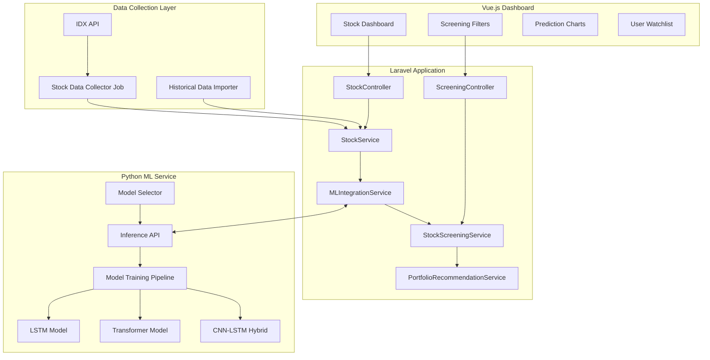

# Indonesian Stock Screening with Deep Learning

## Overview

This plan implements a comprehensive Indonesian stock screening system with deep learning capabilities. The system collects historical data (10 years) and real-time data from IDX API, trains multiple deep learning models (LSTM, Transformer, CNN-LSTM) for price prediction, generates buy/sell signals, assesses risk, analyzes trends, and provides portfolio recommendations. Features tiered access control (free users get basic screening, premium users get advanced predictions).

## Architecture

The system consists of three main components:

1. **Laravel Application**: Main backend with API, services, and Vue.js dashboard
2. **Python ML Service**: Separate microservice for deep learning model training and inference
3. **Data Collection Layer**: Jobs and commands for fetching data from IDX API



## Database Changes

### 1. Create `stocks` table

**File**: `database/migrations/YYYY_MM_DD_HHMMSS_create_stocks_table.php`Columns:

- `id` (uuid, primary)
- `code` (string, unique) - Stock code (e.g., 'BBRI', 'BBCA')
- `name` (string) - Company name
- `sector` (string, nullable) - Business sector
- `sub_sector` (string, nullable) - Sub sector
- `listing_date` (date, nullable)
- `is_active` (boolean, default true)
- `market_cap` (bigInteger, nullable) - Market capitalization
- `category` (enum: 'LQ45', 'IDX30', 'IDX80', 'Kompas100', 'others', nullable)
- `metadata` (json, nullable) - Additional stock info
- `timestamps`
- Indexes on `code`, `sector`, `category`, `is_active`

### 2. Create `stock_prices` table

**File**: `database/migrations/YYYY_MM_DD_HHMMSS_create_stock_prices_table.php`Columns:

- `id` (uuid, primary)
- `stock_id` (uuid, foreign to stocks)
- `date` (date)
- `open` (decimal 15,2)
- `high` (decimal 15,2)
- `low` (decimal 15,2)
- `close` (decimal 15,2)
- `volume` (bigInteger)
- `value` (decimal 20,2) - Trading value
- `frequency` (integer, nullable) - Number of transactions
- `is_intraday` (boolean, default false) - Real-time intraday data
- `timestamp` (timestamp, nullable) - For intraday precision
- `timestamps`
- Unique index on (`stock_id`, `date`, `timestamp`)
- Indexes on `stock_id`, `date`, `is_intraday`

### 3. Create `stock_technical_indicators` table

**File**: `database/migrations/YYYY_MM_DD_HHMMSS_create_stock_technical_indicators_table.php`Columns:

- `id` (uuid, primary)
- `stock_id` (uuid, foreign to stocks)
- `date` (date)
- `sma_5` (decimal 15,2, nullable) - Simple Moving Average 5 days
- `sma_10` (decimal 15,2, nullable)
- `sma_20` (decimal 15,2, nullable)
- `sma_50` (decimal 15,2, nullable)
- `sma_200` (decimal 15,2, nullable)
- `ema_12` (decimal 15,2, nullable) - Exponential Moving Average
- `ema_26` (decimal 15,2, nullable)
- `rsi` (decimal 5,2, nullable) - Relative Strength Index (0-100)
- `macd` (decimal 15,2, nullable)
- `macd_signal` (decimal 15,2, nullable)
- `macd_histogram` (decimal 15,2, nullable)
- `bollinger_upper` (decimal 15,2, nullable)
- `bollinger_middle` (decimal 15,2, nullable)
- `bollinger_lower` (decimal 15,2, nullable)
- `stochastic_k` (decimal 5,2, nullable)
- `stochastic_d` (decimal 5,2, nullable)
- `adx` (decimal 5,2, nullable) - Average Directional Index
- `atr` (decimal 15,2, nullable) - Average True Range
- `volatility` (decimal 5,4, nullable) - Calculated volatility
- `timestamps`
- Unique index on (`stock_id`, `date`)
- Index on `stock_id`, `date`

### 4. Create `ml_models` table

**File**: `database/migrations/YYYY_MM_DD_HHMMSS_create_ml_models_table.php`Columns:

- `id` (uuid, primary)
- `model_type` (enum: 'lstm', 'transformer', 'cnn_lstm', 'ensemble')
- `stock_id` (uuid, nullable, foreign to stocks) - null for general model
- `model_version` (string) - Version identifier
- `status` (enum: 'training', 'active', 'archived', 'failed')
- `training_started_at` (timestamp, nullable)
- `training_completed_at` (timestamp, nullable)
- `metrics` (json) - Training metrics (accuracy, loss, etc.)
- `hyperparameters` (json) - Model hyperparameters
- `file_path` (string, nullable) - Path to saved model file
- `prediction_horizon` (integer) - Days ahead for prediction (1, 7, 30)
- `is_best_model` (boolean, default false)
- `timestamps`
- Indexes on `model_type`, `stock_id`, `status`, `prediction_horizon`

### 5. Create `stock_predictions` table

**File**: `database/migrations/YYYY_MM_DD_HHMMSS_create_stock_predictions_table.php`Columns:

- `id` (uuid, primary)
- `stock_id` (uuid, foreign to stocks)
- `ml_model_id` (uuid, foreign to ml_models)
- `prediction_date` (date) - Date when prediction was made
- `target_date` (date) - Date being predicted
- `predicted_price` (decimal 15,2)
- `confidence_score` (decimal 5,4) - 0-1 confidence level
- `lower_bound` (decimal 15,2, nullable) - Lower confidence interval
- `upper_bound` (decimal 15,2, nullable) - Upper confidence interval
- `prediction_horizon` (integer) - Days ahead (1, 7, 30)
- `actual_price` (decimal 15,2, nullable) - Filled when target_date arrives
- `prediction_error` (decimal 15,4, nullable) - Calculated error
- `metadata` (json, nullable)
- `timestamps`
- Unique index on (`stock_id`, `ml_model_id`, `prediction_date`, `target_date`)
- Indexes on `stock_id`, `target_date`, `prediction_horizon`

### 6. Create `stock_signals` table

**File**: `database/migrations/YYYY_MM_DD_HHMMSS_create_stock_signals_table.php`Columns:

- `id` (uuid, primary)
- `stock_id` (uuid, foreign to stocks)
- `signal_type` (enum: 'buy', 'sell', 'hold')
- `signal_strength` (decimal 3,2) - 0.00-1.00
- `signal_date` (date)
- `source` (enum: 'ml_prediction', 'technical_analysis', 'ensemble')
- `ml_model_id` (uuid, nullable, foreign to ml_models)
- `technical_indicators` (json, nullable) - Indicators that triggered signal
- `reason` (text, nullable) - Human-readable reason
- `price_target` (decimal 15,2, nullable)
- `stop_loss` (decimal 15,2, nullable)
- `take_profit` (decimal 15,2, nullable)
- `risk_level` (enum: 'low', 'medium', 'high', 'very_high')
- `expires_at` (timestamp, nullable) - Signal validity
- `timestamps`
- Indexes on `stock_id`, `signal_type`, `signal_date`, `source`, `risk_level`

### 7. Create `stock_watchlists` table

**File**: `database/migrations/YYYY_MM_DD_HHMMSS_create_stock_watchlists_table.php`Columns:

- `id` (uuid, primary)
- `user_id` (uuid, foreign to users)
- `stock_id` (uuid, foreign to stocks)
- `notes` (text, nullable)
- `alert_price_above` (decimal 15,2, nullable)
- `alert_price_below` (decimal 15,2, nullable)
- `notify_on_signal` (boolean, default true)
- `timestamps`
- Unique index on (`user_id`, `stock_id`)
- Indexes on `user_id`, `stock_id`

### 8. Create `stock_screenings` table

**File**: `database/migrations/YYYY_MM_DD_HHMMSS_create_stock_screenings_table.php`Columns:

- `id` (uuid, primary)
- `user_id` (uuid, nullable, foreign to users) - null for anonymous
- `name` (string, nullable) - Saved screening name
- `filters` (json) - Screening criteria
- `results` (json, nullable) - Cached results
- `results_count` (integer, default 0)
- `last_run_at` (timestamp, nullable)
- `is_saved` (boolean, default false)
- `timestamps`
- Index on `user_id`

### 9. Create `portfolio_recommendations` table

**File**: `database/migrations/YYYY_MM_DD_HHMMSS_create_portfolio_recommendations_table.php`Columns:

- `id` (uuid, primary)
- `user_id` (uuid, foreign to users)
- `risk_profile` (enum: 'conservative', 'moderate', 'aggressive')
- `investment_amount` (decimal 15,2)
- `investment_horizon` (integer) - Days
- `allocation` (json) - Stock allocations with percentages
- `expected_return` (decimal 5,4, nullable)
- `expected_risk` (decimal 5,4, nullable) - Volatility
- `sharpe_ratio` (decimal 5,4, nullable)
- `generated_at` (timestamp)
- `timestamps`
- Index on `user_id`, `generated_at`

## Models

### 1. Create `Stock` model

**File**: `app/Models/Stock.php`

- UUID primary key
- Relationships: `prices()`, `technicalIndicators()`, `predictions()`, `signals()`, `watchlists()`
- Methods: `getLatestPrice()`, `getPriceAt($date)`, `isInCategory($category)`, `getMarketCap()`
- Scopes: `active()`, `byCategory($category)`, `bySector($sector)`
- Casts: metadata (array), market_cap, listing_date

### 2. Create `StockPrice` model

**File**: `app/Models/StockPrice.php`

- UUID primary key
- Relationships: `stock()`
- Methods: `calculateReturns()`, `getPriceChange()`, `isPriceUp()`
- Scopes: `latest()`, `byDateRange($from, $to)`, `intraday()`
- Casts: open, high, low, close, volume, value, date

### 3. Create `StockTechnicalIndicator` model

**File**: `app/Models/StockTechnicalIndicator.php`

- UUID primary key
- Relationships: `stock()`
- Methods: `getSignalStrength()`, `getTrend()`, `isOversold()`, `isOverbought()`
- Scopes: `latest()`, `byDateRange($from, $to)`
- Casts: all decimal fields, date

### 4. Create `MlModel` model

**File**: `app/Models/MlModel.php`

- UUID primary key
- Relationships: `stock()`, `predictions()`, `signals()`
- Methods: `getBestModelForStock($stockId, $horizon)`, `isActive()`, `getAccuracy()`
- Scopes: `active()`, `byType($type)`, `best()`, `byPredictionHorizon($horizon)`
- Casts: metrics (array), hyperparameters (array), training dates

### 5. Create `StockPrediction` model

**File**: `app/Models/StockPrediction.php`

- UUID primary key
- Relationships: `stock()`, `mlModel()`
- Methods: `calculateError()`, `getPredictionAccuracy()`, `isAccurate($threshold)`
- Scopes: `latest()`, `byHorizon($horizon)`, `byDateRange($from, $to)`, `withActuals()`
- Casts: prices, confidence, dates

### 6. Create `StockSignal` model

**File**: `app/Models/StockSignal.php`

- UUID primary key
- Relationships: `stock()`, `mlModel()`
- Methods: `isExpired()`, `isValid()`, `getRiskScore()`
- Scopes: `active()`, `byType($type)`, `byRiskLevel($level)`, `latest()`, `expired()`
- Casts: signal_strength, prices, dates, technical_indicators (array)

### 7. Create `StockWatchlist` model

**File**: `app/Models/StockWatchlist.php`

- UUID primary key
- Relationships: `user()`, `stock()`
- Scopes: `byUser($userId)`, `withAlerts()`
- Casts: alert prices

### 8. Create `StockScreening` model

**File**: `app/Models/StockScreening.php`

- UUID primary key
- Relationships: `user()`
- Methods: `run()`, `getResults()`, `isExpired()`
- Scopes: `saved()`, `byUser($userId)`
- Casts: filters (array), results (array), dates

### 9. Create `PortfolioRecommendation` model

**File**: `app/Models/PortfolioRecommendation.php`

- UUID primary key
- Relationships: `user()`
- Methods: `calculateReturns()`, `getRiskMetrics()`, `getAllocationBreakdown()`
- Scopes: `latest()`, `byRiskProfile($profile)`, `byUser($userId)`
- Casts: allocation (array), amounts, ratios, dates

## Services

### 1. Create `IdxApiService`

**File**: `app/Services/IdxApiService.php`Methods:

- `fetchStockList(): Collection` - Get all listed stocks
- `fetchStockPrice(string $code, ?Carbon $date = null): ?StockPrice` - Get price for specific date
- `fetchHistoricalPrices(string $code, Carbon $startDate, Carbon $endDate): Collection`
- `fetchIntradayPrice(string $code): ?StockPrice` - Real-time intraday data
- `fetchStockMetadata(string $code): array` - Company info, sector, etc.
- `getActiveStocks(): Collection`
- `getStocksByCategory(string $category): Collection`

**Note**: This service will integrate with IDX API. Implementation depends on available IDX API endpoints. May need to use web scraping if official API is limited.

### 2. Create `StockDataCollectionService`

**File**: `app/Services/StockDataCollectionService.php`Methods:

- `collectAllStocks(): void` - Import/update stock list
- `collectHistoricalData(string $stockCode, int $years = 10): void` - Import 10 years historical
- `collectDailyPrices(?Carbon $date = null): void` - Collect daily prices for all stocks
- `collectIntradayPrices(): void` - Collect real-time prices (every minute during market hours)
- `updateTechnicalIndicators(string $stockCode): void` - Recalculate indicators after price update
- `validateDataIntegrity(string $stockCode): array` - Check for missing dates, gaps

### 3. Create `TechnicalIndicatorService`

**File**: `app/Services/TechnicalIndicatorService.php`Methods:

- `calculateSMA(Collection $prices, int $period): Collection` - Simple Moving Average
- `calculateEMA(Collection $prices, int $period): Collection` - Exponential Moving Average
- `calculateRSI(Collection $prices, int $period = 14): Collection` - Relative Strength Index
- `calculateMACD(Collection $prices, int $fast = 12, int $slow = 26, int $signal = 9): Collection`
- `calculateBollingerBands(Collection $prices, int $period = 20, float $stdDev = 2): Collection`
- `calculateStochastic(Collection $prices, int $kPeriod = 14, int $dPeriod = 3): Collection`
- `calculateADX(Collection $prices, int $period = 14): Collection` - Average Directional Index
- `calculateATR(Collection $prices, int $period = 14): Collection` - Average True Range
- `calculateVolatility(Collection $prices, int $period = 20): Collection`
- `updateIndicatorsForStock(string $stockCode): void` - Update all indicators for a stock
- `generateSignalsFromIndicators(Stock $stock): Collection` - Generate buy/sell signals

### 4. Create `MLIntegrationService`

**File**: `app/Services/MLIntegrationService.php`Methods:

- `requestPrediction(string $stockCode, int $horizon = 1, ?string $modelType = null): StockPrediction`
- `requestBulkPrediction(array $stockCodes, int $horizon = 1): Collection`
- `trainModel(string $stockCode, string $modelType, array $hyperparameters = []): MlModel`
- `selectBestModel(string $stockCode, int $horizon): ?MlModel`
- `getModelMetrics(string $modelId): array`
- `checkTrainingStatus(string $modelId): string`

**Note**: This service communicates with Python ML service via HTTP API.

### 5. Create `StockScreeningService`

**File**: `app/Services/StockScreeningService.php`Methods:

- `screen(array $filters, ?User $user = null): Collection` - Main screening method
- `applyFilters(Collection $stocks, array $filters): Collection`
- `filterByPriceRange(Collection $stocks, ?float $min, ?float $max): Collection`
- `filterByVolume(Collection $stocks, ?int $minVolume): Collection`
- `filterBySector(Collection $stocks, array $sectors): Collection`
- `filterByCategory(Collection $stocks, array $categories): Collection`
- `filterByRSI(Collection $stocks, ?float $minRSI, ?float $maxRSI): Collection`
- `filterByMACD(Collection $stocks, bool $bullish = true): Collection`
- `filterBySignal(Collection $stocks, string $signalType, ?float $minStrength = null): Collection`
- `filterByRiskLevel(Collection $stocks, array $riskLevels): Collection`
- `filterByPrediction(Collection $stocks, float $minConfidence, int $horizon = 1): Collection`
- `getFreeTierLimits(): array` - Return limits for free users
- `applyTieredAccess(Collection $results, ?User $user): Collection` - Limit results based on tier

### 6. Create `PortfolioRecommendationService`

**File**: `app/Services/PortfolioRecommendationService.php`Methods:

- `generateRecommendation(User $user, string $riskProfile, float $investmentAmount, int $horizon): PortfolioRecommendation`
- `calculateOptimalAllocation(array $stocks, string $riskProfile, float $amount): array`
- `calculateExpectedReturn(array $allocations): float`
- `calculatePortfolioRisk(array $allocations): float`
- `calculateSharpeRatio(float $return, float $risk, float $riskFreeRate = 0.05): float`
- `getStocksForRiskProfile(string $profile): Collection`
- `validateRecommendation(PortfolioRecommendation $recommendation): array` - Validation errors

**Note**: Portfolio optimization uses Modern Portfolio Theory (MPT). Advanced users get access to this feature.

### 7. Create `StockSignalService`

**File**: `app/Services/StockSignalService.php`Methods:

- `generateSignals(Stock $stock, string $source = 'ensemble'): Collection`
- `combineMLAndTechnicalSignals(Stock $stock): StockSignal`
- `calculateSignalStrength(array $signals): float`
- `calculateRiskLevel(Stock $stock, StockSignal $signal): string`
- `setPriceTargets(Stock $stock, StockSignal $signal): void`
- `expireOldSignals(): void`
- `notifyWatchlistUsers(StockSignal $signal): void`

## Jobs

### 1. Create `CollectStockDataJob`

**File**: `app/Jobs/CollectStockDataJob.php`

- Queue: `stock-data`
- Handle: Fetch stock prices from IDX API and store in database
- Parameters: `$stockCode`, `$date` (nullable)

### 2. Create `CollectIntradayPricesJob`

**File**: `app/Jobs/CollectIntradayPricesJob.php`

- Queue: `stock-data`
- Handle: Fetch real-time intraday prices every minute during market hours
- Runs: Scheduled every minute (9:00-16:00 WIB only)

### 3. Create `UpdateTechnicalIndicatorsJob`

**File**: `app/Jobs/UpdateTechnicalIndicatorsJob.php`

- Queue: `indicators`
- Handle: Recalculate technical indicators after price update
- Parameters: `$stockCode`

### 4. Create `TrainMLModelJob`

**File**: `app/Jobs/TrainMLModelJob.php`

- Queue: `ml-training`
- Handle: Trigger ML model training via Python service
- Parameters: `$stockCode`, `$modelType`, `$horizon`

### 5. Create `GeneratePredictionsJob`

**File**: `app/Jobs/GeneratePredictionsJob.php`

- Queue: `ml-inference`
- Handle: Generate predictions for all active stocks daily
- Runs: Scheduled daily after market close

### 6. Create `GenerateSignalsJob`

**File**: `app/Jobs/GenerateSignalsJob.php`

- Queue: `signals`
- Handle: Generate buy/sell signals based on predictions and technical analysis
- Runs: Scheduled daily after predictions are generated

### 7. Create `ImportHistoricalDataJob`

**File**: `app/Jobs/ImportHistoricalDataJob.php`

- Queue: `historical-data`
- Handle: Import 10 years historical data for a stock
- Parameters: `$stockCode`

### 8. Create `CheckPredictionAccuracyJob`

**File**: `app/Jobs/CheckPredictionAccuracyJob.php`

- Queue: `ml-inference`
- Handle: Compare predictions with actual prices and update accuracy metrics
- Runs: Scheduled daily to validate past predictions

## Commands

### 1. Create `stocks:import-historical` command

**File**: `app/Console/Commands/StocksImportHistoricalCommand.php`

- Purpose: Import 10 years historical data for all stocks or specific stock
- Options: `--stock=CODE`, `--years=10`, `--all`
- Usage: `php artisan stocks:import-historical --all`

### 2. Create `stocks:collect-daily` command

**File**: `app/Console/Commands/StocksCollectDailyCommand.php`

- Purpose: Collect daily prices for all active stocks
- Options: `--date=YYYY-MM-DD` (default: today)
- Usage: `php artisan stocks:collect-daily`

### 3. Create `stocks:update-indicators` command

**File**: `app/Console/Commands/StocksUpdateIndicatorsCommand.php`

- Purpose: Recalculate technical indicators for all stocks or specific stock
- Options: `--stock=CODE`, `--all`
- Usage: `php artisan stocks:update-indicators --all`

### 4. Create `ml:train-model` command

**File**: `app/Console/Commands/MLTrainModelCommand.php`

- Purpose: Train ML model for a stock
- Options: `--stock=CODE`, `--type=lstm|transformer|cnn_lstm`, `--horizon=1|7|30`, `--all`
- Usage: `php artisan ml:train-model --stock=BBRI --type=lstm --horizon=1`

### 5. Create `ml:generate-predictions` command

**File**: `app/Console/Commands/MLGeneratePredictionsCommand.php`

- Purpose: Generate predictions for all active stocks
- Options: `--stock=CODE`, `--horizon=1|7|30`, `--all`
- Usage: `php artisan ml:generate-predictions --all`

### 6. Create `ml:select-best-models` command

**File**: `app/Console/Commands/MLSelectBestModelsCommand.php`

- Purpose: Evaluate and select best model for each stock/horizon combination
- Usage: `php artisan ml:select-best-models`

### 7. Create `signals:generate` command

**File**: `app/Console/Commands/SignalsGenerateCommand.php`

- Purpose: Generate buy/sell signals based on current predictions and indicators
- Options: `--stock=CODE`, `--all`
- Usage: `php artisan signals:generate --all`

### 8. Create `signals:expire` command

**File**: `app/Console/Commands/SignalsExpireCommand.php`

- Purpose: Mark expired signals as inactive
- Usage: `php artisan signals:expire`

## Python ML Service

**Directory**: `python-ml-service/` (separate microservice)

### Structure:

```javascript
python-ml-service/
├── app/
│   ├── models/
│   │   ├── lstm_model.py
│   │   ├── transformer_model.py
│   │   ├── cnn_lstm_model.py
│   │   └── model_selector.py
│   ├── data/
│   │   ├── data_loader.py
│   │   ├── data_preprocessor.py
│   │   └── feature_engineering.py
│   ├── training/
│   │   ├── trainer.py
│   │   └── evaluator.py
│   ├── inference/
│   │   └── predictor.py
│   └── api/
│       └── main.py (FastAPI)
├── requirements.txt
└── README.md
```


### Key Components:

1. **Data Loader**: Fetches stock data from Laravel API/database
2. **Preprocessor**: Normalizes data, handles missing values, creates sequences
3. **Feature Engineering**: Creates technical indicators, feature combinations
4. **Models**: 

- LSTM: For time series prediction
- Transformer: For advanced pattern recognition
- CNN-LSTM: Hybrid for both patterns and sequences

5. **Model Selector**: Auto-selects best model based on validation metrics
6. **Trainer**: Trains models with hyperparameter tuning
7. **Evaluator**: Validates models, calculates metrics (MAE, RMSE, MAPE)
8. **Predictor**: Generates predictions via API endpoint
9. **FastAPI**: REST API for Laravel to communicate with

### API Endpoints (Python Service):

- `POST /api/ml/train` - Train a model
- `GET /api/ml/status/{model_id}` - Check training status
- `POST /api/ml/predict` - Generate prediction
- `GET /api/ml/metrics/{model_id}` - Get model metrics
- `POST /api/ml/select-best` - Select best model for stock/horizon

## Controllers

### 1. Create `StockController`

**File**: `app/Http/Controllers/StockController.php`Methods:

- `index(Request $request)` - List stocks with filters
- `show(Stock $stock)` - Stock details
- `prices(Stock $stock, Request $request)` - Price history
- `indicators(Stock $stock, Request $request)` - Technical indicators
- `predictions(Stock $stock, Request $request)` - ML predictions
- `signals(Stock $stock, Request $request)` - Buy/sell signals

### 2. Create `StockScreeningController`

**File**: `app/Http/Controllers/StockScreeningController.php`Methods:

- `screen(Request $request)` - Run screening with filters
- `save(Request $request)` - Save screening criteria
- `saved(Request $request)` - List saved screenings
- `results(string $screeningId)` - Get screening results
- `delete(string $screeningId)` - Delete saved screening

### 3. Create `StockWatchlistController`

**File**: `app/Http/Controllers/StockWatchlistController.php`Methods:

- `index()` - User's watchlist
- `store(Request $request)` - Add to watchlist
- `update(StockWatchlist $watchlist, Request $request)` - Update watchlist item
- `destroy(StockWatchlist $watchlist)` - Remove from watchlist

### 4. Create `PortfolioRecommendationController`

**File**: `app/Http/Controllers/PortfolioRecommendationController.php`Methods:

- `generate(Request $request)` - Generate portfolio recommendation (premium only)
- `index()` - User's portfolio recommendations
- `show(PortfolioRecommendation $recommendation)` - Recommendation details

### 5. Create `StockPredictionController`

**File**: `app/Http/Controllers/StockPredictionController.php`Methods:

- `predict(Request $request)` - Get predictions for stock(s) (tiered access)
- `accuracy(Stock $stock, Request $request)` - Prediction accuracy metrics

## Request Validation

### 1. Create `ScreenStocksRequest`

**File**: `app/Http/Requests/ScreenStocksRequest.php`Validation:

- `sector`: nullable, array
- `category`: nullable, array, in:LQ45,IDX30,IDX80,Kompas100
- `price_min`: nullable, numeric, min:0
- `price_max`: nullable, numeric, min:0, gt:price_min
- `volume_min`: nullable, integer, min:0
- `rsi_min`: nullable, numeric, between:0,100
- `rsi_max`: nullable, numeric, between:0,100, gt:rsi_min
- `signal_type`: nullable, in:buy,sell,hold
- `signal_strength_min`: nullable, numeric, between:0,1
- `risk_level`: nullable, array, in:low,medium,high,very_high
- `prediction_horizon`: nullable, in:1,7,30
- `prediction_confidence_min`: nullable, numeric, between:0,1
- `limit`: nullable, integer, max:100 (free: max 20, premium: max 100)

### 2. Create `GeneratePortfolioRequest`

**File**: `app/Http/Requests/GeneratePortfolioRequest.php`Validation:

- `risk_profile`: required, in:conservative,moderate,aggressive
- `investment_amount`: required, numeric, min:1000000 (1M IDR)
- `investment_horizon`: required, integer, min:30, max:3650
- Premium users only validation

### 3. Create `AddToWatchlistRequest`

**File**: `app/Http/Requests/AddToWatchlistRequest.php`Validation:

- `stock_id`: required, uuid, exists:stocks,id
- `notes`: nullable, string, max:1000
- `alert_price_above`: nullable, numeric, min:0
- `alert_price_below`: nullable, numeric, min:0
- `notify_on_signal`: boolean

## Routes

**File**: `routes/web.php`Add routes:

```php
// Stock data
Route::get('/stocks', [StockController::class, 'index'])->name('stocks.index');
Route::get('/stocks/{stock}', [StockController::class, 'show'])->name('stocks.show');
Route::get('/stocks/{stock}/prices', [StockController::class, 'prices'])->name('stocks.prices');
Route::get('/stocks/{stock}/indicators', [StockController::class, 'indicators'])->name('stocks.indicators');
Route::get('/stocks/{stock}/predictions', [StockController::class, 'predictions'])->middleware('auth')->name('stocks.predictions');
Route::get('/stocks/{stock}/signals', [StockController::class, 'signals'])->name('stocks.signals');

// Stock screening
Route::post('/stocks/screen', [StockScreeningController::class, 'screen'])->name('stocks.screen');
Route::post('/stocks/screenings', [StockScreeningController::class, 'save'])->middleware('auth')->name('stocks.screenings.save');
Route::get('/stocks/screenings', [StockScreeningController::class, 'saved'])->middleware('auth')->name('stocks.screenings.index');
Route::get('/stocks/screenings/{screening}', [StockScreeningController::class, 'results'])->middleware('auth')->name('stocks.screenings.results');
Route::delete('/stocks/screenings/{screening}', [StockScreeningController::class, 'delete'])->middleware('auth')->name('stocks.screenings.delete');

// Watchlist
Route::get('/stocks/watchlist', [StockWatchlistController::class, 'index'])->middleware('auth')->name('stocks.watchlist.index');
Route::post('/stocks/watchlist', [StockWatchlistController::class, 'store'])->middleware('auth')->name('stocks.watchlist.store');
Route::put('/stocks/watchlist/{watchlist}', [StockWatchlistController::class, 'update'])->middleware('auth')->name('stocks.watchlist.update');
Route::delete('/stocks/watchlist/{watchlist}', [StockWatchlistController::class, 'destroy'])->middleware('auth')->name('stocks.watchlist.destroy');

// Portfolio recommendations (premium)
Route::post('/portfolio/generate', [PortfolioRecommendationController::class, 'generate'])->middleware(['auth', 'premium'])->name('portfolio.generate');
Route::get('/portfolio/recommendations', [PortfolioRecommendationController::class, 'index'])->middleware('auth')->name('portfolio.index');
Route::get('/portfolio/recommendations/{recommendation}', [PortfolioRecommendationController::class, 'show'])->middleware('auth')->name('portfolio.show');

// Predictions (tiered access)
Route::post('/stocks/predict', [StockPredictionController::class, 'predict'])->middleware('auth')->name('stocks.predict');
Route::get('/stocks/{stock}/prediction-accuracy', [StockPredictionController::class, 'accuracy'])->middleware('auth')->name('stocks.prediction-accuracy');
```


## Scheduled Tasks

**File**: `routes/console.php`Add schedules:

```php
// Stock data collection (every minute during market hours: 9:00-16:00 WIB)
Schedule::command('stocks:collect-intraday')->everyMinute()->between('9:00', '16:00')->timezone('Asia/Jakarta')->weekdays();

// Daily price collection (after market close)
Schedule::command('stocks:collect-daily')->dailyAt('16:15')->timezone('Asia/Jakarta')->weekdays();

// Update technical indicators (after daily price collection)
Schedule::command('stocks:update-indicators --all')->dailyAt('16:30')->timezone('Asia/Jakarta')->weekdays();

// Generate predictions (after market close)
Schedule::command('ml:generate-predictions --all')->dailyAt('17:00')->timezone('Asia/Jakarta')->weekdays();

// Generate signals (after predictions)
Schedule::command('signals:generate --all')->dailyAt('17:30')->timezone('Asia/Jakarta')->weekdays();

// Check prediction accuracy (compare with actuals)
Schedule::command('ml:check-accuracy')->dailyAt('18:00')->timezone('Asia/Jakarta')->weekdays();

// Expire old signals
Schedule::command('signals:expire')->hourly();

// Select best models (weekly, Sunday)
Schedule::command('ml:select-best-models')->weeklyOn(0, '2:00')->timezone('Asia/Jakarta');

// Retrain models (weekly, Sunday)
Schedule::command('ml:retrain-models --all')->weeklyOn(0, '3:00')->timezone('Asia/Jakarta');
```


## Vue.js Components

### 1. Create `StockDashboard.vue`

**File**: `resources/js/Pages/Stocks/StockDashboard.vue`

- Main dashboard showing:
- Market overview (IDX composite, top gainers/losers)
- User watchlist
- Recent predictions
- Active signals
- Quick screening form

### 2. Create `StockScreening.vue`

**File**: `resources/js/Pages/Stocks/StockScreening.vue`

- Advanced screening interface with filters:
- Sector/Category dropdowns
- Price range sliders
- Technical indicator filters (RSI, MACD, etc.)
- Signal type filters
- Risk level filters
- Prediction confidence filters
- Results table with sortable columns
- Save/load screening criteria
- Export results (CSV/Excel) - premium feature

### 3. Create `StockDetail.vue`

**File**: `resources/js/Pages/Stocks/StockDetail.vue`

- Stock detail page showing:
- Current price and chart (candlestick/line)
- Technical indicators chart
- ML predictions chart (1d, 7d, 30d horizons)
- Buy/sell signals
- Historical performance
- Company information
- Add to watchlist button
- Price alerts setup

### 4. Create `StockChart.vue`

**File**: `resources/js/Components/Stocks/StockChart.vue`

- Interactive chart component (using Chart.js or similar)
- Show price, volume, technical indicators
- Overlay predictions
- Timeframe selector (1D, 1W, 1M, 3M, 1Y, 5Y, 10Y)

### 5. Create `PredictionCard.vue`

**File**: `resources/js/Components/Stocks/PredictionCard.vue`

- Display ML prediction with:
- Predicted price
- Confidence score
- Prediction horizon
- Confidence intervals (upper/lower bounds)
- Model type used

### 6. Create `SignalCard.vue`

**File**: `resources/js/Components/Stocks/SignalCard.vue`

- Display buy/sell/hold signal with:
- Signal strength indicator
- Risk level badge
- Price targets (stop loss, take profit)
- Reason/explanation
- Expiry date

### 7. Create `WatchlistManager.vue`

**File**: `resources/js/Components/Stocks/WatchlistManager.vue`

- Manage watchlist:
- Add/remove stocks
- Set price alerts
- Notes
- Quick actions (view detail, screen similar)

### 8. Create `PortfolioRecommendation.vue`

**File**: `resources/js/Pages/Portfolio/PortfolioRecommendation.vue`

- Portfolio recommendation interface (premium):
- Risk profile selector
- Investment amount input
- Investment horizon selector
- Generated allocation pie chart
- Expected return/risk metrics
- Sharpe ratio
- Stock allocation breakdown table

## Frontend Dependencies

**File**: `package.json`Add dependencies:

```json
{
  "dependencies": {
    "chart.js": "^4.4.0",
    "vue-chartjs": "^5.2.0",
    "lightweight-charts": "^4.1.0",
    "date-fns": "^2.30.0"
  }
}
```


## Configuration

### 1. Update `config/services.php`

**File**: `config/services.php`Add:

```php
'idx_api' => [
    'base_url' => env('IDX_API_BASE_URL', 'https://www.idx.co.id'),
    'api_key' => env('IDX_API_KEY'),
    'timeout' => env('IDX_API_TIMEOUT', 30),
],

'ml_service' => [
    'base_url' => env('ML_SERVICE_BASE_URL', 'http://localhost:8001'),
    'api_key' => env('ML_SERVICE_API_KEY'),
    'timeout' => env('ML_SERVICE_TIMEOUT', 300), // 5 minutes for training
],
```


### 2. Create `config/stocks.php`

**File**: `config/stocks.php`

```php
return [
    'market_hours' => [
        'open' => '09:00',
        'close' => '16:00',
        'timezone' => 'Asia/Jakarta',
    ],
    
    'historical_years' => 10,
    
    'prediction_horizons' => [1, 7, 30], // days
    
    'free_tier_limits' => [
        'screening_results' => 20,
        'predictions_per_day' => 10,
        'watchlist_size' => 10,
        'portfolio_recommendations' => false,
    ],
    
    'premium_tier_limits' => [
        'screening_results' => 100,
        'predictions_per_day' => -1, // unlimited
        'watchlist_size' => -1, // unlimited
        'portfolio_recommendations' => true,
    ],
    
    'technical_indicators' => [
        'sma_periods' => [5, 10, 20, 50, 200],
        'ema_periods' => [12, 26],
        'rsi_period' => 14,
        'macd' => [
            'fast' => 12,
            'slow' => 26,
            'signal' => 9,
        ],
        'bollinger' => [
            'period' => 20,
            'std_dev' => 2,
        ],
    ],
];
```


## Broadcasting

### 1. Create `StockPriceUpdated` event

**File**: `app/Events/StockPriceUpdated.php`

- Broadcast real-time price updates
- Channel: `stock.{stockCode}.prices`

### 2. Create `StockSignalGenerated` event

**File**: `app/Events/StockSignalGenerated.php`

- Broadcast when new signals are generated
- Channel: `stock.{stockCode}.signals`

### 3. Update `routes/channels.php`

Add:

```php
Broadcast::channel('stock.{stockCode}.prices', function ($user, $stockCode) {
    return true; // Public channel
});

Broadcast::channel('stock.{stockCode}.signals', function ($user, $stockCode) {
    return true; // Public channel
});

Broadcast::channel('user.{userId}.watchlist', function ($user, $userId) {
    return $user->id === $userId;
});
```


## Business Logic Details

### Data Collection

- **IDX API Integration**: Implement API client for IDX official API (or web scraping if API is limited)
- **Historical Data**: Import 10 years of daily prices for all active stocks
- **Real-time Updates**: Collect intraday prices every minute during market hours (9:00-16:00 WIB, weekdays only)
- **Data Validation**: Check for gaps, missing dates, data quality issues
- **Error Handling**: Retry failed API calls, log errors, handle rate limits

### Technical Indicators

- Calculate all indicators after each price update
- Store indicators in separate table for fast queries
- Indicators: SMA (5,10,20,50,200), EMA (12,26), RSI, MACD, Bollinger Bands, Stochastic, ADX, ATR, Volatility
- Update indicators incrementally (only recalculate for new data points)

### ML Model Training

- **Auto Model Selection**: Train multiple models (LSTM, Transformer, CNN-LSTM) and select best based on validation metrics
- **Training Schedule**: Retrain models weekly or when accuracy drops below threshold
- **Feature Engineering**: Include price, volume, technical indicators as features
- **Hyperparameter Tuning**: Use grid search or random search for optimal hyperparameters
- **Validation**: Use time-series cross-validation (walk-forward validation)
- **Metrics**: Track MAE, RMSE, MAPE, Directional Accuracy

### Predictions

- Generate predictions daily after market close for next 1, 7, 30 days
- Store predictions with confidence intervals
- Update actual vs predicted accuracy when target dates arrive
- Use ensemble of multiple models for better accuracy

### Signal Generation

- **Combine Sources**: Merge ML predictions and technical analysis signals
- **Signal Strength**: Calculate based on confidence scores and indicator alignment
- **Risk Assessment**: Classify risk level (low, medium, high, very_high) based on volatility, prediction confidence, market conditions
- **Price Targets**: Set stop loss, take profit based on ATR and support/resistance levels
- **Signal Expiry**: Signals expire after prediction horizon or when conditions change

### Screening

- **Free Tier**: Basic screening with limited filters, max 20 results
- **Premium Tier**: All filters available, max 100 results, export functionality
- **Performance**: Use database indexes, caching for fast screening
- **Save/Load**: Users can save screening criteria for reuse

### Portfolio Recommendations

- **Premium Only**: Advanced feature for premium users
- **Modern Portfolio Theory**: Use MPT for optimal allocation
- **Risk Profiles**: Conservative (low risk, bonds/stable stocks), Moderate (balanced), Aggressive (high risk, growth stocks)
- **Constraints**: Minimum investment per stock, diversification requirements
- **Metrics**: Calculate expected return, risk (volatility), Sharpe ratio

### Tiered Access Control

- **Free Users**:
- Basic screening (limited filters, 20 results max)
- Limited predictions (10 per day)
- Basic watchlist (10 stocks max)
- No portfolio recommendations
- **Premium Users**:
- Advanced screening (all filters, 100 results, export)
- Unlimited predictions
- Unlimited watchlist
- Portfolio recommendations
- Priority support

## Implementation Order

1. Database migrations (stocks, stock_prices, stock_technical_indicators, ml_models, stock_predictions, stock_signals, stock_watchlists, stock_screenings, portfolio_recommendations)
2. Models (Stock, StockPrice, StockTechnicalIndicator, MlModel, StockPrediction, StockSignal, StockWatchlist, StockScreening, PortfolioRecommendation)
3. IDX API integration (IdxApiService)
4. Data collection jobs and commands (historical import, daily collection)
5. Technical indicators service and calculation
6. Python ML service setup (separate repository/project)
7. ML integration service (Laravel <-> Python communication)
8. Stock screening service and controller
9. Signal generation service
10. Portfolio recommendation service (premium)
11. Controllers and routes
12. Vue.js components (dashboard, screening, detail pages)
13. Broadcasting for real-time updates
14. Scheduled tasks configuration
15. Testing and optimization

## Notes

- **IDX API**: May need to implement web scraping if official IDX API is limited. Consider using libraries like Goutte or HTTP client with HTML parsing.
- **Python Service**: Deploy as separate microservice. Use FastAPI for REST API. Consider containerizing with Docker.
- **Model Training**: Training can take hours for 10 years of data. Run asynchronously via queues. Store model files in shared storage (S3 or local filesystem).
- **Performance**: Use Redis for caching frequently accessed data (current prices, indicators, predictions). Implement database query optimization with proper indexes.
- **Real-time Updates**: Use Laravel Broadcasting (Pusher/Echo) for real-time price updates. Polling fallback for clients without WebSocket support.
- **Data Storage**: Consider partitioning `stock_prices` table by year for better query performance with large historical data.
- **Rate Limiting**: Implement rate limiting for IDX API calls to avoid getting blocked. Use queues with delays between requests.