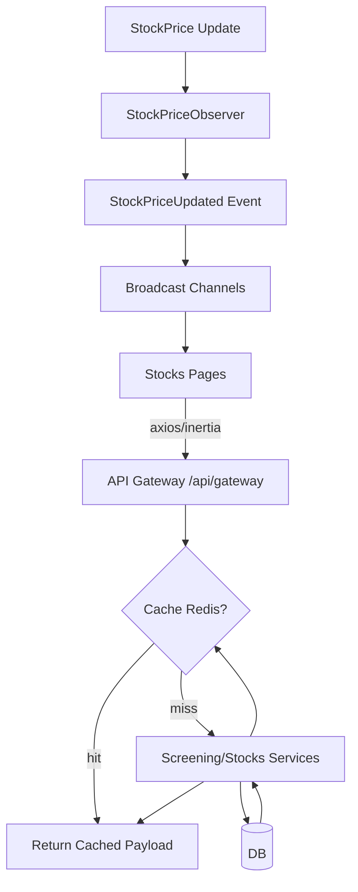

# Optimasi Fitur Saham — Arsitektur & Integrasi

## Tujuan
- Waktu muat halaman < 3 detik untuk Dashboard, Screening, Watchlist
- Response time API critical path < 200ms
- Pengurangan beban database hingga ~70% melalui cache-aside Redis
- Update harga saham real-time via WebSocket

## Arsitektur Sistem
- Frontend (Vue + Inertia):
  - Pagination pada Watchlist dan Screening
  - Lazy updates: berlangganan channel `stock.{code}.prices` untuk harga live
- Backend (Laravel):
  - API Gateway: `/api/gateway/*` mengonsolidasikan endpoint saham
  - Caching:
    - `stocks:dashboard:*` untuk prediksi & sinyal aktif (TTL: 60s)
    - `stocks:screening:{hash}` untuk hasil screening per filter + halaman (TTL: 60s)
  - WebSocket:
    - Event `StockPriceUpdated` broadcast ke channel `stock.{code}.prices` (event name: `price.updated`)
    - Observer `StockPriceObserver` memicu event saat `StockPrice` dibuat/diupdate
- Data Layer:
  - Query efisien dengan eager load selektif (latest price/signal)
  - In-memory pagination pada hasil screening untuk menghindari muatan besar

## Flowchart Integrasi (Mermaid)

## Strategi Caching (Cache-Aside)
- Prinsip:
  - Cek cache terlebih dahulu
  - Jika miss, hitung dari DB → simpan ke cache → kembalikan hasil
- Kunci:
  - Screening: `stocks:screening:{md5(filters,user,page,per_page)}`
  - Dashboard:
    - `stocks:dashboard:recent_predictions`
    - `stocks:dashboard:active_signals`
- TTL:
  - 60 detik untuk data yang cepat berubah

## API Gateway
- Endpoint:
  - GET `/api/gateway/stocks/dashboard`
  - POST `/api/gateway/stocks/screening`
  - GET `/api/gateway/stocks/watchlist`
  - GET `/api/gateway/portfolio/recommendations`
- Fitur:
  - Standardized JSON responses
  - Throttling: `throttle:120,1`
  - Error handling terpusat (HTTP 4xx/5xx)

## WebSocket & Real-Time
- Channel:
  - `stock.{stockCode}.prices` (auth required)
- Event:
  - `price.updated` membawa `close`, OHLC, volume, timestamp
- Frontend:
  - Subscribe per kode pada halaman aktif
  - Update state harga tanpa refresh

## Lazy Loading & Pagination
- Watchlist:
  - Backend: `paginate($perPage)` untuk menghindari payload besar
  - Frontend: navigasi Next/Prev, render per halaman
- Screening:
  - Pagination in-memory pada hasil
  - Pengiriman `page` dan `per_page` dari klien

## Troubleshooting Guide
- Harga tidak update:
  - Pastikan `VITE_PUSHER_*` dikonfigurasi, `resources/js/Utils/echo.js` menginisiasi Echo
  - Cek `routes/channels.php` untuk akses auth channel
  - Pastikan `StockPriceObserver` terdaftar di `AppServiceProvider`
- Cache tidak terasa:
  - Pastikan driver `redis` aktif di `.env` (`CACHE_DRIVER=redis`)
  - Gunakan `php artisan cache:clear` bila perlu
- API lambat:
  - Cek indeks DB pada kolom `date`, `stock_id`, `signal_date`
  - Profiling: gunakan Laravel Telescope atau Clockwork untuk identifikasi kueri mahal

## Rekomendasi Message Queue (Ops Asinkron)
- Antrian tugas berat:
  - Recompute Screening Results untuk filter populer
  - Batch notifikasi watchlist (alert harga, sinyal baru)
- Tools:
  - Laravel Queue (Redis driver)
  - Supervisord / Horizon untuk worker management

## CDN & Aset Statis
- Set `.env`:
  - `ASSET_URL=https://cdn.example.com`
- Deploy:
  - Upload build Vite ke CDN
  - Pastikan cache headers (Cache-Control) diaktifkan

## Load Testing (Apache JMeter)
- Skenario:
  - 10.000 concurrent users
  - Ramp-up realistis (mis. 300 users/sec)
  - Critical path:
    - `/api/gateway/stocks/screening`
    - `/api/gateway/stocks/watchlist`
    - `/api/gateway/stocks/dashboard`
  - Target: p95 < 200ms
- Tips:
  - Aktifkan Keep-Alive
  - Gunakan Connection Pooling
  - Variasikan filter screening untuk mensimulasikan workload riil

## Keamanan & Observabilitas
- Rate limiting per role (lihat `AppServiceProvider::boot`)
- Logging kesalahan terstruktur
- Monitoring:
  - Laravel Telescope/Clockwork untuk dev
  - Sentry untuk exception di production
